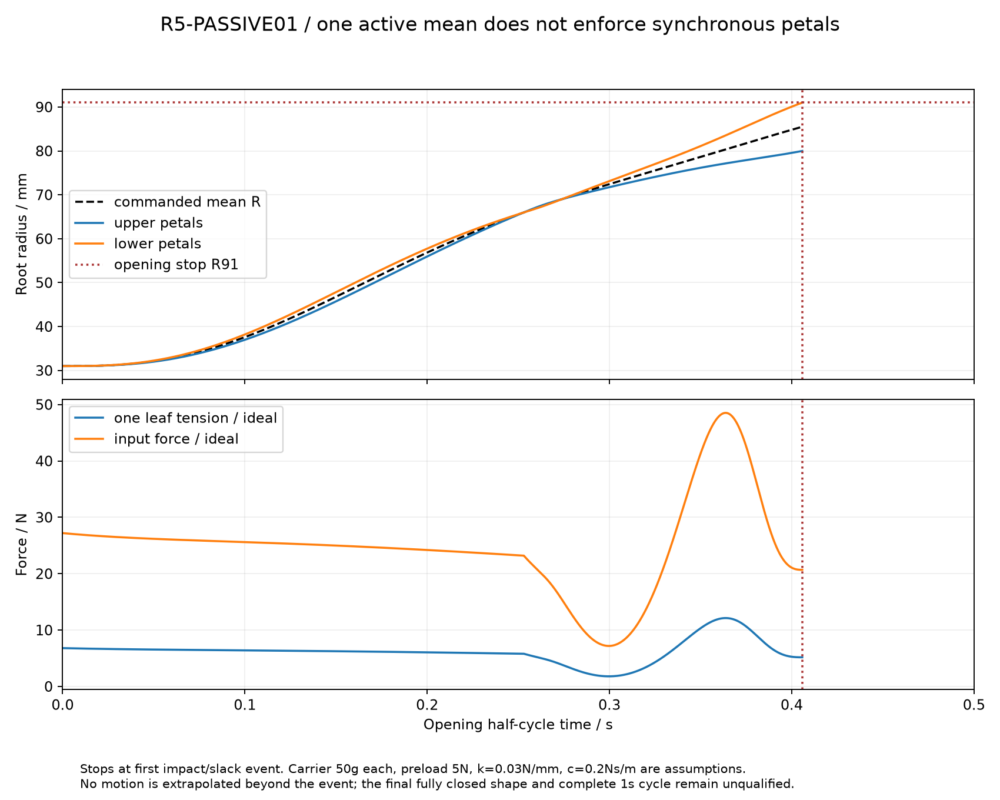

# R5-PASSIVE01：单电机差动的空载不同步与回位条件

**一个平均行程输入不会自动让四瓣同步。** 本研究将 [STAGE01](r5-stage01.md) 的同步假设改为被动运动方程，保留同一灯片和折叠路径。一个具体算例中，下瓣先到展开止挡时，上瓣还差约11.011mm径向行程、仍折着35.04°。计算到首次止挡即停止，没有将后续碰撞或松索伪装成已完成的1秒往返。

这不是证明单电机方案不可行；它说明必须设计回位、阻尼、止挡和松索恢复，或增加合适的机械同步措施。它也不将50mm最小夹持开口改称用户要求的最终全闭姿态。



## 计算范围与输入

采用 [FORM02](r5-petal-form02.md) 已建材料的实际质量、质心和惯量，四支路的运动坐标为闭合位移 `s=91−R`，以米计算。R31…91对应s0.060…0，q(s)沿用STAGE01。重力固定沿头坐标−Z；同一上下类别的左右片在该重力方向下质量指标相同，因此可将四坐标简化为两类。

差动绳索暂按无质量、无伸长、无摩擦且始终张紧；滑轮也无质量。每瓣回位作用假设为 `F₀+k·s`，另加线性粘性阻尼 `c·ṡ`。**这些弹簧、阻尼器和载体质量不是已选器件。** 没有包含实际摇臂/滚轮的旋转惯量、绳轮惯量与摩擦、柔度、槽隙、任意头朝向、工件或止挡碰撞。不能用本结果发布硬件速度、实际索力上限或循环寿命。

参考输入仍是STAGE01的Bernstein9平均位移：最小50mm夹持开口开始，0.5秒内命令平均根半径从31到91mm。采用其既有速度多项式并逆向执行；没有重新优化输入来消除不同步。

## 被动方程与独立核对

每片COM位置记为r(s)，局部绕切向根铰惯量为Iᵧ，q为闭合角。加上仅作平移的载体代理质量m_c：

\[
H_i=m_i\left|r'_i(s_i)\right|^2+I_{y,i}\left(q'_i(s_i)\right)^2+m_c,
\]
\[
b_i=\tfrac12 H'_i\dot s_i^2+U'_i+F_0+k s_i+c\dot s_i,\quad
H_i\ddot s_i+b_i=T.
\]

理想叶索张力T相同；二级索为2T，平均输入力为4T。T必须非负。令两上片 `sᵤ=u+d`、两下片 `sₗ=u−d`，平均输入u由电机侧假设给定，则

\[
\ddot d=\frac{(H_l-H_u)\ddot u+b_l-b_u}{H_u+H_l},
\quad T=H_u(\ddot u+\ddot d)+b_u.
\]

同样的常量预拉力F₀在d方程中抵消，增加它能改变松索裕量，却不会单独消除上下片的位置差。不同刚度、非线性回位或摩擦需要另写方程，不能由此推广为全部回位形式都无效。

另用四个独立坐标求解约束，而不复用上述d方程：

\[
T=\frac{4\ddot u+\sum b_i/H_i}{\sum 1/H_i},
\quad \ddot s_i=(T-b_i)/H_i.
\]

基准算例中，两种方程的位置最大差2.59×10⁻¹¹m，四支路平均约束误差小于1.78×10⁻¹⁵m。时间步长减半、误差要求收紧后首次止挡时刻差1.65×10⁻¹⁰s。COM有限差分重建路径质量H的最大误差1.35×10⁻⁹kg；输入功减阻尼耗散与动能/重力势能/回位势能的变化相差不超过1.71×10⁻⁸J。这是数值模型核对，不是机构试验。

[独立复算](../../engineering/r5_passive01_review.py)另外使用幂多项式重建Bernstein输入、四坐标加5×5约束质量矩阵、COM旋转Jacobian与H有限差分，没有导入本研究生成器。[独立结果](../../engineering/generated/r5-passive01/independent-review.json)确认符号、上下两片的倍数及绳索冲量结论：精确s=0事件为0.405783814840s，相对原数值容差事件仅差64.84ns；独立功—能残差7.43×10⁻⁹J。此审查同样止于首次事件，不延伸成实物完整周期结论。

## 首次止挡与不可继续套用的绷紧约束

基准假设：每个载体50g、F₀=5N、k=0.03N/mm、c=0.2N·s/m。初态四片s=60mm且静止。

| 首次事件前结果 | 数值 |
|---|---:|
| 下瓣到R91展开止挡 | 0.405783880s |
| 上瓣剩余闭合位移 | 11.010986mm |
| 上瓣仍保留的闭合角 | 35.043829° |
| 上瓣闭合坐标速度 | −0.077330m/s |
| 下瓣闭合坐标速度 | −0.153904m/s |
| 事件前叶索张力区间 | 1.795905…12.130729N |

事件检测允许1×10⁻⁸m数值越界，报告中的下瓣−0.00001mm是该容差，不是新物理行程。

如果碰撞瞬间将下瓣速度硬置零，又强迫平均输入速度不变，由 `ṡᵤ+ṡₗ=2u̇` 可得上瓣所需速度突变 `Δṡᵤ=ṡₗ⁻`。叶索对上瓣的广义冲量必须为 `J=Hᵤ·ṡₗ⁻≈−1.207974N·s`。负冲量意味着该双边约束需要绳索“推”，与只受拉绳索不符。真实系统必须转入包含松索、弹性和止挡的模型；此处不强行积分到0.5s或再拼接一个闭合半程，也不把该数值当真实冲击载荷。

## 参数敏感性与夹持代价

共检查每瓣载体代理0/50/100g，与三组(k,c)组合：0.03N/mm与0.2N·s/m、0.1与2、0.3与5。九组都在0.40085…0.41987s先出现某一下瓣的展开止挡；当前参数子集没有消除不同步。这不是对所有可行机构或所有弹簧的穷举。

更硬的回位会增加长方盒接触时的力差。对50×120mm对齐盒体，四个径向闭合位移为60/25/60/25mm。在q90、忽略导轨摩擦和弹性时，法向力为 `Nᵢ=T−(F₀+k·sᵢ)`。以下保守设定是让每片法向都至少24.516625N，来自2kg、重力载荷因子2、假设μ0.4；并不代表实测摩擦或完整力闭合。F₀仍假设5N。

| k / N/mm | 叶索T / N | 二级索 / N | 输入力 / N | 窄边/宽边两对的每片法向 / N |
|---:|---:|---:|---:|---|
| 0.03 | 31.316625 | 62.633250 | 125.266500 | 24.516625 / 25.566625 |
| 0.10 | 35.516625 | 71.033250 | 142.066500 | 24.516625 / 28.016625 |
| 0.30 | 47.516625 | 95.033250 | 190.066500 | 24.516625 / 35.016625 |
| 1.00 | 89.516625 | 179.033250 | 358.066500 | 24.516625 / 59.516625 |

表中二级索载荷可以作为条件硬件筛选输入，但回位参数未选定，不能据第一行冻结整机索具。高刚度会让先接触的一对承担更多额外力，需要兼顾日常物体的局部压损。电机/丝杆效率、保持、接触力反馈与失电状态另行设计。

## 文件与下一步

[源程序](../../engineering/r5_passive01.py)、[机器可读结果](../../engineering/generated/r5-passive01/study.json)、[首次事件前时序CSV](../../engineering/generated/r5-passive01/opening-until-first-event.csv)可在numpy/scipy/matplotlib环境复算：

```sh
python engineering/r5_passive01.py
python engineering/r5_passive01_review.py
```

接下来需将真实载体/滑轮/绳索质量、选定回位元件和松索接触模型一起加入，再综合输入轨迹与止挡结构。此前的同步时序和Blender手动被动偏移继续作为几何参考，不能替代这一步。制造、2kg夹持及完整1秒全闭往返均未在本阶段放行。
