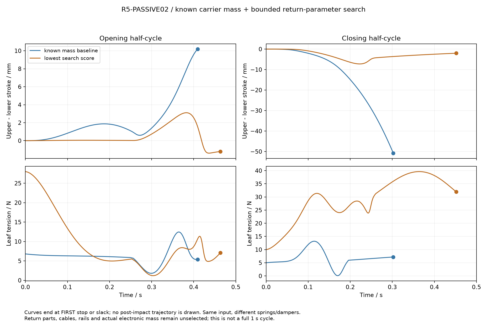

# R5-PASSIVE02：加入已建载体的质量、惯量与有限回位搜索

**加入真实 CAD 分组的质量后，差动仍不会自然同步。** 在同一平均输入下，基线回程的首次展开止挡从 PASSIVE01 的 0.405784 s 变为 0.409378 s，另一组仍差 10.188 mm。238 组有限参数搜索能改善运动，但没有得到全过程上下差不超过 2 mm 的候选。这里的 2 mm 是本研究诊断阈值，不是用户验收指标，也不是证明所有回位机构都无法满足要求。

搜索中分数最低的候选是每瓣预载 10 N、刚度 0.30 N/mm、阻尼 80 N·s/m。它的回程最大上下差约 3.109 mm，闭程约 7.252 mm；两半程仍各自在首次止挡处结束。**不能把两条截断曲线拼接为完整 1 秒往返。** 本轮“闭端”是 STAGE01 的 R31、最小约 50 mm 夹持开口，不是用户要求的最终视觉全闭姿态。



## 已建质量与坐标

读取 [CARRIER01 部件清单](../../engineering/generated/r5-carrier01/parts-manifest.json) 与 [FORM02](../../engineering/generated/r5-petal-form02/study.json)，不改它们，也不改 PASSIVE01。FORM02 局部 COM 先减去铰点 `[0,0,3.5] mm`；CARRIER01 已在根铰坐标，不再减一次。根铰坐标 `+X` 径向、`+Y` 切向、`+Z` 前方，绕 `−Y` 正向闭合，再平移到 `[R,0,20] mm`。

| 每瓣分组 | 质量 | 在本模型中的运动 |
|---|---:|---|
| CARRIER01 的 20 个 rotor 项 | 53.743959 g | 随 q 转动，同时随 R 平移 |
| 17 个 carrier 项 | 45.184473 g | 仅随 R 平移 |
| 两只 607/8-2Z 轴承 | 14.400000 g | 基线全质量仅平移；内圈自转单列敏感性 |
| 固定导槽 | 28.864954 g | 固定于头体，不计入移动质量 |
| FORM02 上瓣加 rotor | 125.201828 g | 合成旋转刚体 |
| FORM02 下瓣加 rotor | 100.239788 g | 合成旋转刚体 |

每路已建纯平移质量为 **59.584473 g**。四路已建移动质量约 **0.689221 kg**，加固定导槽约 **0.804681 kg**，与 CARRIER01 原质量汇总一致。材料密度、螺钉简化体和目录质量分配仍是设计假设，不是称重。轴承、CFS 等均布包络惯量不是原厂内部惯量。导轨滑块、线缆/滑轮、驱动、回位件、实际 LED/PCB 等仍未计入。

合成上/下刚体的根铰 Y 轴惯量分别为 **5.411885842×10⁻⁴ / 1.537184019×10⁻⁴ kg·m²**。计算 H 时使用的是各合成体的 **COM 惯量**，没有再把根铰惯量与 COM 平移项重复相加。完整 COM、三轴张量、来源项和全部 40 个 STEP hash 检查见 [mass-model.json](../../engineering/generated/r5-passive02/mass-model.json)。左右瓣的外形 COM/I 按 Y 镜像，内部 C4 载体不镜像；在限定 `gravity=−Z` 和纯根铰 Y 转动下，两者具有相同 H/G。任意头姿态不能直接继承这个简化。

## 方程与半程初态

闭合坐标 `s=0.091−R`，范围 0…0.060 m；前 25 mm 完成折叠：

`q(s)=π/2·(10w³−15w⁴+6w⁵), w=clip(s/0.025,0,1)`。

COM 的世界分支位置为 `r=[0.091−s,0,0.020]+Rot(−Y,q)c`。基线质量指标与广义重力：

`H=m_rot |r′|² + I_COM,Y q′² + m_translation + m_extra`

`G=m_rot g z′`

`b=½H′ ṡ² + G + F₀ + k s + c ṡ`。

两上片、两下片在各自组内相同，`sU=u+d, sL=u−d`，每叶满足 `H_i s̈_i+b_i=T`，从而

`d̈=[(HL−HU)ü+bL−bU]/(HU+HL)`。

叶索 T、二级索 2T、平均输入 4T 的倍率与 PASSIVE01 相同。T 必须非负。输入复用原 Bernstein9 的 0.5 s、60 mm 位移；每半程独立从共同端点静止启动。任何一瓣越过展开/闭合界或 T 降到零即终止，允许 10 nm 事件数值容差。这里没有碰撞恢复、松索后重张紧或起始止挡释放模型。

## 原 9 组基线的变化

重新计算 PASSIVE01 的 9 组并与其已冻结结果核对。旧列的质量变量是仅平移载体代理；新列保留同一数值作为**额外未知平移质量**，同时已经加入 53.744 g rotor 和 59.584 g 已建平移件。这两个变量不能称为同一个物理部件。新已建件基线取额外 0 g；与旧代表性 50 g 代理的对照是 0.409378 s / 10.188 mm 对 0.405784 s / 11.011 mm。

| 旧代理 / 新额外质量 g | k N/mm / c N·s/m | 旧首次展开止挡 s | 新首次展开止挡 s | 旧 / 新另一组剩余 mm |
|---:|---|---:|---:|---:|
| 0 | 0.03 / 0.2 | 0.400848 | 0.409378 | 12.166 / 10.188 |
| 0 | 0.10 / 2 | 0.406241 | 0.408802 | 10.905 / 10.319 |
| 0 | 0.30 / 5 | 0.417499 | 0.421121 | 8.397 / 7.635 |
| 50 | 0.03 / 0.2 | 0.405784 | 0.410294 | 11.011 / 9.981 |
| 50 | 0.10 / 2 | 0.406920 | 0.410316 | 10.749 / 9.976 |
| 50 | 0.30 / 5 | 0.418537 | 0.423219 | 8.176 / 7.204 |
| 100 | 0.03 / 0.2 | 0.408480 | 0.410783 | 10.392 / 9.871 |
| 100 | 0.10 / 2 | 0.408030 | 0.411824 | 10.495 / 9.638 |
| 100 | 0.30 / 5 | 0.419873 | 0.446024 | 7.895 / 3.209 |

这些响应非线性，增加质量不能概括为“总是更同步”。[9 组完整对照](../../engineering/generated/r5-passive02/nine-case-comparison.json)保留每个张力范围与旧结果重放误差。

## 回位参数搜索与初始止挡

只做离散范围搜索和一次 9 点局部细化，去重后 238 组。共同预载取 5/10/15 N、共同刚度 30…350 N/m、共同阻尼 0.2…120 N·s/m，并比较上下刚度、阻尼差和线性同步力拟合；完整网格与每组结果见 [candidate-search.json](../../engineering/generated/r5-passive02/candidate-search.json)。先按 CABLE01 的条件容量筛选静态力，再同时惩罚两个半程的过程差、首事件剩余行程与错误初事件。这个分数只是比较工具，不是用户目标的替代或全局最优性证明。

| 参数候选 | 半程 | 首事件时刻 s | 过程最大上下差 mm | 首事件另一组剩余 mm | 叶索张力范围 N |
|---|---|---:|---:|---:|---:|
| 基线：两组 5 N / 0.03 N/mm / 0.2 N·s/m | 开 | 0.409378 | 10.188 | 10.188 | 1.803…12.445 |
| 同上 | 闭 | 0.302370 | 50.787 | 50.787 | 0.103…13.186 |
| 最低分：两组 10 N / 0.30 N/mm / 80 N·s/m | 开 | 0.463471 | 3.109 | 1.202 | 1.199…28.000 |
| 同上 | 闭 | 0.451845 | 7.252 | 2.025 | 10.000…39.629 |
| 差异阻尼：共同 10 N / 0.30 N/mm，上 76、下 84 N·s/m | 开 | 0.444508 | 3.981 | 3.430 | 0.949…28.000 |
| 同上 | 闭 | 0.459697 | 5.576 | 1.241 | 10.000…39.591 |

每条已列曲线在首次目标止挡前保持正张力。差异阻尼改善闭程却恶化开程；不能只看结束时差值，因为过程中仍可能明显不同步。更大的共同预载只提高 T，在上下预载相同时会从 d 方程抵消，不直接消除位置差。阻尼是有功耗的元件，报告 JSON 还保存首事件前的耗散能量和峰值功率；不能把未走完的两个半程相加作为已验证的持续 1 Hz 热循环。

最低分候选在两个独立半程各耗散约 2.910 J，四路阻尼合计峰值约 13.42 W。这不是已选阻尼器的热额定；实际阻尼件、安装空间和力速曲线尚未选定。

上下预载或刚度不同有一个更早的边界问题。在共同端点静止且 `u̇=ü=0` 时，若该端点上下回位力不同，双边自由模型要求一组立即朝止挡外加速。要让线性回位在 s=0 和 s=60 mm 两个端点都无此冲突，必须同时满足：

`F₀U=F₀L`，`F₀U+0.06 kU=F₀L+0.06 kL`，所以还需要 `kU=kL`。

这只针对“共同端点启动、没有初始止挡反力”的当前模型。真实系统可有初始接触力并先后释放；本研究按要求在首事件结束，未把它暗中补成无碰撞运动。拟合出的 `ΔF₀=−1.708 N、Δk=41.081 N/m` 因此出现约 60–100 μs 的错误初始止挡事件，主要是 10 nm 数值容差的表现。它说明要设计接触释放过程，**不是不同回位件在物理上永远不可行**。仅靠线性力拟合的 RMS 剩余约 3.154 N，也没有精确匹配同步所需的非线性惯性/重力差。

## CFS 与根轴承自转的边界

CARRIER01 把 CFS4 全部 4 g 作为随曲柄刚性转动的均布包络，自己的中心 Y 惯量代理为 `2.6667×10⁻⁸ kg·m²`。真实外圈可独立滚动，不能在该动能上再叠加整个 CFS 的外圈动能。

本包先移除该中心项，再分别计算零中心自转、把总质量允许的 `Jmax=0.004×0.004²=6.4×10⁻⁸ kg·m²` 全分到滚圈或全分到随曲柄的轴体。COM 平移仍只计一次。固定槽单侧纯滚动假设下，滚轮中心 `p(s)=[0.091−s+0.008 cos(q−π/4), 0.020+0.008 sin(q−π/4)]`，绝对角速率幅值为 `|ω_ring|=|p′(s) ṡ|/0.004`；相对曲柄的角速率不能与绝对角速率混用。这些是惯量分配极端敏感性，不是已测内部结构，也没有同时强制两侧槽壁无滑动。

最低分候选中，CFS 极端分配把开程首事件改动不超过约 **40 μs**，闭程不超过约 **13 μs**，没有改变本轮结论。另把两轴承全部质量在 9.5 mm 半径内作为可随根轴转动的内圈惯量上限场景，得到 `1.2996×10⁻⁶ kg·m²`。它只覆盖这种共同转动分配的敏感性，不是滚珠、保持架独立自转的完整界。实际摩擦、间隙、滚动滑移与局部弹性未包含。数值见 [spin-sensitivities.json](../../engineering/generated/r5-passive02/spin-sensitivities.json)。

## 50×120 mm 盒体与钢索条件容量

按 CARRIER01 方位，UR/UL 是上瓣，LL/LR 是下瓣；相对瓣是 **UR–LL、UL–LR**，不能把两上瓣当作一对相对夹面。对齐盒体的闭合坐标是 `[60,25,60,25] mm` 或转 90° 后的 `[25,60,25,60] mm`，顺序 UR/UL/LL/LR。

在 q90 平移段，限定重力 −Z，忽略导轨摩擦，法向 `N_i=T−F₀i−k_i s_i`。沿用 2 kg、载荷因子 2、**假设 μ=0.4**，保守要求每叶 N≥24.516625 N，取 `T=24.516625+max(F₀i+k_i s_i)`。这只是法向门槛和索力筛选；不代替实际摩擦、接触点与完整抓持扳手检查。

| 回位候选 | 叶索 / 二级索 / 输入 N | 窄边 / 宽边每面法向 N | 与 CABLE01 的联系 |
|---|---:|---:|---|
| 5 N、0.03 N/mm | 31.3166 / 62.6333 / 125.2665 | 24.5166 / 25.5666 | 低于 50 / 100 N 中档条件，但运动不同步 |
| 10 N、0.30 N/mm；阻尼共同或上下不同 | 52.5166 / 105.0333 / 210.0665 | 24.5166 / 35.0166 | 超过中档 50 / 100；仍低于理想终端条件弯曲代理上限 64.766 / 109.293 |

后一行仅约有 4.26 N 的二级代理余量，终端保持率至少约 **87.45%** 才能满足所采用的 10× 筛选；若仅假定 85%，二级条件上限 102.087 N，已不覆盖。CABLE01 的实际允许张力仍为 null，名义槽径比、公差与端眼未闭合，所以这里不发放载荷能力。

上下刚度/预载不同还会令相对的两面法向不等，形成居中盒体的 XY 残余力。结果逐项保存 `unbalanced_XY_normal_force_N`；不能仅凭每片 N 足够就宣称静力平衡。只有相同静态回位参数、对称相对接触时该法向合力才自动抵消。上下阻尼不同不影响这里的零速静态值。

物理索路的包装代价另见 [R5-ROUTE01](r5-route01.md)。本包没有把其尚未确定质量的轮叉、索和轮惯量当成零质量实物，更没有据此更新整头重量；两者需要下一轮联合验证。

## 校核与文件

逐个刚体 COM 位置有限差分、COM 惯量求和与合成指标对照，H 最大误差小于 1.35×10⁻⁹ kg，H′ 小于 2.49×10⁻⁷ kg/m。基线与最低分候选的两个半程另用四坐标加 5×5 约束质量矩阵求解，位置差小于 1.22×10⁻¹¹ m，输入功减阻尼耗散与总能量变化最大残差小于 1.86×10⁻⁷ J。事件步长/容差加严后差小于 2.6×10⁻¹¹ s。数值一致性不等于机构试验。

复现命令：

```sh
python engineering/r5_passive02.py
python engineering/generated/r5-passive02/delivery_check.py
```

依赖 numpy、scipy、matplotlib；完整运行会重建本包结果和图，不联网、不修改旧研究。[源程序](../../engineering/r5_passive02.py)、[study.json](../../engineering/generated/r5-passive02/study.json)、[时序 CSV](../../engineering/generated/r5-passive02/baseline-and-candidate.csv)保留条件与输入 hash。当前输出是完整的有限搜索与质量补全分析，未选定回位元件，也未放行制造、2 kg 实物抓持或完整 1 秒闭—开—闭。
