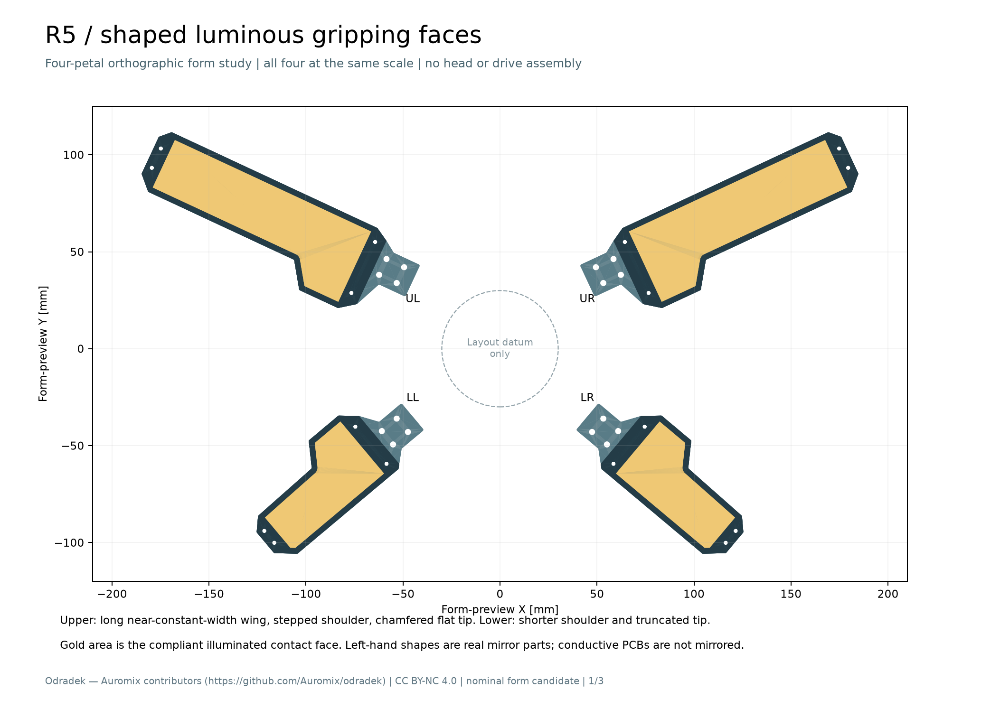
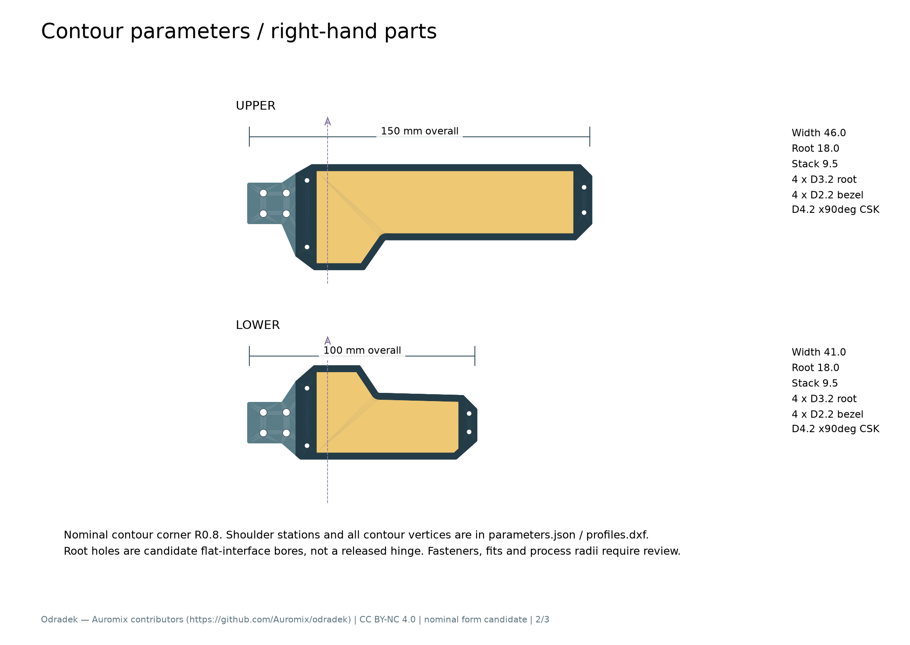
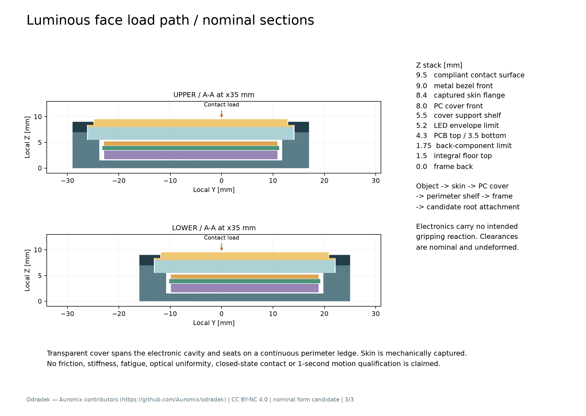

<!-- SPDX-License-Identifier: CC-BY-NC-4.0 -->
<!-- Required Notice: Odradek — Auromix contributors (https://github.com/Auromix/odradek) -->

# R5-PETAL-FORM01：有肩部转折的发光夹持面

本候选把用户外形参考和 [R5 单驱动概念图](../concepts/11-r5-single-drive-head.png)中的**长翼、宽肩、折线回收和截平倒角端**转为真实参数化灯片。上片 150 mm，下片 100 mm；上下沿用同一造型语汇，左右严格镜像。金色区域代表参与接触的透明顺应皮层及其下的发光面，不是另加在片尖的夹持垫。

这里只研究灯片轮廓、分层实体和载荷路径，不包含中央电机、连杆、铰轴或新头部总装。图中的四片展开位置是同尺度造型排布，不能作为闭合姿态、碰撞、抓力或 ≤1 s 完整开合周期通过的证据。参考图上的旧“四独立指”标签不继承；当前整机方向是**一电机＋mimic 联动**，由独立机构研究处理。



[参数 JSON](../../engineering/generated/r5-petal-form01/parameters.json) · [可复算脚本](../../engineering/r5_petal_form01.py) · [四片造型 STEP](../../engineering/generated/r5-petal-form01/R5-PETAL-FORM01-four-petal-form.step) · [尺寸／截面 PDF](../../engineering/generated/r5-petal-form01/R5-PETAL-FORM01-dimensions-and-sections.pdf) · [实体与质量结果](../../engineering/generated/r5-petal-form01/study.json) · [QA](../../engineering/generated/r5-petal-form01/qa.json)

## 1. 轮廓如何回应参考

上片近根部展开为 46 mm 宽肩，在局部 x≈51…60 mm 通过折线收回到较等宽的长翼，外段名义宽 33 mm；端部以截平和倒角结束。下片保留 41 mm 肩部、折线和短翼，端部同样截平，避免变成三角尖片。两种右片的肩部分别偏向局部 −Y／+Y，以对应展开时上下的相向关系。

本版没有照搬旧 FPL 的三角轮廓，也没有把旧板裁进新外形。轮廓源是可读的折线顶点与 R0.8 平面圆角；顶点、台阶、腔体和孔位均来自参数，STEP 不是外观图片的薄片贴图。

| 默认参数 | 上片 | 下片 |
|---|---:|---:|
| 总长／最大宽／堆叠高 | 150／46／9.5 mm | 100／41／9.5 mm |
| 根部名义宽、金属厚 | 18／7 mm | 18／7 mm |
| 透明盖座的 X 裁切区间 | 30…142 mm | 30…92 mm |
| 透明承力盖厚 | 2.5 mm | 2.5 mm |
| 接触面名义面积 | 2972.045 mm² | 1436.869 mm² |
| 根接口候选孔 | 4×Ø3.2，X7／17，Y±4.5 | 相同 |
| 前压圈候选孔 | 4×Ø2.2；Ø4.2×90°沉头座，沉深 1 mm | 相同孔径，不同位置 |

根接口是初步平面安装垫及孔位，**不是已经选定的轴毂、铰链、螺钉或完整连接**。前压圈沉头座用于要求后续选件头不高于 Z9.0；光面 Z9.5，名义高出 0.5 mm。没有将普通凸头螺钉放在光面前方。真实头径、角度、配合、公差和拧紧仍须与具体件一起核对。



四种真实镜像件分别位于 [upper-right](../../engineering/generated/r5-petal-form01/upper-right/)、[upper-left](../../engineering/generated/r5-petal-form01/upper-left/)、[lower-right](../../engineering/generated/r5-petal-form01/lower-right/)、[lower-left](../../engineering/generated/r5-petal-form01/lower-left/)。各目录有七件命名 STEP 总装、独立 STEP、四种拟用材料件 STL 和 `profiles.dxf`。DXF 为 **mm**，包含外轮廓、盖、接触面、PCB 候选边界、压圈和孔位／沉头分层；圆弧来自真实 CAD，不只是重新画出的折线。

## 2. 让光面承力，电子留在后腔

采用四件实体构成的候选截面：一体暗色金属框／底板、可拆前压圈、透明承力盖、透明顺应皮层。法向路径为：

```text
工件 → 可换顺应皮层 → 透明承力盖
     → 连续周边支承台阶 → 一体框和底板 → 根部连接

LED／PCB 位于透明盖后方的避载腔，不作为盖板支柱。
```



| 局部 Z，mm | 当前实体／预留 |
|---|---|
| 0…1.5 | 一体框底板 |
| 1.75…3.4 | 背面电子预留体；不是器件清单 |
| 3.5…4.3 | 新异形 PCB 空白预留，0.8 mm 厚 |
| 4.4…5.2 | LED 正面预留体，未排点、未选数量 |
| 5.5…8.0 | 2.5 mm 透明承力盖，座于周边台阶 |
| 8.0…8.4 | 皮层法兰，受压圈唇边捕获 |
| 8.4…9.5 | 接触区顺应层；总接触区皮层厚 1.5 mm |
| 7.0…9.0 | 周边可拆压圈；法兰让位腔至 Z8.4 |

盖在座内的名义单边间隙 0.2 mm，台阶与盖的名义搭接宽约 2.2 mm；皮层正面与压圈开口单边间隙 0.15 mm。皮层法兰厚 0.4 mm，用几何捕获替代对胶粘性能的假设，但**没有验证其剪切、撕裂、剥离或循环保持能力**。

通过共面 BREP 求交得到上／下透明盖与金属支承的实际名义接触面积 **633.173／388.972 mm²**；皮层与压圈的捕获平面面积 **307.076／190.307 mm²**。这些是真实未变形接触面，不是按包围盒估出的数。PCB、LED 和背面电子预留之间，以及它们与结构件之间无正体积交叠。

LED 预留到盖底仅 **0.30 mm**，背面电子预留到底板仅 **0.25 mm**。这些是未变形名义间隙，尚不能容纳已证明的全部公差、热变形或夹持挠曲。盖受力后不能碰到 LED，这个门槛需要真实载荷／支承模型和实体测试。顺应面只比压圈高 0.5 mm，压缩、工件边缘或倾斜接触也可能使金属先接触，不能从本截面推导“所有物体都只接触软面”。

PCB 目前只有几何预留，没有安装柱、接头、焊盘、铜箔、布线或导热方案。电子固定和出线需继续设计，不能把 CAD 内的空白板称为已可装配的 PCBA。压圈孔是通孔／沉头几何；尾侧锁紧、实际螺钉长度、数量和装配工具尚未选定。拆下压圈后，皮层、盖和板可从光面侧取出的构造意图仍需结合接头／紧固件完成服务路径检查。

## 3. 材料是假设，质量只对已建材料积分

本轮质量采用金属 2700、透明盖 1200、顺应皮层 1030 kg/m³。2700 是明确的名义铝材密度假设，不指定合金、热处理或厚度下限。1200 参考 Covestro [Makrolon 1205 官方页](https://solutions.covestro.com/en/products/makrolon/makrolon-1205_000000000000830205)的典型 PC 密度；没有据此冻结该牌号、板材采购或机械许用值。

皮层密度只参考 Dow [SYLGARD 184 官方页](https://www.dow.com/en-us/pdp.sylgard-184-silicone-elastomer-kit.01064291z.html)的透明属性和 25°C 比重 1.03，近似用于质量预算。该产品主要为封装弹性体，**本版没有把它认定为已合格的耐磨抓取皮层**。摩擦、污染后的滑移、磨损、透光／雾度、清洁剂相容性和固化批次密度均待验证。[来源与使用边界](../../engineering/generated/r5-petal-form01/reference-and-materials.json)

| 已建材料件 | 上片 g | 下片 g |
|---|---:|---:|
| 一体框／底板 | 52.042122 | 35.055640 |
| 压圈，已扣沉头座 | 7.205968 | 4.967115 |
| 透明承力盖 | 9.966785 | 4.961004 |
| 顺应皮层 | 4.736099 | 2.309284 |
| **单片条件小计** | **73.950975** | **47.293044** |

两上、两下合计 **242.488037 g**。LED、PCB、铜／焊料、连接器、线、全部紧固件、铰／轴毂和连杆／驱动**未知且未计入**，不为这些预留体分配零质量或编造密度。这不是完整四指质量，更不是头部质量。

`study.json` 给出两种右片逐件名义体积、材料假设、COM 和完整中央惯量。关于局部根参考点 `[0,0,3.5] mm`、绕局部 Y 的**已建材料**惯量，上／下分别约 **0.000539464322／0.000149157795 kg·m²**。这个根参考用于与独立联动数学对接，并不代表本件已有该轴的实体支承。

左片 COM 用 Y 取反，惯量应作 `I_left = M I_right Mᵀ，M=diag(1,−1,1)`，不能直接复用右片的带符号非对角项。`qa.json` 的各 hand 导出记录还保留由镜像后真实 BREP 独立积分的质量、COM/I。未来动力学应在这些子集之外补入电子、铰、连杆与紧固件，不能用本小计证明一秒周期。

## 4. 净截面和几何核对

只对实际金属框求取带孔净截面，使用 0.04／0.02 mm 薄片积分并扣除薄片自身沿 X 的惯量项；未借用盖或 PCB 作为金属梁加强层。

| 右片实际截面 | 面积 mm² | 绕局部 Y 的截面二次矩 mm⁴ |
|---|---:|---:|
| 上／下，X7 根孔中心 | 81.2003 | 331.5679 |
| 上，X35 宽肩 | 119.0000 | 421.9366 |
| 上，X80 长翼 | 99.5000 | 375.8032 |
| 下，X35 宽肩 | 111.5000 | 405.9513 |
| 下，X65 短翼 | 93.1848 | 357.0631 |

这组面积和二次矩只是可追溯的几何输入，没有采用屈服、接触压力、摩擦或疲劳许用值，也没有给出梁／板强度或挠度通过。框的开口截面、透明盖的周边支承、局部紧固和皮层接触不能用一个梁公式代替。

已完成每种片内七个实体的两两交叠检查、四类实际接触面检查、全部单件／命名总装 STEP 往返、镜像反向还原、16 个材料件 STL 闭合流形和 DXF 毫米单位／外轮廓尺寸核对。四片组合只有造型排布，**没有做闭合干涉或物体先接触校核**。

STL 用于无电几何样件，不给打印材料赋予上述候选材料强度，也不意味着透明承力盖可以直接用透明打印件代替。外轮廓 R0.8 已为真圆弧；口袋 X 裁切处、刀具圆角、密封／公差、沉头座的最小实际边缘与紧固工艺还需加工审查。这些文件不是制造放行图。

## 5. 电气、参数修改和后续接口

四个 `profiles.dxf` 中的 `PCB_candidate` 是新的镜像异形边界。左右镜像**机械**不等于镜像已有导电板：同款装配不能直接取镜像后假定 pin1、顶／底面和接头出线仍正确。新形状可能需要上右、上左、下右、下左各自的 PCB 版本；是否通过结构调整合并为两版，需要重新做 ECAD／MCAD 协同。旧 FPL 只作器件和工程方法参考，其板形、灯点、热区与接头适配结论全部不自动继承。

默认参数中轮廓顶点可直接修改，`length_mm`／`width_scale` 对相应模板比例缩放，**包括候选孔位**；它不是“保持已释放根接口不动”的产品变型系统。修改后脚本重新检查孔位所在实体、层间相交、材料件有效性及导出；通过这些检查仍不等于制造或运动验证。

```bash
OPENBLAS_NUM_THREADS=1 ../../work/r4-runtime/venv/bin/python engineering/r5_petal_form01.py

# 将复制到 work/ 的参数文件作为下一候选输入：
OPENBLAS_NUM_THREADS=1 ../../work/r4-runtime/venv/bin/python engineering/r5_petal_form01.py \
  --parameters ../../work/r5-petal-next-parameters.json
```

输出始终写入本候选目录；修改参数前应保留已审核快照，再为后续版本选择独立目录／版本名，避免覆盖冻结研究。当前 `study.json` SHA256 为 `6239375fadc6c43a9e538674af1f0bf620ba53a4962bd5320f33bd06474869e9`。与联动代理对接时使用局部根、完整质量字段和镜像约定；四片展示图中的根位置／方位不约束最终头部。主参数、旧 FPL、P16 研究与主总装均未修改。
