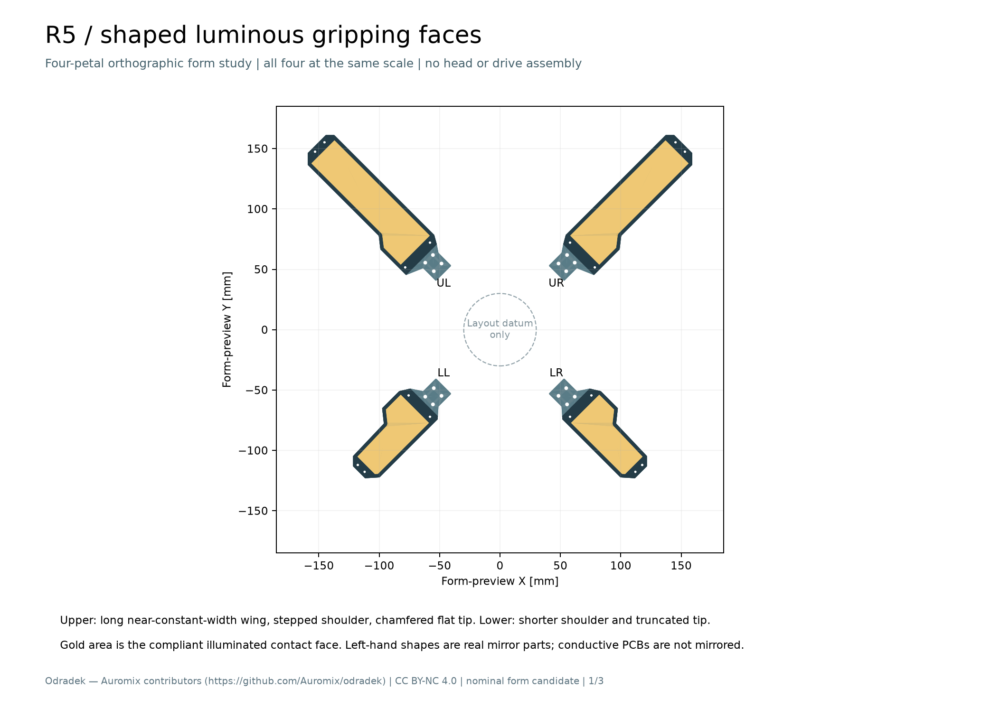
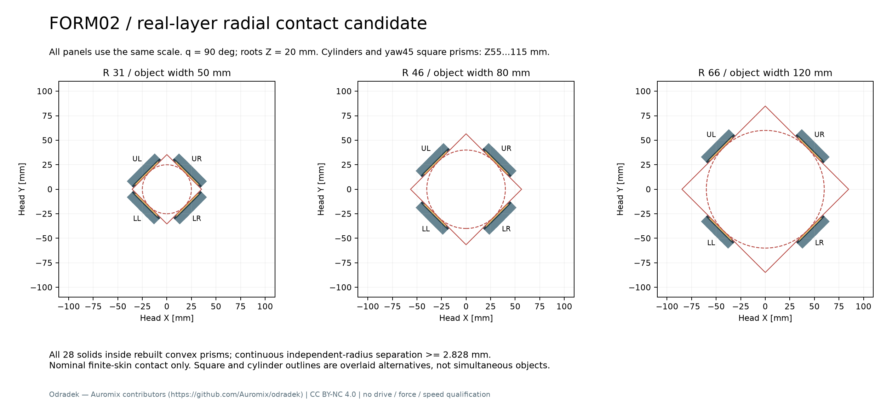

# R5-PETAL-FORM02：正交削肩灯片候选

本候选将削肩轮廓重建为四片、28 个真实分层实体。**固定 q=90°、根部 Z=20 mm、四片各自 R=31…66 mm 时，名义实体连续分离下界为 2.828427 mm。** 对同轴圆柱和绕头轴 yaw=45° 的正方棱柱，在限定高度 Z=55…115 mm 内，可通过径向平移让四片有限皮层接触 50…120 mm 的直径或边宽。这里完成的是裸灯片的几何研究，不是径向机构、折叠阶段、抓力、1 秒周期或制造放行。

FORM02 是独立候选，未替换 [FORM01](r5-petal-form01.md)，也未修改主参数、旧 CAD、旧电子板或驱动方案。前期 work-only 凸包试算只是设计依据；本次重新构建轮廓、偏置、腔体、台阶与孔，并对新导出 STEP 重新核查包含关系。



## 轮廓与分层

上片保持长 150 mm，仅将原 `(29,−29)`、`(51,−29)` 两节点移到 Y=−23；下片保持长 100 mm，仅将 `(49,25)`、`(29,25)` 两节点移到 Y=23。其余折线节点不动，转角仍采用名义 R0.8。最大宽度由上 46→40、下 41→39 mm；根部宽度仍为 18 mm。上片 X21…51 的肩部下缘现在共线，保留参数节点用于追溯。左右为真实镜像零件，不能据此镜像已布线 PCB。

每片包含四个按假定材料计量的实体：暗色骨架、前压圈、透明承力盖板、透明顺应皮层；另有 PCB、背面电子、LED 三个**未知质量的预留实体**。四片共 28 个有名称的零件。新板需要适应新轮廓，左右异形板可能需要各自版本；旧 FPL 板只作经验参考。

| 部位 | 局部 Z 范围 / mm | 本轮状态 |
|---|---:|---|
| 骨架与腔底 | 0…7；腔底顶 1.5 | 原创实体，净截面含孔 |
| PCB 预留 | 3.5…4.3 | 无真实板材层叠/布线与质量 |
| 背面器件预留 | 1.75…3.4 | 距腔底名义 0.25 |
| LED 预留 | 4.4…5.2 | 无器件封装、焊高公差 |
| 透明承力盖板 | 5.5…8 | 名义厚 2.5 |
| 皮层法兰 | 8…8.4 | 厚 0.4；槽高也为 0.4 |
| 皮层发光接触面 | 8.4…9.5 | 比压圈高 0.5 |
| 前压圈 | 7…9，内压唇底 8.4 | 名义零预压，未验证保持力 |

[三页尺寸与截面 PDF](../../engineering/generated/r5-petal-form02/R5-PETAL-FORM02-dimensions-and-sections.pdf) 包含四片同尺度正投影、上下轮廓尺寸和 X35 截面。完整节点、孔位与加工轮廓分别见 [参数](../../engineering/generated/r5-petal-form02/parameters.json)、[孔坐标 CSV](../../engineering/generated/r5-petal-form02/hole-coordinates.csv) 和四个手性目录的 `profiles.dxf`。图纸无公差，不能直接当生产图。

## 孔边距与名义承压面

本轮**所有孔位保留，移动量为 0**。右手上片压圈孔为 `(26,−19)/(26,10)/(146.5,−4)/(146.5,7)`；下片为 `(26,−10)/(26,15)/(96.5,−4)/(96.5,4)`。左右镜像时 Y 反号。根部四孔仍为 X7/17、Y±4.5。

| 项目 | 新实体计算结果 | 限制 |
|---|---:|---|
| 根孔 Ø3.2 对轮廓最小剩余宽度 | 2.9 mm | 不是孔边撕裂/疲劳许用值 |
| 压圈 Ø2.2 通孔与 Ø4.2×90° 沉头 | 深 1.0 mm | 实际螺钉完整头部尚未验证 |
| 沉头外圆对外边最小距离 | 上、下均 1.4 mm | 尾端孔控制；上削肩近根孔为 1.9 mm |
| 沉头外圆对前开口最小距离 | 上、下均 3.15 mm | 另以最大圆柱包住锥头，确认全体积在未钻孔帽部内 |
| Ø5 / Ø2.2 后垫圈量规承压面积 | 每孔 15.833627 mm² | 8 个右手位置直接计算，左手由完整反射实体继承 |
| Ø6 / Ø3.2 根螺钉头量规承压面积 | 每孔 20.231857 mm² | 只验证独立片体，不是已设计轴毂 |

几何量规没有被当作真实螺钉放进 28 零件总装。沉头小于孔径不等于头部一定低于 Z9；实际头缘平段、角度、公差、尾部螺母/工具和实际根轴连接均未闭合。可采购候选与目录限制仍引用 [HW01](hardware/r5-petal-hardware01.md)，不继承其旧轮廓的接触结果，本轮承压面已重算。

上下盖板承台与盖板的名义共面面积分别为 **610.892 / 381.256 mm²**；盖板与皮层底面为 **3183.276 / 1612.758 mm²**；皮层法兰与压圈为 **296.407 / 186.610 mm²**。这些是未变形 CAD 接触投影，不证明压力均匀。预期力流仍为物体→皮层→透明盖板→骨架周边台阶→根部；LED/PCB 不承担预期夹持反力。

## 径向阶段的连续证据

头坐标 +Z 朝物体。四根轴方位按 UR/UL/LL/LR 为 45/135/225/315°；根点 `P=R·er+[0,0,20]`，局部铰轴参考 `h=[0,0,3.5]`。在本轮固定 q=90° 时：

```text
X_head = R·er + [0,0,20] + x·ez + y·et − (z−3.5)·er
局部皮层顶面 z=9.5 → er·X_head = R−6
```

左手 STEP 已先在局部 Y 镜像，装配矩阵仅含合法刚体旋转/平移。不能再在装配时镜像一次。三个径向装配的 JSON 明确给出每件变换、头坐标包围盒和名义质量惯量；其中根 Z20、q90 的径向装配与仅作外形展示的 `four-petal-form.step` 是不同状态。

28 个新 STEP 均以实体差集证明包含在对应**新轮廓的凸包×Z0…9.5** 内。对每对片体，固定单位分离方向 `n=(erA−erB)/|erA−erB|`，对凸柱顶点及各自独立 R 区间端点求投影上下界；投影随 R 为仿射函数，因此覆盖整个连续区间，不依靠采样外推。

| 对 | 连续分离下界 / mm | R31 的真实 BREP 最短距离 / mm |
|---|---:|---:|
| UR–UL | 11.313708 | 12.020815 |
| UR–LL | 50.000000 | 50.000000 |
| UR–LR | 2.828427 | 3.535534 |
| UL–LL | 2.828427 | 3.535534 |
| UL–LR | 50.000000 | 50.000000 |
| LL–LR | 12.727922 | 13.435029 |

R31、46、66 的 18 个真实距离样本均符合下界。**2.828427 是整个独立径向区间的保守下界；3.535534 只是本轮采样的最小真实距离。** 该证书只包含裸片的 28 个实体，新增紧固件、轴毂、导轨、连杆、线缆、中央相机/显示等不在集合内；0→90° 折叠过程也不在证书内。



## 有限灯面的圆柱 / 方盒接触

物体均以头 Z 为轴、居中，有限高度固定为 **Z55…115 mm**。圆柱直径或正方棱柱边宽记 W，方盒绕头轴 yaw45°，使其四个侧面法线与四片 `er` 一致。取 `R=W/2+6`，故 W50/80/120 对应 R31/46/66。

每片局部点 `[65,0,9.5]` 位于实际有限皮层顶面；其 R2 圆盘也完整位于面内，但此圆盘只用于说明不是边缘点，**不是预测接触斑**。刚体变换后该点为 `W/2·er+[0,0,85]`，位于有限物体侧面。所有片体实体均处于各自皮层平面的外侧；接触前 R 更大时具有正分离，接触位置不需要穿过物体。此关系对 W50…120 连续成立。

新实体另独立完成两类物体×三尺寸×四指×七层，共 **168 次物体/部件 BREP 检查**：全部无正体积交叠，四片皮层距离为零，其余层距物体至少 0.5 mm。方盒与每片皮层的名义平面交集面积为每上片 1609.727、每下片 1290.022 mm²；圆柱则是未变形平面与圆柱的名义线接触，真实压强和接触宽度取决于软材、盖板挠曲与物体变形。

该结果不覆盖偏心、倾斜、其他 yaw 的盒体，或任意瓶肩/瓶底/薄壁壳形状。W120 在 R66 已经接触，初态侧向装入裕量为零；需要额外开口行程或装入路径。尚未证明加载后的四面同时贴合、摩擦/抗倾覆力闭合、单电机分配或松脱能力。

## 质量、惯量与未决项

骨架/压圈暂按 2700 kg/m³、透明盖板按 1200、皮层按 1030 积分；这些是候选材料名义密度，不是采购批次或机械许用值。PCB/LED/铜/焊料/接头/线缆、所有紧固件、根轴、传动和电机均未知且未计量，不能把表内小计当成完整夹爪质量。

| 已建材料小计 | FORM01 / g | FORM02 / g | 变化 / g |
|---|---:|---:|---:|
| 单上片 | 73.950975 | 71.457869 | −2.493105 |
| 单下片 | 47.293044 | 46.495829 | −0.797215 |
| 四片 | 242.488037 | **235.907396** | **−6.580641** |

右手上片 COM 为 `[74.493172,−0.776572,4.204723]` mm，下片为 `[49.022358,0.790706,4.173495]` mm。完整惯量以 SI `kg·m²`、绕各自 COM、局部轴给在 [study.json](../../engineering/generated/r5-petal-form02/study.json)；四手版本给在 `qa.json`，径向装配在各 R 状态 JSON 给出头坐标值及聚合值。左右 COM 与惯量分别检查 `M·c` 和 `M·I·Mᵀ`，`M=diag(1,−1,1)`；逐件与聚合惯量做对称、半正定及单位检查。骨架净截面包含实际孔/腔，以 0.04/0.02 mm 薄切片收敛核对，未将这些截面数值冒充盖板或根部强度通过。

本轮有意保留 HW01 尚未闭合的接口：0.4 mm 皮层法兰与压槽造成名义零预压；真实 M2 头是否低于 Z9 未验证；PC 盖板与 LED 名义间隙仅 0.3 mm，变形、公差和接触载荷未验；皮层保持、透明性、耐磨和纸盒/塑料瓶/金属罐摩擦未实测。削肩改变跨度，因此 HW01 旧窄条挠度数值不能直接标作 FORM02 结果，也不能从跨度减小推导已安全。后续仍需真实材料、保持结构、孔连接、接触试验与电子布局协同。

## 复算与交付

从仓库根目录运行（本地已安装 CadQuery 的研究环境）：

```sh
../../work/r4-runtime/venv/bin/python engineering/r5_petal_form02.py
../../work/r4-runtime/venv/bin/python engineering/generated/r5-petal-form02/delivery_audit.py
```

脚本导出 28 个单件 STEP、四套七件命名总装、四片外形总装、三个 q90 径向总装、16 个已计量材料 STL、4 个 DXF、尺寸/截面与接触图、质量/孔位账和验证 JSON。STL 仅表达原材料形体的几何；打印件不能替代金属/PC/软材承载证据。原始 STEP 逐件回读，16 个 STL 均检查闭合与正体积，4 个 DXF 的 mm 单位/12 个孔圆/轮廓范围均校核。

输入与交付哈希记录在 `study.json`、`qa.json` 和 `ready-manifest.json`。本候选原创源和几何采用 CC BY-NC 4.0，保留 Odradek — Auromix contributors (https://github.com/Auromix/odradek) 通知。无采购、通电、试验、1 秒循环或制造释放。
