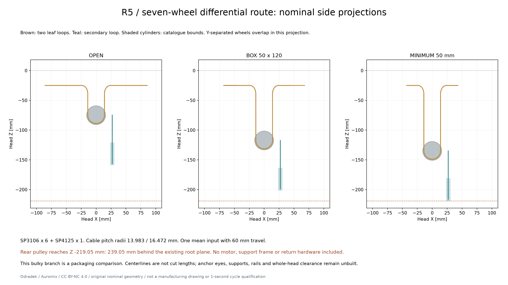

# R5-ROUTE01：两级差动的实际轮径索路包装

**本布置能建立恒定索长的单输入差动关系，但明显加深头部，不作为当前紧凑外观的定案。** 它把先前抽象的三动滑轮展开成四个固定转向轮、两个叶索动轮及一个二级动轮，使用[CABLE-HARDWARE01](hardware/r5-cable-hardware01.md)的真实目录轮径。最小50mm夹口时，最后滑轮到头坐标Z−219.05mm，即在现有根铰平面后方239.05mm；尚无电机、导轨、轮叉、回程机构与外壳。这个数值属于本次具体布置，不是所有差动机构的深度下限。



该包只有目录外包圆柱、索中心线和拉点标记。STEP中的细线不是钢索实体，端点小球不是可承载接头。本轮不声称已建立完整装配或可制造的传动。

## 几何与装配数量

叶索使用2037，名义直径0.9652mm；二级索2050，1.1938mm。轮的索中心线节半径取`(槽底直径+索径)/2`，得到13.9827和16.4719mm。这是名义刚性几何，不计槽接触变形、索压扁或原厂公差。

| 位置 | 型号／数量 | 本布置坐标与方向 |
|---|---|---|
| 四个固定90°转向轮 | SP3106 ×4 | 径向R33.757224，Z−38.9827；轮轴沿各瓣切向 |
| 上／下两个180°动轮 | SP3106 ×2 | X0、Y±13.9827，Z分别为zA/zB；轮轴+Y |
| 二级180°动轮 | SP4125 ×1 | X27、Y0、Z=zC；轮轴+X |
| 四个叶索拉点 | 未设计承载件 | `[R+30,0,−25]`经各瓣方位旋转，纯平移载体上的候选点 |
| 二级索两端 | 未设计轮叉 | `[27,±16.4719,zA/zB]`，需与上／下动轮载体连接 |

方位依次为UR45°、UL135°、LL225°、LR315°。固定轮内侧垂直索段的XY坐标为`[±13.9827,±13.9827]`，与两只叶索动轮的切点严格对齐。四次90°转向不是将不同方向的绳索直接穿过一个任意点。

二级索端和动轮向X偏27mm，以避开两只叶索轮的实体外包。偏置需要真正的导向轮叉承受力矩，不能用一条参考杆当成已经设计的支承。

## 恒索长、自由度与轮速

令四个根半径为R₁…R₄，均在31…91mm；上、下组平均为`yA=(R₁+R₂)/2`、`yB=(R₃+R₄)/2`，全体平均`u=ΣRᵢ/4`。本布置使用

\[
z_A=-75+y_A-91,\quad z_B=-75+y_B-91,\quad z_C=-140+u-91.
\]

一个叶索回路包含两段径向直线、两段竖直线、两个90°圆弧和一个180°圆弧。因此

\[
L_A=R_1+R_2+2(30-a)+2(z_f-z_A)+2\pi r_p,
\]

下回路相同。二级索为`L_S=zA+zB−2zC+πrS`。代入上述关系，两叶回路分别恒定为334.376047mm，二级为181.748000mm。**这些是从理想端轴点开始的中心线长度，不是下料长度**；绳眼曲线、回头尾、压接调整和装配余量没有纳入。

两个叶动轮、一个二级动轮共形成三条索长约束，保留一个主动平均输入和三个被动分配坐标。它允许四个R不同，不能把一个输入误称为机械同步。上组两瓣是相邻瓣，并非一对相对夹持面；50×120mm盒体采用R=`[31,66,31,66]`，上／下组平均都48.5mm。

无滑移且不计绳轮惯量时，固定轮角速率幅值为`|Ṙᵢ|/rₚ`；叶动轮角速率幅值为`|Ṙ₁−Ṙ₂|/(2rₚ)`、`|Ṙ₃−Ṙ₄|/(2rₚ)`；二级动轮为`|żA−żB|/(2rS)`。动轮平移速度不等于轮缘滚动速度。所有R相同时，动轮可以平移而不自转，固定轮仍在滚动。轮惯量和轴承摩擦尚未加入[被动运动研究](r5-passive01.md)。

## 真实轮径暴露的代价

旧暂定拉点`R+13`在本索路最小半径时，距固定轮切点只有10.242776mm，不足以容纳CABLE01所举22.112mm叶索绳眼轴到端套远端的空间示例。因此本比较移到`R+30`，剩下27.242776mm直线，扣除该示例后仅5.130776mm。此项只检查长度，没有实体端接、紧固、尾端、公差或疲劳证据，不能冻结拉耳尺寸。

二级动轮比两组名义中心滞后65mm。任意独立R使组间差最多60mm，因此最短二级直线为35mm；扣除28.676mm端部示例只剩6.324mm。较短的轴向布局需要重排端接和轮叉，不能简单删掉这段距离。

以叶索50N的条件例计算：每个90°固定轮承受70.711N合力，每个叶动轮承受100N，二级索100N，平均输入200N。由于二级拉点的X27mm和Y2.4892mm偏置，每个叶动轮的载体还必须平衡约2.71145N·m力矩。这里没有选定载体、导轨或把轴承目录径向容量当成轮叉资格。

新叶索拉点Z−25距根铰Z20还有45mm偏置，50N向内拉力对根铰参考点贡献局部+Y方向2.25N·m。它属于径向载体／导轨需要平衡的载荷，不能直接当成灯片根铰或原折叠凸轮上的力矩；实际支承反力要在导轨位置确定后重算。

这条索路至少需要七套轮轴/隔套/保持件和三个受导向的动轮组件，实际回位和失电保持另计。全部滑轮的目录质量尚缺，故没有用估计密度把它们伪装成最终整头质量。本路线的支承数量、深度与[CARRIER01](r5-carrier01.md)的256.53mm外包叠加，说明它仍需与紧凑外观重新权衡。

## 检查及其边界

在16个R超立方体顶点加5个命名姿态，检查441对轮外包、294组索管与非本回路轮、63对索管，均为正间隙；最小分别11.9603、10.5259、12.1692mm。索管检查以分段圆弧中心线到实体的距离减索半径及弦高误差，不把中心线本身零厚度当成安全间隙。

七个轮外包之间另有连续分离界：固定轮与叶动轮Z间隔≥4.2673mm，上下叶动轮Y间隔≥21.6154mm，二级与叶动轮X间隔≥7.5563mm，固定轮与二级Z间隔≥66.0923mm；固定轮两两不动，以实体距离核对。这些仅证明给定轮圆柱在连续R域分离。

[独立索路复核](../../engineering/r5_route01_review.py)从37个姿态的实际中心线点重建直段和圆弧长度，误差小于8.6×10⁻¹⁴mm；另用1000组任意瞬时速度重解三条索长约束、轮接触无滑动方程和虚功，核对轮速及偏置力矩。[复核结果](../../engineering/generated/r5-route01/independent-review.json)不重复实体碰撞，也不扩大上述连续证据范围。

**连续索路／原载体／完整头部没有被证明无碰撞。** 非本轮索管间隙仍为有限姿态检查；没有加入真实槽型、挡索件、绳眼与轮叉。与本回路所属轮的接触被显式排除，因为保守轮圆柱包含了未挖出的槽。任意独立R姿态也不代表[PASSIVE01](r5-passive01.md)已能驱动到那里。

## 文件与结论

[源程序](../../engineering/r5_route01.py)、[参数与结果](../../engineering/generated/r5-route01/study.json)、[逐项检查](../../engineering/generated/r5-route01/sample-checks.json)，以及[展开](../../engineering/generated/r5-route01/open.step)、[50×120盒体](../../engineering/generated/r5-route01/box_50x120.step)、[最小50mm夹口](../../engineering/generated/r5-route01/minimum_50mm.step)的STEP可复现本比较：

```sh
python engineering/r5_route01.py
python engineering/r5_route01_review.py
```

本阶段将差动代数转成了有真实轮径的索路，给出需新增的支承和具体体积代价；没有将它升级成选定传动。下一次紧凑方案比较应一起考虑四面贴合的必要性、正向同步与小行程顺应、轮叉／回位空间及真实夹持载荷，避免先用渲染藏住未容纳的机械件。
