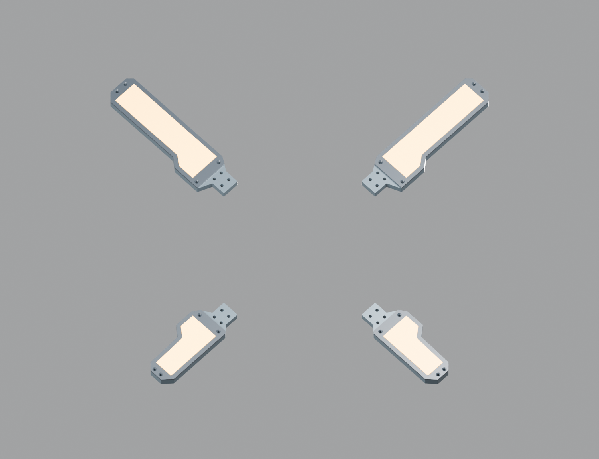
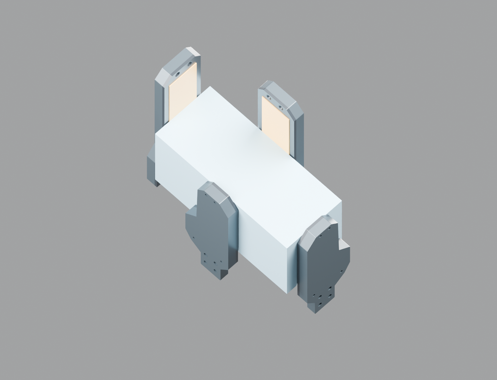

# R5-STAGE-BLENDER01：径向夹持与被动位移的原生模型

[下载Blender模型](../../engineering/generated/r5-stage-blender01/odradek-r5-fold-radial-candidate.blend)。本模型把 [FORM02](r5-petal-form02.md) 的28个真实CAD实体放在 [STAGE01](r5-stage01.md) 路径上，便于比较展开、平行夹持、圆柱和长方盒接触。**模型仅有灯片和示例物体，没有实际差动传动、导槽、载体、中心屏、相机、电机或线束。** 不把视觉上悬空的根部解释为已完成结构。



## 一个主动输入与三个被动参数

选择空对象 `MEAN_INPUT_AND_PASSIVE_OFFSETS`，在自定义属性中调整 `mean_radius_mm`。这是理想差动代数中的一个输入u；三个 `passive_UR_mm / passive_UL_mm / passive_LL_mm` 仅用于检查被动重新分配的状态，不是另外三台电机。第四个偏移自动取前三个负和：

```text
RUR=u+a, RUL=u+b, RLL=u+c, RLR=u−a−b−c
ΣRi=4u
每片角度沿用 STAGE01 的 q(Ri)
```

手动调整时必须让每个Ri都在31…91mm内。模型不会通过截断单片R来偷偷破坏平均值约束；角函数的端段钳位也不代表区间外新增了合格行程。无载三个偏移都为0仅是强制同步的评审姿态，被动差动实际运动还取决于摩擦、惯量、回位和接触。

| 状态 | u / mm | a,b,c / mm | UR/UL/LL/LR半径 / mm |
|---|---:|---|---|
| 展开 | 91 | 0,0,0 | 91/91/91/91 |
| 刚折到90° | 66 | 0,0,0 | 66/66/66/66 |
| Ø80圆柱 | 46 | 0,0,0 | 46/46/46/46 |
| 50×120长方盒 | 48.5 | −17.5,+17.5,−17.5 | 31/66/31/66 |
| 最小夹持开口50 | 31 | 0,0,0 | 31/31/31/31 |

最小开口不是已经完成的护罩全闭造型。这里没有动画时间或电机动力学，不证明1秒开合。示例物体位于头坐标Z55…115；需要查看时，在 `Example objects / Z55 to115 only` 集合打开对应物体的显示/渲染。保存默认状态为展开且两个示例物体隐藏。



## CAD对应与重开检查

28个网格逐件来自STEP，12个电子预留实体默认隐藏，仍可单独显示。其余16个实体是骨架、压圈、透明承力盖板和顺应皮层，发光材质只表达外观，不能当作已布置的LED或真实透光率。

五个状态共140次网格世界包围盒与独立变换的CAD比较，最大差约0.004224mm；原生角驱动最大差约4.38×10⁻⁸rad，平均半径约束误差小于0.000003mm。另对Ø80圆柱和50×120长方盒执行56次真实STEP/物体查询：灯片与物体零正体积交叠，四片皮层均接触，非皮层距离大于0.49mm。它只验证所列名义姿态，不验证软材受压、夹力或稳定性。

12条驱动均使用Blender原生简单表达式，不依赖Python驱动命名空间或帧回调；`pow()`用于多项式幂。[Blender官方驱动说明](https://docs.blender.org/manual/en/4.5/animation/drivers/drivers_panel.html#simple-expressions)解释了简单表达式的适用范围。交付文件另外以禁用自动Python执行的进程重新打开，重复五状态核对，记录于 [reopen-review.json](../../engineering/generated/r5-stage-blender01/reopen-review.json)。该检查不是物理仿真。

## 复建

先在CadQuery环境导出网格和CAD参照包围盒，再由Blender4.5LTS生成场景。缓存属于work，交付模型本身保存网格、原生驱动和材料，可独立打开：

```sh
../../work/r4-runtime/venv/bin/python engineering/r5_stage_blender01.py --prepare --mesh-json ../../work/r5-stage-blender01/mesh.json
../../work/r4-runtime/Blender.app/Contents/MacOS/Blender --background --python engineering/r5_stage_blender01.py -- --mesh-json ../../work/r5-stage-blender01/mesh.json
../../work/r4-runtime/Blender.app/Contents/MacOS/Blender --background --disable-autoexec engineering/generated/r5-stage-blender01/odradek-r5-fold-radial-candidate.blend --python engineering/r5_stage_blender01.py -- --mesh-json ../../work/r5-stage-blender01/mesh.json --review
```

以前的 [LINKAGE-BLENDER01](r5-linkage-blender01.md) 保留固定根轴/滑块候选，不被本文件覆盖。两者不应通过混用参考杆或质量拼成一套制造总装。
