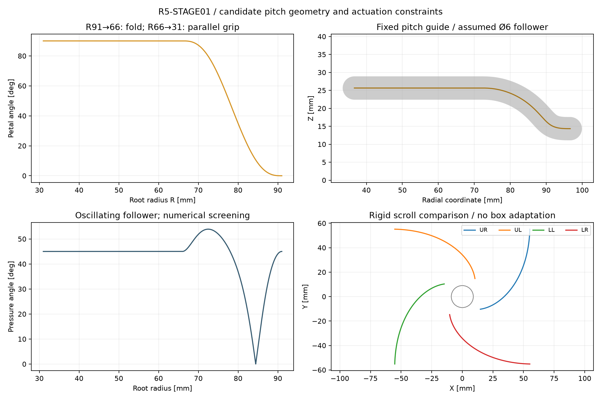
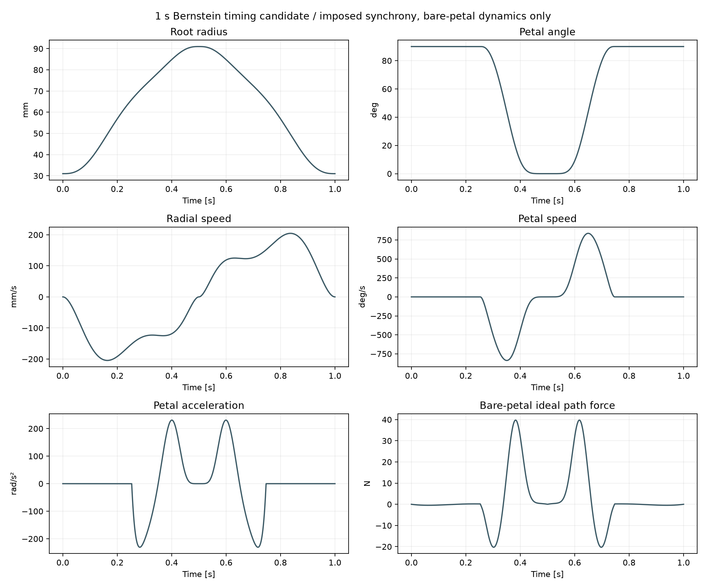

# R5-STAGE01：折叠后径向夹持与单电机差动候选

**候选运动路径已建立；驱动机构尚未实现。** 每片先从展开折到90°，再保持灯面朝内平移。继承 [FORM02](r5-petal-form02.md) 的实际分层灯片，并将裸片无干涉证据扩展到四片各自不同步的折叠/径向状态。一个电机仍可作为目标，但长方盒需要被动分配行程，不能用四个等位移的 mimic 命令代替机械差动。

本研究保留 [LINK01](r5-link01.md) 原方案，不将其丝杆、驱动、Blender或 [MOTION02](r5-motion02.md) 的转速与力矩结果移植过来。本文的导槽是新拓扑候选，现有 STEP 中尚无它的承力轴、滚子、导轨、差动、回位结构或紧固件。

## 每片只有一条名义路径

四根轴仍为45/135/225/315°、根部Z20，左右镜像。R从91收至31mm，折叠发生在R91…66，其后R66…31保持q90：

```text
t = clamp((91 − R)/25, 0, 1)
H(t) = 10t³ − 15t⁴ + 6t⁵
q(R) = (π/2) H(t)
Xhead = R er + 20 ez + x(cosq er + sinq ez)
        + y et + (z−3.5)(−sinq er + cosq ez)
```

R91是本轮为机构引入的候选参数，不是用户确认的整头尺寸。比FORM02外形展示R66增加25mm，展开宽度与中央结构包装必须重新核对。最小夹持开口仍为50mm；**不把该状态称作已完成的护罩式全闭外观**。

径向载体上安装灯片铰轴，灯片另带一个半径a=8mm、相位−45°的随动销。固定板上的名义销中心导槽为：

```text
C(R) = [R + a cos(q(R)−45°), 20 + a sin(q(R)−45°)]  // 径向-Z平面
```

载体平移R，导槽约束铰角q，因此每支路名义上只有一个自由度。实际q必须限定在0…90°并装在正确支路。以槽参数τ和实际q作未知，沿设计路径的约束雅可比行列式为 `a cos(q−45°)`，在本角域内为5.657…8mm/rad，无局部奇异；该角域内sin单调，也给出唯一支路。角域外存在其他装配支路，例如槽参数τ60、实际q180°、实际R71.3137也可落入同一个槽点。限位、装配防错与防脱结构不能省略。



名义Ø6滚子、6.3mm槽宽仅为尺寸假设，尚未选定轴承。它意味着单边法向间隙0.15mm，无预压时不会产生精确的q(R)；在最大压力角位置作一阶换算，对应约±1.824°角游隙，尚未包括滚子、销、轴承和槽的制造误差。12001点加局部极值细化得到最大压力角53.9076°、最小曲率半径5.45359mm；3.15mm轮廓偏置的局部正则裕量约0.4224。压力角已经偏大，滚子/轴承/导轨反力、摩擦与寿命必须核算，不能由“曲线无自交”推出可制造或可高速运行。

[DXF](../../engineering/generated/r5-stage01/fixed-fold-guide-pitch-reference.dxf) 和 [CSV](../../engineering/generated/r5-stage01/fixed-guide-pitch.csv) 是销中心轨迹及假定槽宽参考，图层与文字明确为REFERENCE ONLY。尚无公差、滚子型号、刀具补偿、真实槽端、承力板厚和3D装配，不可直接用作加工图。

## 四片不同步时的裸片分离

FORM02已证明28个新STEP分别包含在各自新轮廓凸柱内。所有轮廓点x≥0、z≤9.5，因此对任意q∈[0,90°]：

`ρ = R + x cosq − (z−3.5)sinq ≥ R−6`。

取每对片体的固定法向 `n=(erA−erB)/|erA−erB|`，其中 `n·erA>0`、`n·erB<0`，横向投影仍由真实轮廓Y极值界定。**只要四片各自R≥31，任意独立q∈[0,90°]的保守最小间隙仍为2.828427mm。** 因而允许一片仍在折叠、另一片已经径向夹持；不依赖严格同步。全部处于R≥66折叠区时，下界为52.325902mm。

这是裸灯片的名义连续几何证明，未扣公差/变形，未加入轴毂、滚子、螺钉、导槽板、滑块、线束或中央光学件。它也不证明控制器可以自由选择所有这些独立角度；真实机构仍约束q(R)。

折叠区每片对自身er的最小投影≥60mm。居中同轴直径≤120的圆柱、yaw45°且两边均≤120的长方盒，在每个er方向的支撑值≤60mm，因此这部分裸片折叠路径不先穿入物体。到q90后，有限灯面是否实际覆盖物体侧面仍按FORM02的Z55…115试验输入判断。120mm物体在R66即接触，不能据此宣称已具有自由插入余量；真实安装/接近路径另需检查。

## 严格同步为什么不适合所有盒体

四条刚性径向槽可以只由一块旋转盘驱动。比较路径取销半径r=R−13、盘角0…80°，`r=78 exp(−kθ)`、`k=ln(78/18)/(80°)`；四槽相差90°。名义滚子中心压力角约46.40°，加入假定槽半宽3.15和外壁3mm后的盘外径约168.3mm；这只是裸槽盘尺寸，不是完整头外径。

但是，50×120mm居中长方盒的两对侧面分别要求R31和R66，相差35mm。共同R命令不能让四片同时接触。若仅用假定10N/mm的小弹簧吸收这个差值，先接触的每片会额外增加350N；该数字是反例，不是允许夹力。2.45mm左右的短顺应行程无法处理35mm的形状差异。

因此卷盘保留为圆柱/对齐正方盒的刚性比较路线，不作为普通盒体的优选承诺。宽度范围不是足够的几何描述：偏心、非方形、瓶肩、软壳和不规则物体仍需要接触规划及物理试验。

## 单电机加被动差动的数学入口

下一步优先研究两级活动滑轮或等效机械差动。若直绳段平行、滑轮无摩擦无质量、绳长固定且始终张紧，可吸收固定布线路径常数后写成：

```text
R1 + R2 = 2 yA
R3 + R4 = 2 yB
yA + yB = 2 u
所以 R1 + R2 + R3 + R4 = 4 u
```

这里只有1个主动输入u，无额外接触约束时有3个被动自由度。接触逐步约束相应支路，其余支路仍可重新分配；四面全接触且理想刚体无顺应时，不能继续缩小u。它不同于四个严格等位移的URDF mimic。50×120盒的35mm是两对瓣的径向位置差；按本式相邻成组，各端相对平均值为±17.5mm，不能把35mm直接当某个活动滑轮中心的必要行程。无载时也不会自动同步：上下片质量、摩擦、回位弹簧和惯量不同，可能造成不同运动。四支路状态检测、被动均衡、行程限位和开回程必须实际设计。

理想静态、q90、重力沿头−Z、居中物体COM位于共同接触高度时，若各法向N相同、假定摩擦系数μ=0.4、重力载荷因子2，2kg物体要求：

`N = 2·2·9.80665/(4·0.4) = 24.516625N/瓣`。

理想差动输入力4N=98.0665N。若输入恰由4mm导程丝杆驱动，100%效率保持转矩为0.0624311Nm。这不包括回位力、摩擦、加速度、丝杆/电机惯量、实际接触高度偏差或失电保持；μ亦未测定。刚性卷盘在50/120宽度的同样理想场景则分别需要1.85379/5.45837Nm，不能与丝杆数值直接混为同一轴的转矩。

**小输入转矩不等于小内部载荷。** q90时，单片法向N作用在局部x65mm，单是法向分量就产生约1.594Nm的展开方向铰矩。a8mm、销相位45°、直槽法向沿Z时，该分量对应滚轮力约282N，尚未合入切向摩擦、片体重力与真实接触位置。单纯限制q≤90°的止挡不能承担朝q减小的展开反力；需要真实承载导槽，或另行设计可解锁的止回结构。Ø6滚子占位不能据空载运动学直接选用，真实静额定、销悬臂、外圈接触、滚道硬度和载体力流是下一轮选型输入。

尚未布置真实滑轮轴、绳端、卷绕、预紧/回位、断绳约束或行程余量；也未证明现有头壳能容纳它们。本文不采购新部件，保留现有3274候选，但不给它赋予新机构的额定能力。

## 1秒时序：先把非线性加速算清楚

用户要求“空载全闭→全开→全闭，完整往返不超过1秒”。本候选先在每半秒施加同一路径，测试50mm最小开口→全开→50mm最小开口；50mm端点未定义或满足最终全闭外观，因此不能据该时序宣称已经满足完整用户要求。**下表强制四片同步，只积分FORM02的235.907g已建材料；不是被动差动的动力学预测。**

| 指标 | 径向五次时间函数 | 重新分配时间的Bernstein候选 |
|---|---:|---:|
| 单向径向行程 | 60mm | 60mm |
| 峰径向速度 | 225.000mm/s | 204.689979mm/s |
| 峰径向加速度 | 1.385641m/s² | 2.000006m/s² |
| 峰灯片角速度 | 1220.048725°/s | 837.475068°/s |
| 峰灯片角加速度 | 614.644992rad/s² | 230.775876rad/s² |
| 裸片理想路径峰力 / RMS | 69.283792 / 21.732310N | 39.757852 / 13.053460N |
| 假设4mm导程的峰转速 | 3375.000rpm | 3070.349689rpm |
| 同假设下裸片理想峰转矩 | 0.0441074Nm | 0.0253106Nm |

新时序减轻了短折叠段的角加速集中，但角速度仍快。**两列都缺少滑块、凸轮、滑轮、线缆、丝杆、转子、摩擦与动态接触，不能当作完成1秒机械验证。** 也不代表允许持续1Hz运行。

Bernstein关闭半程速度为9次多项式，时间归一化τ=t/0.5，单位mm/s的10个控制系数为：`[0,0,378.998876,0,0,188.755374,387.828233,244.417517,0,0]`。系数总和1200，因此半秒积分恰为60mm，端点速度与加速度均为0；开启严格采用时间反演。系数来自有限采样的局部搜索，不是全局最优；40001点复算的峰加速度2.000006略高于搜索网格上的2，因此未声称全程≤2m/s²。

路径坐标s=91−R以米计，每片COM为c(s)，关于铰轴方向的COM惯量为Iyy：

```text
H(s) = Σ [m |dc/ds|² + Iyy (dq/ds)²]
F = H s¨ + 0.5 (dH/ds) s˙² + dU/ds
```

积分力功与动能/势能变化核对，Bernstein全程最大残差约7.32×10⁻⁹J。这个检查证明所写名义方程与积分自洽，不验证真实质量、绳索差动同步或摩擦模型。未将输入侧电机/丝杆等效惯量遗漏称为可忽略。



## 交付与下一项实物设计

[源脚本](../../engineering/r5_stage01.py)、[参数/结论/哈希](../../engineering/generated/r5-stage01/study.json)、[完整时序CSV](../../engineering/generated/r5-stage01/synchronous-bernstein-cycle.csv) 可复算。依赖NumPy、SciPy、Shapely、ezdxf、Matplotlib和冻结FORM02输出：

```sh
../../work/r4-runtime/venv/bin/python engineering/r5_stage01.py
../../work/r4-runtime/venv/bin/python engineering/r5_stage01_review.py
```

第二个脚本不导入主实现，分别用Beta积分/Bernstein原函数、3D COM有限差分和完整镜像旋转惯量的Newton–Euler虚功重建两种时序。最大路径力差小于0.00001N，并独立检查混合阶段投影界、导槽装配支路和差动约束秩；[复核结果](../../engineering/generated/r5-stage01/independent-review/review.json)保留输入哈希。复核还给出导槽中心线径向导数的解析下界0.333568，证明中心线单调，但不代替实体槽壁的公差/接触验证。

下一步先做单瓣真实径向载体、根轴与导槽的3D装配，然后验证差动布线与无载回程。实际机构加入后重做总装碰撞、力流、质量/惯量和轨迹；之后才能决定是否替代当前LINK01及其硬件。四瓣结构保持上长下短、左右对称与发光面夹持的方向不变，中央双相机与LED仍需与新载体共同装配检查。
