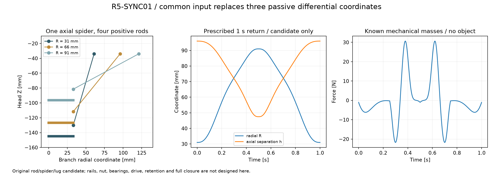

# R5-SYNC01：单输入同步连杆草案

按用户“先保存上传，不要搞得太复杂”要求，本版保存已有模型与计算，停止继续扩展。它是**机构候选草案**，尚未完成整头装配或制造审查。

一个轴向四臂滑架通过四根100mm等长连杆约束四个径向载体，同步驱动四瓣。没有三个独立的被动差动坐标，也不依赖回位弹簧实现同步。保留FORM02外形与STAGE01先折叠、后径向夹持的名义运动。

每支路外销轴中心为 `[R+30,0,−34] mm`，内销轴中心为 `[33,0,−34−h] mm`；整组按45°/135°/225°/315°布置。正向分支满足

`R = 3 + sqrt(100²−h²)`。

R31–91mm对应h96–47.49737mm，轴向行程48.50263mm。当前滑架中央孔只是预留，**不是实际丝杆螺母安装接口**；4mm导程与2:1传动仅用于估算，不是已装入的执行器。

保存内容：

- 原创连杆、四臂滑架、载体连接座及概念销轴STEP；3种无载几何样件STL。
- R31/R66/R91三个同步子装配STEP、连杆侧面DXF、两页名义尺寸审查PDF。
- 已知质量下的1秒指定轨迹、虚功/能量检查、8个离散姿态碰撞记录；新增件对旧载体/灯片和相机原创建包容体的这8组检查未见穿透。

当前空载数学模型轴向峰速约0.169m/s、峰加速度约2.931m/s²；假设4mm丝杆和2:1减速时电机峰速约5070rpm。没有加入电机、丝杆、销轴、导轨及支承的实际惯量、摩擦和热条件，因此不代表硬件已经实现1秒。50mm夹持开口也不等于最终全闭外观。

两瓣主夹持静力见[TWOCONTACT01](r5-twocontact01.md)。导槽和根轴的新载荷裕量不足尚未解决；滑架导向/防转、固定掌体、真正螺母接口、销轴保持、工作位锁止、相机线和失电保持均未完成。当前草案未做独立机构复核或PDF视觉审查，不据此加工带载金属样机。

[计算与边界记录](../../engineering/generated/r5-sync01/study.json) · [名义尺寸PDF](../../engineering/generated/r5-sync01/R5-SYNC01-nominal-review-dimensions.pdf) · [生成脚本](../../engineering/r5_sync01.py)

SPDX-License-Identifier: CC-BY-NC-4.0。Odradek — Auromix contributors。
