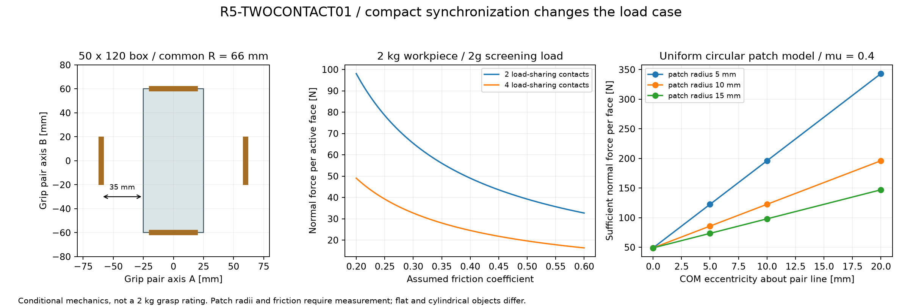

# R5-TWOCONTACT01：同步四瓣中的两瓣主夹持

用户接受长方盒由一对相对灯片主夹持，另一对同步靠拢但不必接触，优先紧凑可靠。这取消了“任意矩形四面都贴合”对差动机构的需求，**没有取消2kg净工件目标**。本研究把同步几何、主接触夹力和根支承反力重新关联。它是选型输入，不是2kg抓持资格。

## 同步时先夹住较大尺寸

保留FORM02/STAGE01的几何：四片折至90°后共同径向移动，发光夹持面距中心 `R−6 mm`。对以两对夹持轴为长宽方向、居中对齐的盒体，第一次接触出现在

`R = max(W_A,W_B)/2 + 6 mm`。

例如50×120mm盒体在 **R66** 由120mm方向的相对两片接触，另两片与50mm宽两侧各留35mm。不能把它画成R31时夹住50mm方向：那样另一对已侵入120mm盒体。方盒或居中圆柱可能四片同时触及，真实误差与刚度不保证平均分担。偏转盒体、任意插入路径和实际物体全包络需另行验证。

## 每片法向力和支承变化

工程初筛取净工件 `m=2kg`、重力载荷系数 `k=2`、假设摩擦 `μ=0.4`，主接触数 `n=2`：

`N = kmg/(nμ) = 49.03325 N/片`，每片切向反力为19.61330N。四片均分时24.516625N不能直接沿用。

下表保留CARRIER01的8mm曲柄、滚轮Y32mm、根轴承Y±16mm，接触合力位于瓣局部X65/Y0，夹持面距根轴法线6mm。使用FORM02与CARRIER01已建转动件质量/质心，而非仅裸瓣；左右瓣只镜像瓣体，内部曲柄仍为相同手性。头部重力方向为−Z，工件用2倍重力、已建转动件自重用1倍。它不是任意重力方向上界。

| 条件结果 | 上瓣/下瓣范围 | 含义 |
|---|---:|---|
| 根部所需抵抗的展开力矩 | 3.07043–3.07061Nm | 90°最大折叠止挡不能承担相反方向的展开反力 |
| CFS4导槽法向力 | 542.780–542.813N | 包含上述切向反力与已知转动件自重；单纯49N法向项约563N |
| 靠滚轮侧根轴承合反力 | 803.985–804.185N | 外悬滚轮导致明显放大 |
| 607/8-2Z目录C0/最大反力 | 最小1.18132 | 不足以继承之前条件下的静态裕量结论 |
| CFS4目录C0/载荷 | 最小2.06333 | 不是整套机构安全系数 |
| 目录平轨40HRC容量/载荷 | 最小1.47196 | 实际弯轨、宽度/材料/接触均未取得资格 |

脚本逐一重建三维力与力矩平衡，96组情景比较2/4接触、μ0.2/0.3/0.4/0.6、X35/65/95。X95是敏感性点，不是已验证的下瓣有效接触面。根轴、曲柄、短轴销和导槽必须按新载荷重选或重构；不能因选择了更简单的同步传动而沿用旧夹力结论。

## 不滑落与不转动是两个条件

两个理想摩擦点的抓取矩阵秩为5，无法抵抗绕两接触点连线的纯力矩。真实灯面具有接触面积，但可用抗扭依赖软层压力分布、物体曲率、摩擦与偏心，不能把整块发光面积都当作受压面。瓶罐与平盒的接触区域不同。

为量化所需余量，另设两个完整贴合、均匀压力的圆斑，半径a。用“均匀平移摩擦场＋周向摩擦场”的构造，得到一个保守的**充分条件**，不是最优摩擦极限：

`μN ≥ F_t + 3|M_n|/(4a)`。

这里每片承担切向力F_t，M_n是两片合计需要抵抗的绕夹持连线力矩。两个圆斑的周向平均力臂为2a/3，平移和抗扭共享同一摩擦预算。若法向力只取49.033N，两倍重力的平移已经用完该预算。

例如a=10mm、偏心10mm、仍按2倍重力，充分条件要求每片 **122.583N**。但实际下瓣X65/Y0处的半径10mm圆斑并不完全落在顶层皮面内（0.05mm薄片见证有0.494062mm³超出）；它只能作为假设曲线。半径8mm样片另外做实体包含检查。即使几何包含，也不证明该面积能形成均匀接触压力，更不证明瓶罐具有这种接触斑。

下一步同步机构采用一个共同输入；夹力设计覆盖一对主要接触。接触层的小范围顺应负责误差和限力，不能再用多级差动掩盖抓持受力。相机观察不能代替接触/滑移检测，真实摩擦与受压面积仍需在打印台架上测量。

## 复现和边界

运行 `python engineering/r5_twocontact01.py`；[计算结果](../../engineering/generated/r5-twocontact01/study.json)、[96组条件](../../engineering/generated/r5-twocontact01/conditional-loads.csv)保存输入哈希。脚本通过六维力/矩残差、独立点接触矩阵和圆斑极坐标积分检查；材料、接触形状与摩擦仍是条件模型。

继承的目录来源见[CAM-HARDWARE01](hardware/r5-cam-hardware01.md)，实际质量来源见[CARRIER01](r5-carrier01.md)。本研究没有选出新电机、重新制造轴承座或证明任意2kg物体可抓；完整同步运动、失电保持、近物体减速与全闭外观仍需继续完成。
