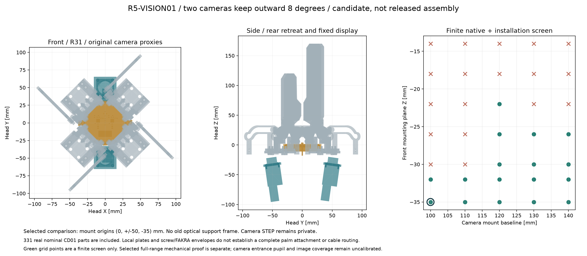
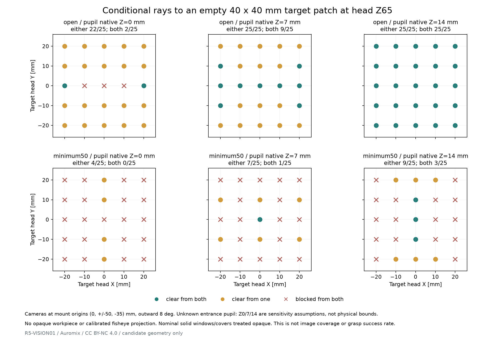

# R5-VISION01：径向载体下的双鱼眼和中央显示位置

这是固定光学模块的独立包装比较，使用冻结的 FORM02、CARRIER01 和 CD-PCB01。原双相机前安装面在 `X0、Y±50、Z−14 mm`，与新载体和固定导槽发生真实实体干涉，不能继承旧 P16 光学支架。相机仍上下外倾各 8°，正面中心保持 X0；中央显示继续使用原有圆形 LED 板、杯、压框、窗口和实际背面器件。

本研究优先保留 100 mm 上下安装基线，将两相机前安装面后退至 `Z−35 mm`，比旧位置后退 21 mm。这是待整合的几何候选。独立前安装板和紧固件规划不等于已经完成与新掌体的承载连接。

最新需求允许盒体仅一对相对瓣主夹持，其余同步但不必接触，优先紧凑可靠。本报告完成的是已有冻结径向载体的光学比较；新的正向同步机构和安装结构需另外核对，不能自动继承这里的结论。



## 坐标与真实组件

头坐标 +Z 指向工件，根铰平面 Z20。相机厂商坐标的前安装面是 z0，变换为 `Rx(−sign×8°)` 后平移 `[0,sign×Y,Z]`；上相机 sign=+1。这里的 Z 不指镜头最前面，也不指旧摘要中的相机长度。

原厂 ZED X One S Fisheye STEP 共 14 个实体。与原 [P16-CARRIER 来源](sources/p16-carrier.json)一致，排除序号 7 的 Image plane 和序号 8 的 Simple FOV，只检验 12 个物理实体；其原生完整包络约 25×25×47.462 mm，包含后部 FAKRA 公头。原厂 STEP 保留在私有 work 缓存，公开 STEP 只包含原创保守包络。相机型号与配对主机沿用 [光学台架](hardware/optical-bench-build.md)，本研究没有重新验证软件或线缆链。

中央模块保留 **331 个名义对象**：既有安装件和板轮廓、285 个 LED 包络，以及32个独立背面器件实际最大封装包络。第33个背面件 GH12 使用已有配对预留，不再重复计数。背面器件使用 `mcad_material_envelope`，没有把焊盘和 XY 规划余量当成同高实体。旧 `CD01-optical-frame` 被排除；杯两侧 M2 接口和原紧固件仍待新的安装结构承接。

为连续运动证明，程序先逐个确认这331个对象均位于原创建的完整显示包容体内：包括 Ø64 杯外包、X±35.25 mm 安装耳和后伸紧固件。随后使用这个更保守的完整包容体做碰撞检查。Ø60 量规没有被当作显示模块本体。

相机安装规划包括32×30×4 mm独立前板、Ø20.5镜头通孔、21 mm方形孔距的4个M2通孔和头部避让。M2×6只按原名义包络放置，穿入相机4 mm、板内2 mm，不是本轮确定的紧固件/拧紧规范。后部 FAKRA 保留整个26.2 mm插壳长度，仍未闭合配对基准、工具、线弯和应变释放。

## 有限位置比较

位置筛选为 `Y=50/55/60/65/70 mm` 与前安装面 `Z=−14/−18/−22/−26/−30/−32/−35 mm` 的35组组合。每组分别检查真实相机、原创保守体、前板、螺钉规划和插壳预留，对四个固定导槽及R31的四个底脚。该筛选的绿点只表示这组有限对象没有干涉，不能替代全运动证明。

向外移动相机不是自动可行：Y65、Z−18的相机保守体可避开导槽，但其前板仍与导槽相交；Y70、Z−18同样受前板限制。Y60、Z−22即使无实体交叠，名义最小距离也只有约0.054 mm，不足以充当装配余量。

旧位置的真实物理相机与UR/LL固定导槽逐实体相交体积和为158.461922／159.135932 mm³；与最小R31的四个载体底脚各约0.258997 mm³。程序逐对物理solid求交后累加，**不是多实体并集的重叠体积**。一次对厂家compound整体做Boolean曾漏掉一个碰撞分量，因此不作为该碰撞量的依据。

| 比较位置 | 安装基线／相对旧位后退 | 光学相机组件对原机构的连续间隙下界 | 相机组件对完整显示包容体距离 |
|---|---|---|---|
| Y50，Z−35 | 100 mm／21 mm | 4.843566 mm | 14.512252 mm |
| Y60，Z−30 | 120 mm／16 mm | 0.939358 mm | 18.854712 mm |
| Y65，Z−26 | 130 mm／12 mm | 0.939358 mm | 20.734422 mm |

表内下界包括安装板、螺钉与FAKRA预留，但不包括尚未设计的承架。0.939358 mm是区间算法的保守下界，不是声称最小实体距离正好等于它。将相机上下拉开可减少后退，但会扩大光学组件的正面高度；本轮以100 mm基线的位置作紧凑宽度比较，没有宣布唯一选型。

最终精确值见[35组位置筛选](../../engineering/generated/r5-vision01/finite-position-screen.json)。没有把原厂无受控公差的几何间隙解释为制造容差合格。

## 连续域证明方法

每个瓣的R可独立处于31…91 mm。转动零件和 FORM02 按完整q0…90°计算，即使q未遵守既有q(R)，仍采用同一个更宽的证明域：其源包围盒各顶点的高度为 `20+x sin(q)+z cos(q)`。检查端点与驻点即可获得解析Z下界；若高于固定光学对象最高点，整个角域都分离。上下左右片的实际源轮廓分别读取，没有镜像电子板或借用旧P16运动证书。

不转动的载体和轴承仅沿单位径向平移。因此R中点的真实实体距离为d，区间宽度ΔR时，`d−ΔR/2`是整段的距离下界。程序先用两端包围盒组成的扫掠外包快速排除，再按需二分并使用真实BREP距离；首个不能证明的区间会保留为失败，不能将采样全绿改名为连续通过。固定导槽不运动，直接计算实体距离。

证明还覆盖相机各组件与完整中央模块、上下相机之间。它不包含新掌体、导轨支承、差动轮叉、控制器、线束、保护罩或工具空间。这些对象未建模，不能继承光学模块的间隙结果。

三组比较均通过720组非转动件检查和36组转动件Z分离界。完整中央显示包容体对载体的保守连续下界为0.1328125 mm；转动件对全部光学对象的Z分离下界为3.149763 mm。前者只是目前区间划分获得的名义数学下界，未减去制造、安装、变形或热胀误差，不足以决定装配公差。

## 夹取区域视线的条件检查

机械分离不会自动保证相机能看到夹口。显示模块留在前方、相机后退以后，中央屏会遮挡一部分靠近根部的射线。程序对展开、折叠、最小50 mm夹口及两个盒体方向分别发出射线，目标是头坐标Z20/40/65/100 mm上的40×40 mm空区域，每层5×5点；没有加入实际不透明工件。

两个`box50x120/box120x50`案例沿用历史差动的独立R组合`[31,66,31,66]`及其反向，不代表当前正向同步路线。同步四瓣遇到50×120 mm盒体时会先在R66接触120 mm方向；另一对不会继续自行缩到R31。已有`folded=[66,66,66,66]`、全q90案例可作为这个同步几何的空场观察比较，不能将R31全围拢的遮挡直接归给它。

厂家资料未给出当前镜头的入口瞳位置。原生z0、7、14 mm只是三组显式敏感性假设，**不是真实瞳位置的保证上下界**。结果记录每点遮挡来源、相对光轴的水平/竖直角度，以及单相机/两相机的几何可见数。它没有使用未标定的鱼眼投影，也不声称覆盖率、立体重叠或抓取成功率。透明盖片在本次纯实体射线模型中保守视为遮挡体。

数据中的`clear`仅表示这条假设射线未碰模型，不表示它落在真实镜头、传感器裁切和校正后的有效成像域内。



Z65目标层的结果如下。分母25只是离散空区域目标点数。

| 入口瞳原生z假设 | 展开：至少一机／双机 | R31全围拢：至少一机／双机 |
|---|---|---|
| 0 mm | 22／2 | 4／0 |
| 7 mm | 25／9 | 7／1 |
| 14 mm | 25／25 | 9／3 |

R66全q90的结果与表中展开列相同：三个瞳假设分别为22／2、25／9、25／25。这里仍然未加入会改变遮挡的真实盒体。

因此不能称后退位置已经解决近夹口观察。原生z14假设下，Z20目标层仅有10／25点在展开时至少被一机看到；相机后退后的中央屏遮挡和围拢瓣体遮挡是不同限制。完整[逐射线结果](../../engineering/generated/r5-vision01/sightline-screen.json)保留了它们的首次命中对象，没有把这些空场点推算成真实盒体表面的可见百分比。

前安装板向新承架延伸、后端电缆出口和照明眩光都会改变结果。下一步应以实物光学台架标定入口瞳附近的遮挡掩膜，并用50–120 mm实际盒体/瓶罐检查接触前与接触后的图像。

## 复现与边界

```sh
python engineering/r5_vision01.py
python engineering/generated/r5-vision01/draw_sightlines.py
python engineering/generated/r5-vision01/delivery_check.py --refresh
```

默认从项目外的 work/p16-carrier-reference 读取私有厂商STEP，也可用 `--native-camera /path/to/file.step` 明确指定；程序校验其SHA256。可分别运行 `--phase geometry` 和 `--phase optics`，但后者依赖前者的当前生成结果。

对原交付文件只运行 `python engineering/generated/r5-vision01/delivery_check.py`，核对冻结哈希和记录。`--refresh`用于明确重生成后的新文件清单；它先检查源哈希、记录逻辑和证明条件，再重新锁定文件，不等同于实物测试。STEP时间戳和SVG内部标识可能随重生成变化，未承诺逐字节相同回放。

本阶段没有修改 FORM02、CARRIER01、CD-PCB01 或旧光学结构，不是整头装配或金属制造放行。核心交付是明确的新相机安装面位置、完整显示实物包络、有限候选的失败证据和对应的连续机械分离边界。

可审查[源程序](../../engineering/r5_vision01.py)、[完整结果](../../engineering/generated/r5-vision01/study.json)、[三组连续证明](../../engineering/generated/r5-vision01/mechanical-certificates.json)、[固定光学件原创STEP](../../engineering/generated/r5-vision01/fixed-optics-original.step)及[R31装配比较原创STEP](../../engineering/generated/r5-vision01/candidate-original-envelopes.step)。两份STEP均使用原创相机包络，未嵌入厂家STEP。
