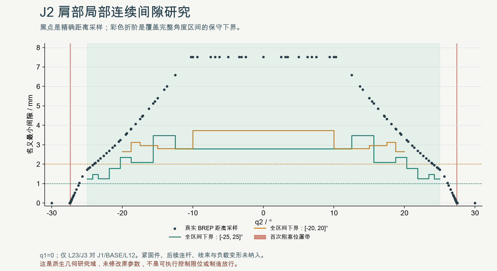

# 现状肩部派生几何域：SHOULDER-DOMAIN01

SPDX-License-Identifier: CC-BY-NC-4.0
Required Notice: Odradek — Auromix contributors (https://github.com/Auromix/odradek)

现状肩部可证明的局部派生研究域为 **q2±25°，完整区间至少1mm名义间隙**；更保守的±20°有至少2mm名义间隙。这里保留现有J1、J2原点及全部历史连接件，不修改baseline。原baseline的q2±90°只是设计研究范围，并非已经核实的厂商机械限位；派生几何域也不是未来执行限位。

- [完整样本、连续区间证与来源hash](../../engineering/generated/shoulder-domain-01/study.json)
- [检查脚本](../../engineering/studies/shoulder_domain.py)
- [图表脚本](../../engineering/studies/render_shoulder_domain.py)
- [连续间隙图](../../engineering/generated/shoulder-domain-01/shoulder-domain.png)
- [独立数值复核](../../engineering/generated/shoulder-domain-01/qa.json)
- [现状整臂离散碰撞记录](integrated-collision-study.md)

## 范围

固定集合为真实J1、BASE的8个原创件及L12三个原创件；移动集合为L23三个原创件与真实J3，以世界 `[0,0,170] / +Y` 旋转。q1固定0°。移动集合都在J3转轴之前，故这几个壳体/连接件的位置不由q3改变；这不意味着L34及后续结构在任意q3下也安全。

J2安装接触是独立例外，先作连续证明：将上述移动集合的所有solid包含在绕J2轴不变的R85包络中，轴向Y0～110；Y0～2.5处挖空R34.8。该包络对真实J2逐solid无交叠，才把该预期输出接触从最小间隙计算中分离。没有仅因“相邻关节”就忽略接触或碰撞。

本研究未加入L12/L23全部紧固件、桌面实体、后续连杆/头部、工件、内走线、公差及载荷变形。OEM内部转子和有效螺纹仍未识别。它是局部名义几何域，不是整个机械臂的可执行控制限制或制造许可。

## 真实冲突与离散距离

±30°时，L23输出板已与L12输出板相交：正向20.809022mm³、负向20.264771mm³。±65°都出现三对肩部冲突，故把历史reach简单改成负角度不能解决。

| q2 | 最小真实BREP表面距离 mm | 最近对象 |
|---:|---:|---|
| −25° | 1.723346 | J3 ↔ L12输出板 |
| −20° | 3.353530 | J3 ↔ L12输出板 |
| 0° | 7.515637 | L23输出板 ↔ J1 |
| +20° | 3.353530 | J3 ↔ L12输出板 |
| +25° | 1.723346 | J3 ↔ L12输出板 |

距离是名义CAD计算结果，不是量具测量或制造公差。正负向总体接近，但真实原厂细节/原创孔系存在差异，算法分别计算两侧，没有默认镜像相等。

## 连续区间证明

移动集合各实体的包围盒角点给出到J2轴的半径上界 **R=86.556340034 mm**。对区间中点m，使用真实BREP距离d(m)以及逐solid Boolean检查。任意点从m旋转到θ的位移不超过 `2R sin(|θ−m|/2) ≤ R|θ−m|`；这里角度以弧度计。

因此，对闭区间[a,b]中的所有角度，集合间距离满足：

`d(θ) ≥ d((a+b)/2) − R·(b−a)/2`。

若右侧大于所要求间隙并额外留1e−6mm数值阈值，则整个区间通过；否则分成两半继续精确查询。最终JSON保存每个闭区间叶节点的中点距离、运动位移上界和连续间隙下界。叶区间无缝覆盖目标域。这个方法不把离散点间的插值曲线当成证据。

从25°无碰点到30°有碰点分别二分正、负侧局部过渡。局部二分本身不证明之前没有其他阻塞；脚本另把区间连续扩展到自由端点内侧0.05°，要求至少0.01mm名义距离，然后才用该连续自由域端点与有接触/交叠的端点夹住“从零位出发首次阻塞”的位置。0.01mm研究余量不能用于实际加工或运行。

## 最终连续结果

| 完整闭区间 | 分区叶数 | 计算得到的最小连续下界 |
|---|---:|---:|
| [−25°,25°] | 18 | 1.245169mm（满足所设1mm） |
| [−20°,20°] | 12 | 2.642919mm（满足所设2mm） |
| [−27.3694336°,27.3694336°] | 26 | 0.020242mm（仅边界研究） |

共129个真实距离样本。正负向从零位出发的首次阻塞角度模均位于 **[27.3694336°,27.421875°]**：前者以内有完整连续自由域证，后者为实际接触/交叠见证。更窄的局部二分过渡为27.4194336°（距离0.0018456mm）至27.421875°（距离0）；不把这个局部夹逼单独冒充更窄的全局首次接触证明。

## 派生研究域及后续使用

候选派生域为 **q2∈[−25°,25°]**，按完整区间至少1mm名义间隙验证；另保留 **[−20°,20°]** 的至少2mm名义间隙对照。最终机器可读叶区间数据是该结论的依据。尚未修改baseline参数、历史CAD、控制器限位或软件轨迹。

约1mm名义几何间隙仍需扣除制造装配误差、关节偏摆、背隙、受载挠度与线束包络。该研究域适合后续无载装配/规划研究，不能直接作为带载运行许可。整臂端点和路径须重新检查，已验证的inspect离散姿态也不能代替其进入路径。

另行研究抬高肩轴的结构候选时，应与本现状证据并列比较，不覆盖本报告；更大几何行程须同时检查真实叉架、紧固件、装入顺序、关节内线缆与载荷变化。

复现：给`engineering/studies/shoulder_domain.py`传入与整臂筛查相同的四个`--model ID=/private/vendor.step`参数。原厂输入hash自动校验，公开输出不复制原厂BREP。图表脚本读取最终JSON；图中的黑点仅是样本，连续证来自有明确下界的区间分区。
