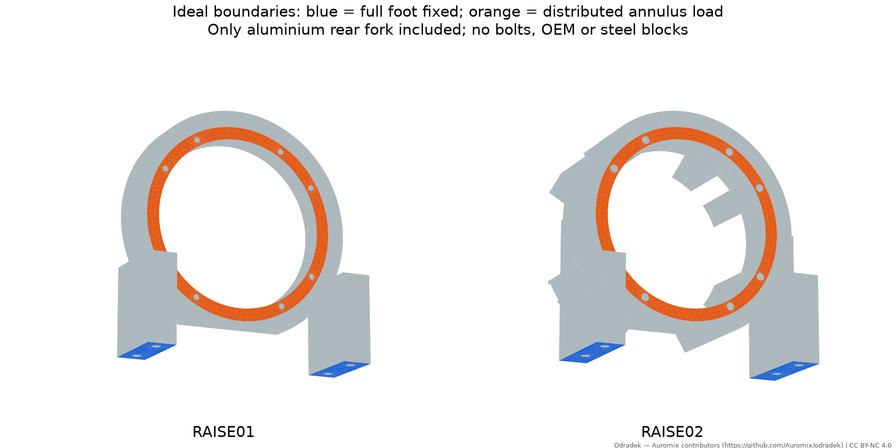
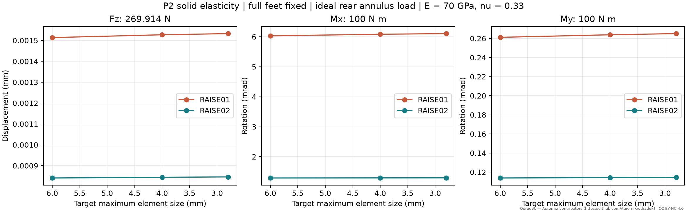
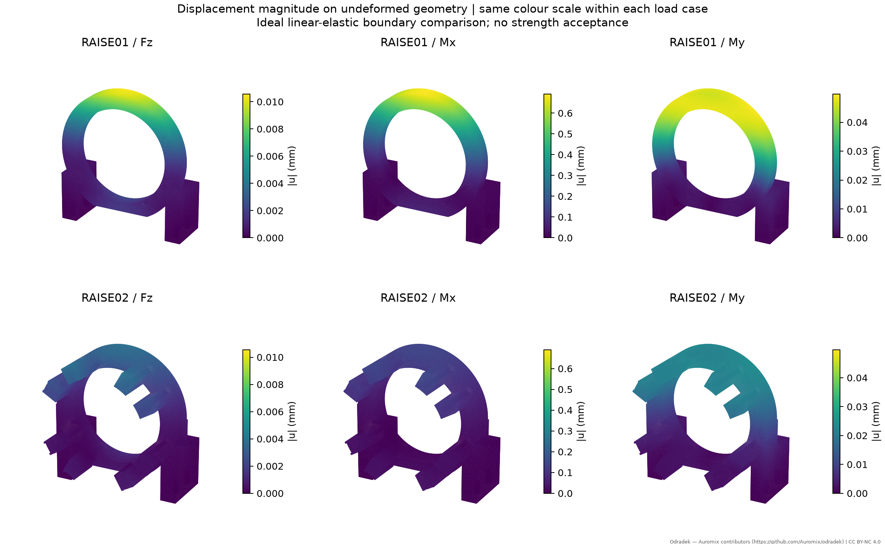

<!-- SPDX-License-Identifier: CC-BY-NC-4.0 -->
<!-- Required Notice: Odradek — Auromix contributors (https://github.com/Auromix/odradek) -->
# SHOULDER-FEA01：抬肩后叉的理想边界实体刚度比较

状态：READY，独立线弹性研究；数值与文件检查完成。没有更改 RAISE01、RAISE02、总装基线或其制造状态。

本研究比较两版真实原创铝后叉的几何刚度。它不包含关节内部、前压环、输出底板、钢螺纹块、螺钉、预紧、接触、摩擦或装配误差；不能据此声明 2 kg 负载合格、疲劳寿命或制造放行。尤其是面上法向拉力，是本次理想分布力矩的数学边界，真实非粘接接触无法传递它，实际系统必须由螺栓和接触共同闭合力流。

## 输入、坐标与材料

只读 `shoulder-raise-01/part-placements.json` 和 `shoulder-raise02/part-placements.json` 中的 rear_fork，并逐一核对原 STEP SHA-256。01 的局部 STEP 按其矩阵平移，02 的 STEP 已是世界零位；没有重复变换。两个后叉均是单一有效实体，足面世界 Z=127.2 mm，J2 轴 Z=205 mm，实际跨度 **77.8 mm**。衍生世界坐标 STEP 只含原创几何，不含供应商 CAD。

名义材料统一取各向同性 E=70,000 MPa、ν=0.33，以隔离几何与边界差异。密度仅沿用名义 CAD 质量账；静力方程不加重力体力。这里不使用任何未知厚坯的屈服保证值，也不将材料名称等同于供货保证。厚板订料、热处理/状态与材质证书由独立材料补充研究处理。

Fz=269.9137325096238 N 取自 STRENGTH01 的 expanded_force_N，只作为同工况线性灵敏度输入；原值包含 1.5 研究乘数与未计量质量上界，不能解释为认证安全系数。本研究取 +Z 正向比较，线性反向载荷的位移也反向。Mx=My=100 N·m 为两个独立标准化工况；三者分别求解，并非同时施加的某个实测工况或额定负载。

## 可复核的边界

主比较固定后叉全部底足面上的三向位移。01 与 02 的面积不同，因此不能把主比较收益全归因于截面。

载荷区为后法兰世界 Y=−45.7 mm、中心 (0,−45.7,205) 的 **R47.7…54.7 mm 环面，扣去原固定孔位置的八个 Ø4.5 mm 圆**，CAD 面积 2124.659112 mm²。此区在 OCC 实体表面 imprint 后才网格化，保持体积不变；不是按三角形中心粗选一圈。其面积不等于先前 OEM 实际接触求交的 1957.714878 mm²，不声称 R64 整环贴合原厂法兰。

另做一档相同支承区域的敏感性：四个中心 (±57,−52)、(±57,−26)，Z=127.2 mm，外 R8、内 R3.3 的环面，共 **667.399943 mm²**。它们对应现有输出底板四支柱的名义接触投影，分别 imprint 到两版底足，只固定这四个区域。该对照同样是完全粘结式的位移约束；没有单边接触、分离、滑移或螺栓弹性，且一档结果不冒称单独完成网格收敛。

分布载荷不使用单节点集中力。设载荷面面积 A、面积中心 c、r=x−c，Q=∫rrᵀdA，J=tr(Q)I−Q，给定关于 o=(0,−45.7,205) 的力 F 和力矩 M，则：

```
t(x) = F/A + β × r
β = J⁻¹ [M + (o−c) × F]
```

在每个实际离散载荷面上积分求 A、c、Q，并以 P2 形函数装配一致节点载荷。独立重新累加节点力与 r×f，验证目标六分量合力/矩。输出的功共轭位移/转角为 `fᵀu / F` 或 `fᵀu / M`，避免把任意节点位移叫作整体转角。三工况还构造同一广义柔度矩阵检查 Maxwell–Betti 互易性及正能量。

## 求解链与网格边界

使用 Gmsh 4.15.2 从 STEP 建立四面体体网格，scikit-fem 12.0.2 装配 P2 十节点位移场，SciPy 1.18.1 与 PyAMG 5.3.0 的六刚体模态预条件 CG 求解；小基准用 SuperLU。几何映射保持直边一次四面体，**不是曲边 P2 几何**，所以 CAD 体积/载荷面积偏差要随网格一并报告。刚度积分为四阶；报告的 von Mises 是积分点采样值，单元平均使用该数值积分规则，不是严格应力上界。

先完成两项独立验证：

- 仿射应变 patch：对 10×8×6 mm 体施加 εxx=0.001、εyy=εzz=−νεxx 的边界位移，求解内部自由度；核对精确位移、单轴应力和能量，并以 m/Pa 单位独立重装配检查刚度缩放。
- 100×10×10 mm 悬臂：足端固支、末面均布总力 100 N，P2 三档体网格；与 Euler–Bernoulli/Timoshenko 参考比较。梁公式不含完整三维夹持端效应，约 1% 差异不冒称精确三维误差。

实际后叉主比较采用最大网格尺度 6、4、2.8 mm，曲率约束和小孔/圆角会产生更小单元。每网格检查所有线性 Jacobian 为正、体积误差、mean-ratio 质量统计、刚度矩阵对称、自由度残差、完整反力/力矩、应变能与外功。P2 改善 P1 偏硬问题，但仍以连续两档响应变化 <2% 为本次声明的工程收敛判据，不能替代严格误差估计。

## 结果

<!-- RESULTS_START -->
主比较的六个响应均满足本次最后两档变化 <2% 的判据，最大变化 **0.459%**。相同四足面的单档敏感性仍保留明显改型收益，说明主结果并非仅由 02 增大的全足固定面积造成；它不能单独量化真实螺栓接触边界。

| 版本 | 网格上限 mm | 四面体 | P2 DOF | CAD 体积偏差 | Fz 位移 mm | Mx 转角 mrad | My 转角 mrad |
|---|---:|---:|---:|---:|---:|---:|---:|
| 01 | 6 | 37,004 | 190,779 | 0.0749% | 0.001513479 | 6.031427 | 0.261153 |
| 01 | 4 | 50,643 | 255,351 | 0.0446% | 0.001527043 | 6.084568 | 0.263834 |
| 01 | 2.8 | 76,779 | 376,584 | 0.0350% | 0.001532542 | 6.105630 | 0.265044 |
| 02 | 6 | 147,775 | 730,161 | 0.0978% | 0.000841157 | 1.291027 | 0.113850 |
| 02 | 4 | 231,614 | 1,111,665 | 0.0825% | 0.000844503 | 1.294171 | 0.114288 |
| 02 | 2.8 | 336,917 | 1,587,459 | 0.0704% | 0.000846361 | 1.296146 | 0.114483 |

最细档 02 / 01 响应比依次为 0.552260, 0.212287, 0.431939；对应竖向、绕 X、绕 Y 刚度约提高到 **1.81、4.71、2.32 倍**。这里只比较这三种声明的理想载荷模式，不是整个机械臂刚度。

| 同四足面，h6 单档 | 01 响应 | 02 响应 | 02 / 01 | 02 相对其全足固定增幅 |
|---|---:|---:|---:|---:|
| Fz (mm) | 0.001529341 | 0.000870291 | 0.569063 | 3.464% |
| Mx (mrad) | 6.034262349 | 1.340217228 | 0.222101 | 3.810% |
| My (mrad) | 0.262687614 | 0.122200826 | 0.465194 | 7.335% |

全足 CAD 固定面积分别为 1265.460184 / 1575.860184 mm²。同四足 CAD 面积均为 667.399943 mm²，离散面积分别为 667.401634 / 667.401634 mm²，均约差 0.000253%。同足面的三个响应降幅分别为 43.09%、77.79%、53.48%；全足约束会高估实际连接刚度，不能直接用于整臂末端定位误差承诺。

八个网格、24 个载荷解的最大反力不平衡 6.922e-09 N，最大力矩不平衡 4.466e-07 N·mm，最大能量相对误差 1.070e-11。所有正 Jacobian，最小 mean-ratio 0.075431；全部体网格保持单连通，导出二次节点中点误差小于 2e−15 mm。所有条件与逐例反力在 JSON 中保留。

独立 patch 位移/应力误差 1.388e-17 mm / 1.165e-12 MPa；SI 刚度换算误差 2.100e-16。悬臂基准最细档位移 0.570730297 mm，最后两档变化 0.08003%，相对 Timoshenko 参考差 -0.913%。






<!-- RESULTS_END -->


名义质量口径也必须分开：FEA 单独后叉为 01 的 0.373295 kg 与 02 的 0.720230 kg；整个 L12 原创金属账包含输出底板、前环及 02 钢螺纹块后为 0.671453 kg 与 1.234570 kg，增加 0.563117 kg。没有把未参与这次刚度模型的钢块质量删除，也没有假设把它们与铝件完全粘结。02 长螺钉/原厂夹紧载荷与尾部接口仍属于独立必要门槛。

## 原始数据、可视化与复算

入口脚本：[shoulder_fea01.py](../../engineering/shoulder_fea01.py)。定量结果在 [生成目录](../../engineering/generated/shoulder-fea01/)，每档 JSON 保留原 STEP/placement SHA、离散体积/面积、节点/单元/DOF 数、载荷装配、解残差、反力、力矩、能量、响应、互易性和原始文件 SHA。

完整体网格 `.msh` 与全体 P2 位移/应力场 `.vtu` 保留在工作区 `work/shoulder-fea01-raw/`，不随仓库发布。`raw-artifact-manifest.json` 列逐文件字节数与 SHA。仓库仅保留两版最细档的无损 gzip 压缩二次边界表面场（`.vtu.gz`，解压后用 ParaView 等 VTU 阅读器加载），包含三载荷的位移向量/范数；它们是求解后原始表面自由度的精确子集，重读逐值核对，不包含内部应力，不能拿它作完整体网格。图中几何均未放大变形，同一载荷两版使用同一色标。彩图为三角面角节点范数的平均取色；精确二次边节点位移保留在表面 VTU。

在已安装上述依赖及 CadQuery 2.8 的 Python 中，从仓库根目录执行：

```bash
python engineering/shoulder_fea01.py --stage benchmark
python engineering/shoulder_fea01.py --stage actual --variant 01 --size 6
python engineering/shoulder_fea01.py --stage actual --variant 01 --size 4
python engineering/shoulder_fea01.py --stage actual --variant 01 --size 2.8
python engineering/shoulder_fea01.py --stage actual --variant 02 --size 6
python engineering/shoulder_fea01.py --stage actual --variant 02 --size 4
python engineering/shoulder_fea01.py --stage actual --variant 02 --size 2.8
python engineering/shoulder_fea01.py --stage actual --variant 01 --size 6 --support posts
python engineering/shoulder_fea01.py --stage actual --variant 02 --size 6 --support posts
python engineering/shoulder_fea01.py --stage report
python engineering/shoulder_fea01.py --stage audit
```

内存建议 32 GB，较密网格按单任务串行执行。设置 `OPENBLAS_NUM_THREADS=1` 可避免多任务 BLAS 线程竞争。OCC/Gmsh 导出的 STEP 时间头、网格编号、AMG 插值/舍入可使重新运行的文件 SHA 改变；可复算应以固定输入哈希、几何体积、声明边界、数值响应和误差判据共同判断，不能只比较文件字节。

## 仍然开放

尖角、孔壁和固支边界的应力峰值可能随细化上升，没有证明其收敛，不对峰应力给安全系数。真实系统还需验证后叉/底柱/法兰接触刚度、螺栓预紧与松弛、原厂允许夹紧载荷、螺纹有效深度、M4×100 供货/等级、后侧接头与工具空间、疲劳和制造公差。02 更重、后伸更长；刚度改善不能自动覆盖尾部布线阻塞或把它升级为已选架构。早期 3D 打印仍仅适用于几何与装配验证，不能把金属各向同性结果套给打印材料。

数值 API 参考：[Gmsh 官方手册](https://gmsh.info/doc/texinfo/)；[scikit-fem 官方三维线弹性示例](https://scikit-fem.readthedocs.io/en/stable/listofexamples.html#example-11-three-dimensional-linear-elasticity)。这两个来源支持求解实现方式，不是机械组件的承载证书。
