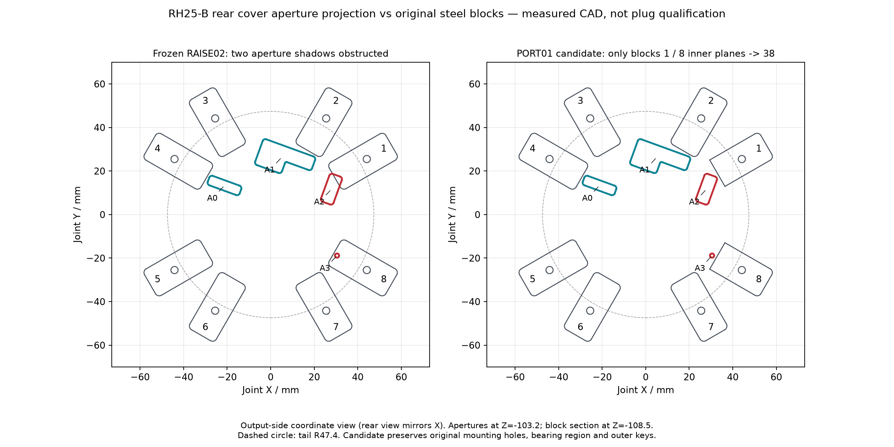

<!-- SPDX-License-Identifier: CC-BY-NC-4.0 -->
<!-- Required Notice: Odradek — Auromix contributors (https://github.com/Auromix/odradek) -->
# SHOULDER-PORT01：RH25-B 尾部开口与抬肩钢块

**局部几何研究，2026-09-27；未改 RAISE02、主参数或总装。** 已找到两处真实尾盖开口的轴向通道遮挡：`STEEL_THREAD_BLOCK_1` 遮住右侧长开口的一部分，`BLOCK_8` 遮住小圆孔的全部后向视线。可通过把这两块的内侧径向平面从 34 mm 削到 38 mm 消除，原承压区、M4 孔和止转舌保留。**尚未证明真实配对插头可以插入、拔出或接线；连接器型号/安装基准仍不完整。**

证据：[测量与检查 JSON](../../engineering/generated/shoulder-port01/study.json)、[官方来源与连接器候选](sources/shoulder-port01.json)、[可复算脚本](../../engineering/shoulder_port01.py)。两块独立候选 STEP 仅含我们的原创钢件：[BLOCK 1](../../engineering/generated/shoulder-port01/SHOULDER-PORT01-BLOCK-1-R38.step)、[BLOCK 8](../../engineering/generated/shoulder-port01/SHOULDER-PORT01-BLOCK-8-R38.step)。未重新分发原厂 STEP/PDF，没有外联或采购。



## 1. 真实模型、观察方向及可确认的基准

采用精确候选 **EPS-RH-25-100-E-B-D** 的 `RH-25-100-E-B-D 3D-A0.STEP` 与 `2D-A0.PDF`，来自 [MYACTUATOR RH25 官方资料包](https://www.myactuator.com/_files/archives/cab28a_bc732701dadf4512a0d917ecaab12747.zip)。下载的真实 URL、文件 SHA-256、版本和页码以 [sources JSON](sources/shoulder-port01.json) 为准。STEP 的 42 个实体中，编号 3 为包含这些开口的后盖；没有找到能可靠映射每个端口、配对座和插入基准的独立连接器模型。2D-A0 画出了端口内部轮廓，但没有逐端口的配对 PN、安装坐标或深度尺寸。

统一关节坐标沿用原接口提取：输出接触面为 `z=0`，`+z` 朝输出，`x` 取原厂投影坐标。RAISE02 肩轴原点为世界 `(0,0,205)` mm、轴向世界 `+Y`，转换为：

```text
world X = joint x
world Y = joint z
world Z = 205 − joint y
后向插拔：−joint z = −world Y
```

图中 `+joint x` 向右、`+joint y` 向上，是从输出侧沿 `−joint z` 观察的坐标投影；**从后方正视尾盖需镜像图中 X**。不要把这张坐标图直接当配线观察面。

后盖后平面 `z=−103.2000001` mm，钢块主体前平面 `z=−104.5` mm；两者名义轴向间隙为 **1.2999999 mm**。钢块主体厚 8 mm，范围 `z=−112.5…−104.5`；外侧止转舌伸至 `z=−102.5`，其径向位置为 55…64 mm，位于尾壳外。1.3 mm 只描述钢块与尾盖的壳体间隙，并不是插头的预留长度。

产品册 260805 PDF p2、[单页附件图 260416](https://www.myactuator.com/_files/ugd/cab28a_e9498ee9264e48ab8dac33f7e6a2635d.pdf) 的尾面标着 **RH-25-100-N**，端口组方位也与 B 版图不同。因此只取附件名称和功能，不套用 N 图的方位或针号观察面。用户手册 V1.4 PDF p25 §5.2 同样只给功能，并要求对照电机标签；[官方手册入口](https://www.myactuator.com/downloads-rhseries) 未提供可关闭该缺口的受控配对图。

## 2. 后盖开口及真实遮挡

取后盖后平面的 4 个真实内轮廓，填充成平面后向挤出 60 mm，得到 `z=−163.2…−103.2` 的探针。它包含该开口截面沿该方向所有位置，因而比离散插拔姿态检查更完整；**它不包含未知插壳、锁扣、手指、工具或电缆外形**。用每个真实钢块及后叉逐实体 Boolean common 检查，阈值 `10⁻⁴ mm³`。

| 开口 | 真实轮廓面积 mm² | joint XY 面积中心 mm | 图形对照推断的功能组 | 原结构检查 |
|---|---:|---|---|---|
| A0 | 70.309292 | (−21.209762, 13.359865) | 两个 EtherCAT 4 触点口 | 钢块/后叉无探针穿透 |
| A1 | 245.851769 | (5.120959, 26.343776) | 两个电源口 + 两个 CAN 口 | 钢块/后叉无探针穿透 |
| A2 | 81.509292 | (27.919574, 11.653751) | BAT / RES 两个 2 触点口 | BLOCK 1 穿透 **79.012920 mm³** |
| A3 | 2.835287 | (30.498125, −18.841937) | LED 指示小孔 | BLOCK 8 穿透 **22.682299 mm³** |

功能组来自 B 版后视轮廓与附件图的形状/触点数量对照，仍是推断；不据此分配 BAT 与 RES 的上下针、EtherCAT IN/OUT 或任何线序。A3 的实际圆孔 `Ø1.9` 已测得，LED 功能依图示推断。中心尾盖 `Ø28` 开口不是可改写的贯通轴孔尺寸；整机标称轴孔仍为 `Ø22`，本研究不重新批准整束穿线。

两次穿透均发生在钢块恒定的 8 mm 主体，对应投影阴影面积分别为 `79.012920/8 = 9.876615 mm²` 和 `22.682299/8 = 2.835287 mm²`。后者覆盖整个小圆孔。未碰到开口的钢块也不能据此批准更大的实际配对插壳。

## 3. 最小范围的原创修订候选

原厂固定孔不是等间距八孔；本次保持提取的原始孔阵。BLOCK 1 对应约 `+30°`，BLOCK 8 对应约 `−30°`。每块局部 `r` 轴指向其 M4 孔，孔轴位于 `r=51`、切向 `t=0`。

| 项目 | BLOCK 1 / A2 | BLOCK 8 / A3 |
|---|---:|---:|
| 完整开口在该块 r 轴的最大投影 mm | 36.644058 | 36.783119 |
| 保留 1 mm 投影余量所需内缘下限 mm | 37.644058 | 37.783119 |
| 本候选内缘平面 mm | 38 | 38 |
| 真实通道到修改件最短距离 mm | 1.355942 | 1.216881 |
| 切除体积 mm³ | 434.265482 | 434.265482 |
| 按 7850 kg/m³ 的质量减少 g | 3.408984 | 3.408984 |

这里的下限是“以一个平面分隔**完整开口**并保持 1 mm 余量”的充分条件，不是任意异形小缺口的数学最优切除量。两处统一取 `r=38` 便于定义和复核；没有改变其余六块。新切面是名义平面，新增边缘倒钝、表面处理与制造公差尚未发布。

保持情况已通过 BREP 验证：

- 每块与后叉的真实共面接触面积修改前后均为 **117.701385 mm²**；原接触区开始于半径 47.7 mm，切除区远离该区域。
- M4 轴附近 `R7`、跨整个钢块厚度的保护柱中切除体积为 0；名义大径至切向边缘仍为 5 mm，至新内缘为 11 mm。原孔、外侧止转舌和其配合不变。
- 两个新件均为有效单实体，分别对原厂 42 个实体无穿透，最小壳体距离仍约 1.3 mm。
- 4 个开口 ×（8 钢块 + 后叉）共 **36** 个连续轴向探针检查均无穿透。两件 STEP 导出后重读有效，体积误差低于 `7×10⁻¹⁰ mm³`，包围盒误差低于 `5×10⁻¹² mm`。

新件是原件的严格实体子集，故沿用原件已验证路径时不会新增外部几何碰撞；这只是一条几何单调性结论。削减后的刚度、紧固预紧、疲劳、缺口和实际工艺仍须在下一版本结构审查中保留。当前主模型和质量集成没有替换这两块，不能提前把约 6.818 g 质量减少写入主 BOM。

## 4. 配对连接器能确认到哪里

| 功能 | MYACTUATOR 公开附件称谓 | 可确认的连接器候选/尺寸 | 尚未确认 |
|---|---|---|---|
| 两路 DC | XT30U-F，14 AWG，200 mm | AMASS **XT30U-F.G.Y** 黄色有官方图纸 | MYACTUATOR 是否采用该厂该完整 PN；板端配对 PN、每个口的注册坐标/朝向、插入基准及深度 |
| EtherCAT IN/OUT | SH1.0 mm 4 pin，480 mm | 只能确认附件简称 | 制造商、完整料号、压接端子、锁扣、对插面、真实外形；不能自动等同 JST SH |
| CAN、BAT、RES | GH1.25-2P，300 mm | 只能确认附件简称 | 同上；不能自动等同 JST GH |

[AMASS 官方 XT30U-F 2025V0 图纸](https://www.china-amass.net/uploads/94.XT30U-F-SPEC-2025V0.pdf) 给出 12.4 ±0.3 mm 长、5.6 ±0.3 mm 宽；8.8 ±0.3 mm 是缩小的主体段，**最大法兰高度用对插图的 10.2 ±0.3 mm**。无导线的初步上限盒为 **12.7 × 5.9 × 10.5 mm**；对插组合总长 20.1 ±0.5 mm，但不能将该总长视作 RH 尾面后的突出长度或拔出行程。没有配对座基准，所以本次没有把这个盒子任意放入 A1 再声称通过。

[AMASS 官方 XT 目录](https://www.china-amass.com/public/upload/20260207/7fa24f5a6f35ec66c7a115c07a34ab06.pdf) p9 列出同族线式 `XT30U-M.G.Y`；p10 还有多种板式变体，说明仅知线端 F 不能锁定关节端 PCB 座。黄色后缀 G.Y 在两份资料一致；黑色后缀分别写 G.B 与 N.B，不能静默替换。现行产品规格的 80 V DC 与目录的 500 V DC 耐压试验量不同；20 A 的 16 AWG/温升条件也不是本臂 14 AWG 线束和母线的验证。

## 5. 装配与下一步关闭条件

建议先采用两块 `r=38` 独立候选进行无电、无载试装，直接核对真实端口位置和插壳边界。装配顺序可沿用 RAISE02 钢块后向装入/正面长螺钉夹紧的路径，因为修改件为原件子集；**不要依赖“先插好线再放钢块”绕过未知的维修空间**。若实物比开口向外扩张超过约 1.2 mm，当前余量可能不够，仍需带插壳再定缺口。

获得受控配对图后，按下列顺序完成而不是猜测：

1. 把每个板端座的接触面原点、键位和对插轴注册到本文 joint frame，记录 B 版电机与固件/硬件批次；确认 A0/A1/A2 功能映射。
2. 加入实际线端壳、锁扣/释放行程、端子焊接或压接区、热缩与应力消除，按最大公差建包络；实测 14 AWG 完整线径与最小弯曲半径。
3. 对后叉、八钢块、紧固件及相邻结构检查静态、直向插拔包含体及实际弯线路径；必要时进一步局部避让。若需切到承压区或孔周保护区，再重算结构，而不是继续无条件向外退钢块。

尚未闭合的是可制造线束与带真实配对插头的维护几何；**真实开口遮挡及可保留承力接触的局部修改范围已经闭合**。长螺钉及厚板已有 [SHOULDER-PROC01 具体采购候选](hardware/shoulder-procurement01.md)；本检查仍不替代有效螺纹长度、公差、预紧和材料批次确认。

复算（从仓库根目录，原厂文件仅供本地输入）：

```bash
/path/to/cadquery/python engineering/shoulder_port01.py \
  --vendor-step '/local/vendor/RH-25-100-E-B-D 3D-A0.STEP'
```
