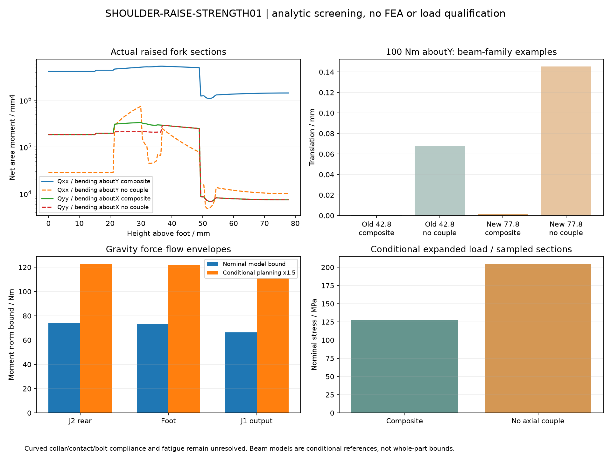

<!-- SPDX-License-Identifier: CC-BY-NC-4.0 -->
<!-- Required Notice: Odradek — Auromix contributors (https://github.com/Auromix/odradek) -->

# SHOULDER-RAISE-STRENGTH01：加高肩架的解析初筛

**状态：完成可复算的载荷传递、螺栓组及名义截面/柔度筛查；未做 FEA，未形成制造或 2 kg 承载放行。** 输入为已抬高 35 mm 的真实候选，足面至 J2 轴使用 **77.8 mm**。旧 42.8 mm 仅作为明确分开的对照，未代替新跨度。

结果指向两个需要优先验证的部位：后叉双腿向 14 mm 厚曲环的过渡，以及两腿/曲环能否形成假定的轴向力偶。条件扩展重力情景中，两个梁参照的名义应力约 **127 / 205 MPa**；它们的差异说明载荷分配很重要，不能仅凭某个材料屈服值宣布通过。固定侧 M4 内缘名义净边仍只有 **1.30 mm**，螺纹、接触和预紧尚未闭合。

[可复算脚本](../../engineering/shoulder_raise_strength.py) · [完整载荷和结果](../../engineering/generated/shoulder-raise-strength01/study.json) · [实际净截面与柔度矩阵](../../engineering/generated/shoulder-raise-strength01/sections.json) · [QA](../../engineering/generated/shoulder-raise-strength01/qa.json) · [几何候选](shoulder-raise-study.md)



## 1. 输入、质量与坐标

直接消费 [RAISED-ARM-INTEGRATION01 模型](../../engineering/generated/raised-arm-integration01/model.json)，SHA256：`e3b2a10a2f11cbc6a5085150dd1d5bcba3848431f40e4aea7485d4d5125d33a1`。脚本另从旧 11 自由度输入独立实施抬升，再逐体匹配新模型的质量、COM、旋转、中央惯量与关节原点，避免只抬视觉网格。

- J1 输出保持世界 Z105.2；J2 升到 Z205；J7 为 Z675；整头 face 为 Z839；临时净工件的 home TCP 为 Z949 mm。
- L12 三件真实名义金属共 **0.671452819 kg**，采用世界轴中央惯量及 `orientation=I`，不重复旋转。
- L12 紧固件仍为 **0.20 kg 总预算**，放在新金属聚合 COM，惯量沿用旧 50 mm 立方体代理。它不是实际螺钉质量分布；在足面以上全计入此预算，是本研究明确的分配情景。
- 完整运动链模型小计 **21.510480095 kg**，含固定 J1 和 2 kg 净工件；不含固定底座、未计量的 185～450 g 头部余量及其他未建模装置。
- HEAD-MASS04 的 2.802491 kg、13 个头部刚体与四独立指运动原样继承。P16 内部质量分配、关节整模块惯量和若干紧固件惯量仍是代理。

本报告的力和力矩最终表达在 **L12 的世界零位方向轴**；当前 q1 转角被旋回该基底。长度用于动力学时为 m，CAD 截面与梁积分使用 mm，力 N、力矩 N·m；柔度矩阵输入的力矩单独注明为 N·mm。

## 2. 从身体载荷到三个安装面的力流

从现有零位、inspect、reach、q2=±90° 静态数学姿态，以及旧动力学复核的 8 组运动状态，共 **13 组**输入计算。它们不是本报告批准的实机轨迹；全臂碰撞、线缆、限位与抓取约束不由本次力学计算确认。

逐刚体计算支承所需作用量：

```text
F_i = m_i (a_i − g)
M_i,COM = I_i α_i + ω_i × (I_i ω_i)
F_P = Σ F_i
M_P = Σ [M_i,COM + (r_i − P) × F_i]
```

a、ω、α 由同一已冻结姿态模型沿二次时间轨迹做独立差分；用 0.2 / 0.1 ms 两档核对，并与现有 M/C/G 计算比较。这个一致性检查验证计算关系，不验证代理惯量本身。

| 切面 | 本体坐标 m | 纳入的身体 |
|---|---|---|
| J2 固定后接触面中心 | `[0,−0.0457,0.205]` | J2 整模块代理及全部下游；不含 L12 自身 |
| 后叉足面四孔组中心 | `[0,−0.039,0.1272]` | 上项 + 后叉、前环与整组 L12 硬件预算；不含输出板 |
| J1 输出面中心 | `[0,0,0.1052]` | J1 之后全部身体，含三件 L12 与硬件预算 |

J2 后面到足面不能只用 77.8 mm 标量乘力；实际向量为 `[0,−6.7,77.8] mm`。脚本使用完整叉积传递，保留 6.7 mm 横向偏心。对同一身体集合：`M_B=M_A+(A−B)×F`，最大重构误差约 `7.55×10⁻¹⁵ N·m`。

新增 35 mm 纯竖向高度对给定力的附加力矩为 `ΔM=[−0.035 Fy,+0.035 Fx,0] N·m`。竖直重力 Fz 本身不会因为这段竖向抬高额外产生 `mg×35 mm`；横向惯性/接触力会。新增后叉质量的重力与惯性已通过新输入模型计入。

13 组样本中，各自最大力/矩并不出现在同一姿态：

| 切面 | 最大合力 N | 最大合矩 N·m |
|---|---:|---:|
| J2 后面 | 182.705 | 55.072 |
| 足面 | 188.661 | 54.861 |
| J1 输出面 | 191.247 | 54.123 |

这些是样本结果，不是全角域动态上界。未知转子惯量、摩擦、急停、撞击、硬限位、外部接触以及控制任务速度/加速度未闭合。净工件在模型里已计一次；四指内部抓紧力不会再次作为额外 2 kg 重复施加给整臂，但工件是否能可靠被夹住仍是独立问题。

## 3. 可追溯的静重力界与规划敏感性

对已建模身体，用 J2 到各关节/COM 的折线路径长度和三角不等式给重力矩范数上界。头部固定体用其距离；指片用根点加固定旋转半径；P16 滑动体另加完整行程差。这是对指定质量/COM/运动模型成立的几何界，不是所有实际未知质量的保证。

对固定在 J1 后、J2 前的质量，只使用水平力臂；不会让抬高量虚增静重力矩。额外情景同时采用：

- 未计量头部质量 **0.45 kg**；**假设**它在以 head face 为心、半径 0.25 m 的规划球内。该球是本次敏感性输入，尚非全开合状态的实物包络证明，也未给未知件指定真实运动归属。
- 已计量/代理头部 COM 再偏 50 mm、2 kg 净工件 COM 偏 100 mm，作为沿用的研究敏感性。
- 上述总量乘 **1.5 研究倍率**。它不是已选安全系数，也不涵盖所有急停、碰撞或热持载情况。

| 切面 | 名义竖向力 N | 名义重力矩范数界 N·m | 条件扩展力 N | 条件扩展矩界 N·m |
|---|---:|---:|---:|---:|
| J2 后面 | 175.529 | 73.979 | 269.914 | 122.766 |
| 足面 | 181.489 | 73.274 | 278.852 | 121.663 |
| J1 输出面 | 184.076 | 66.237 | 282.733 | 110.849 |

表中每个切面的界各自保守，并非一个同时达到所有数值的姿态。所有 5 个静态样本都落在相应名义界内。动态 8 样本不拿静力界当上限。

## 4. 螺栓组、摩擦与啮合门槛

采用实际 RH25 提取孔坐标，不把厂商非零相位孔重建成随意均布。足面四孔相对自身形心为 `(±57,±13) mm`。固定面八个 M4 为 PCD102；J1 输出十六个 M4 为 PCD77。

在各自法兰平面建立 x/y、法向 z，孔阵 P 先减自身形心。等刚度弹性反力模型：

```text
n_i = Fz/n + p_iᵀ(PᵀP)⁻¹[−My,Mx]ᵀ
v_i = Fxy/n + Mz [−y_i,x_i] / Σ(x_i²+y_i²)
```

该模型重构三个力及三个力矩。`n_i` 是有正负的连接反力，**没有自动等于螺栓拉力**：压缩接触、预紧、分离、撬力和载荷分配系数尚未求解。报告保留绝对值作为连接外载需求。名义 M4/M6 应力面积用既有筛查的 8.78/20.1 mm²；外载 VM-like 数值不含预紧、拧紧扭转、杆弯曲与缺口。

静重力的 Mx/My 在给定范数圆内变化时，逐孔轴向绝对值界用线性函数的解析幅值，独立于角度抽样；剪切采用三角不等式界。

| 连接组 | 名义最大绝对轴向外载 N/孔 | 条件扩展值 N/孔 | 扩展名义轴向外载应力 MPa |
|---|---:|---:|---:|
| J2 固定八 M4 | 314.1 | 521.2 | 59.4 |
| 足面四 M6 | 1490.7 | **2469.5** | **122.9** |
| J1 输出十六 M4，长度未选 | 226.6 | 377.6 | 43.0 |

足面绝对轴向界不是所有四孔同时 2469.5 N；更不能把这种有符号反力模式直接当成四颗预紧值。JSON 保留每个孔的值和全部样本的剪切、外载等效应力。

另保留 **J2 绕其 Y 轴施加 157 N·m** 的独立目录峰值敏感性，加指定扩展竖向力；不与已经包含惯性反力的动态样本重复相加，也不称零速持续力矩。在固定法兰上，该 Y 向力矩是法向扭矩，主要形成切向传力需求，不能当成八颗螺钉轴向拉力。

若额外假设有效摩擦半径为孔圈半径 51 mm，`N_clamp ≥ |F_t|/μ + |T_n|/(μr)` 给出这一峰值情景的总夹紧力需求：μ=0.08/0.15/0.20 时约 **41.85 / 22.32 / 16.74 kN**。这是明确的理想摩擦模型；实际接触压力分布、有效半径和摩擦尚未确定。它不是选定预紧值，不能直接转成拧紧扭矩。足面尚未选择有效摩擦半径；滑移后的孔壁承压与紧固件剪切是另一校核。

已有候选螺钉来源为 [Accu M4×50、12.9](https://www.accu.co.uk/metric-cap-head-screws/16032-SSC-M4-50-12-9) 与 [Accu/Holokrome M6×35、12.9](https://www.accu.co.uk/metric-cap-head-screws/642488-SSC-M6-35-HK-12-9)，本轮消费已保存 BOM，未采购或重新确认供货。12.9 的牌号/目录名不代替批次证明、预紧和整体连接设计。

M4 后叉名义几何啮合 14 mm，M6 盲孔名义进入 13 mm，均须扣除首末不完整牙和加工倒角。输出 M4 的 OEM 有效起牙/终牙仍未知，长度不能冻结。脚本给出 4/6/10/13/14 mm **假设有效长度**下的 N/mm 拉力需求，它不是已计算的螺纹剥离应力或容量。固定 M4 内侧 1.30 mm 净边、M6 足部约 5 mm 名义大径边距、孔壁承压/开裂与实际牙型，均需单独确认。

## 5. 实际净截面与 77.8 mm 梁参照

读取冻结的后叉 STEP，沿足面到轴心取 **157 个新构型截面**；旧对照单独取 87 个。用 0.001 mm 薄片体积/厚度计算净面积和二阶面积矩，保留通孔、曲环与腿的交叠。没有将两个腿的名义 `16×42` 一直外推到轴心，也没有把曲环当不存在。

令 `Q=∫[[x²,xy],[xy,y²]]dA`。两种参照是：

- **理想组合截面**：整张净截面共享平面应变，可形成跨腿轴向力偶，Q 保留各截面岛到整体形心的平行轴项。
- **无截面岛轴向力偶**：各岛以自身形心受弯，使用各岛 Q 的和，删去跨岛平行轴项；仍假设相同曲率和理想载荷分担。

在同一 Euler–Bernoulli 梁假设族中，第二者 Q 较小、柔度较大；脚本检查差矩阵的半正定性。**这不构成真实曲环/接触结构的严格应力或挠度上下界。** 真正的环上八点/面载荷分布、截面岛的纵向连接与剪流、J2 外壳刚度、固定面/足面柔度均未求解。

输入合力矩先用实际截面形心运输，再对能量积分：

```text
M(z) = M_end + [r_end−c(z)] × F
κ = Q⁻¹ [−My(z), Mx(z)] / E
U = ½ ∫ { [−My,Mx] Q⁻¹ [−My,Mx]ᵀ / E + Fz²/(EA) } dz
```

对各力/矩求虚功导数得到端点平动/转动。积分用实际 **77.8 mm** 高度，保留形心 Y 变化带来的耦合。弯曲/轴向参照尚未含剪切变形与扭转；JSON 末项 `thetaZ_NOT_MODELED` 的零只是被省略的自由度，**不是预测零扭转**。截面高度仍是离散采样，孔边缺口峰值不由名义公式捕捉。

本梁参照输入为 J2 后接面传来的身体载荷。后叉、前环与硬件自身载荷已进入足面/J1 完整力流，但未沿曲环及腿真实分布进这两个梁参照；报告没有把它称为全件应力。装配刚度与自重分布应在后续结构模型一起纳入。

### 5.1 同一载荷下的新旧比较

E 取名义 70 GPa。下表只比较规定模型和载荷，不表示实际误差边界。

| 纯端力矩参照 | 旧 42.8 mm 平移分量 | 新 77.8 mm 平移分量 | 新端点转角 |
|---|---:|---:|---:|
| 100 N·m 绕 X，理想组合 | uy=−0.0781 mm | uy=−0.0922 mm | θx=0.005629 rad |
| 100 N·m 绕 X，无岛间力偶 | uy=−0.0783 mm | uy=−0.0938 mm | θx=0.005663 rad |
| 100 N·m 绕 Y，理想组合 | ux=0.000599 mm | ux=0.001273 mm | θy=0.00004551 rad |
| 100 N·m 绕 Y，无岛间力偶 | ux=0.06784 mm | ux=0.14530 mm | θy=0.005471 rad |

新件的绕 Y 平移参照约为旧件的 2.1 倍，不能沿用旧挠度。绕 X 仍主要受薄曲环影响，简单把全部后叉按统一长方柱做 `L³` 放大同样不正确。近 0.007 rad 的转角乘 0.6 m 刚性下游杠杆约为 4.2 mm，只是说明转角可被放大的几何例子，不是预测整臂 TCP 误差。

### 5.2 新截面的条件载荷筛查

对重力矩方向使用解析圆域幅值，截面应力用包含真实截面的矩形边界取上界；这只是在**已取截面、已规定梁应变假设**内的名义上界。

| 输入 | 理想组合名义应力 MPa | 无截面岛力偶名义应力 MPa |
|---|---:|---:|
| 名义重力矩界 | 76.9 | 123.5 |
| 条件扩展重力界 | **127.3** | **204.7** |
| 独立 157 N·m 绕 Y 情景 | 11.0 | 207.8 |

名义最大站位集中在世界 Z≈179.1～179.6 mm，靠近双腿结束后的后环区域。此处的螺栓孔、环形路径和缺口已令模型敏感；表中没有应力集中、预紧应力或疲劳，不能由这些数值推出通过。

冻结输出板未改。继续用其实际 16 mm 宽径向筋条带截面，输入新的足面轴向界；名义/扩展情景约 **87.5 / 145.0 MPa**、**0.0457 / 0.0756 mm**。仍是将筋根理想夹固于原厂支承环外缘的局部条带模型，不是整板/接触分析。

## 6. 材料、加工与实物门槛

本轮只采用既有 [thyssenkrupp 6061 数据表](https://ucpcdn.thyssenkrupp.com/_legacy/UCPthyssenkruppBAMXUK/assets.files/material-data-sheets/aluminium/aluminium-6061.pdf)来源记录的名义 E=70 GPa、ρ=2700 kg/m³。**6061-T6 仍是候选**；未确认毛坯产品形式、原材厚度、轧制方向、热处理与材质证明。本轮没有把旧 3 mm 挤压材的 240 MPa 保证引用为本厚件保证。

49 mm 是腿的高度，不是材料表里的原材厚度。若按后叉 Y 方向选板坯，所需毛坯厚度至少约 42 mm 加加工余量；也可能选其他原材形式。具体采购规格与适用屈服值尚未闭合。因此 JSON 的 `yield_applied_MPa=null`，不报告“屈服安全系数”。E=66.5/70/73.5 GPa 仅作为 ±5% 自选敏感性；在线弹性同载荷下，挠度/转角相对名义乘 1.0526/1/0.9524，名义应力不因 E 变化。

放行前的实际门槛包括：

1. 取得 OEM 输出有效牙区间、允许拧入长度、安装预紧及固定/输出接口载荷限制；确认16根输出 M4。
2. 明确真实毛坯/热处理与孔边工艺，完成薄内缘、铝牙、净截面缺口、压溃、螺栓预紧与滑移/分离校核。
3. 验证曲环和双腿载荷分配、安装面的接触刚度与后叉模态。可采用有明确材料/网格/载荷/接触边界的后续 FEA，再用应变/位移实测核对；本轮没有 FEA。
4. 在完整运动域与实际加减速/急停/接触载荷中补齐峰值、疲劳谱、重复预紧和线束约束；把未计量头部质量分配实测化。

不要把后续改良简单理解为继续加粗 49 mm 长腿；先确认薄曲环/过渡、接触与力偶路径，再决定加筋、加厚或改变承力拓扑，并重新验证已得到的运动/装配间隙。

**打印件只能验证几何。** 用 PLA/PETG 打印可检查孔位、止口、插入顺序、工具通道与外形；真实关节必须由独立外部工装承托。打印后叉不得承担 2.74 kg 关节自重、通电驱动或 2 kg 工件，也不能据金属计算给打印件额定载荷。未选热嵌件、层向、打印批次和蠕变参数。

## 7. 数值核对与复现

- 新模型逐体字段与独立抬升重构匹配；所有输入与冻结几何 hash 只读核对。
- 三个安装面的合力/合矩运输及所有螺栓组重构通过。
- 刚体牛顿/欧拉合力经 Jacobian 投影，与现有 M/C/G 最大差约 `5.56×10⁻⁸ N·m`；双时间步反力差约 `3.51×10⁻⁷`（N 或 N·m）。这些是数值一致性，不是物理精度。
- 等截面单位梁分别核对 `FL³/(3EI)`、`ML/(EI)`、`ML²/(2EI)`，验证量纲及能量导数。
- 新/旧几何的约 0.5 / 1.0 mm 积分站距比较，在保留的非小量柔度项上最大变化约 2.0%。这没有证明孔边局部应力收敛，故正文只保留适当有效位数。
- 组合与无岛间力偶模型的 Q/柔度差满足预期能量顺序；不把该顺序推广为真实结构严格界。

```bash
python engineering/shoulder_raise_strength.py
```

依赖现有 CadQuery/OCP、NumPy、SciPy、matplotlib。输出仅位于 `engineering/generated/shoulder-raise-strength01/`；没有修改 SHOULDER-RAISE01、旧参数、原 CAD、HEAD03、HEAD-MASS04 或根线程的动力学实现。
