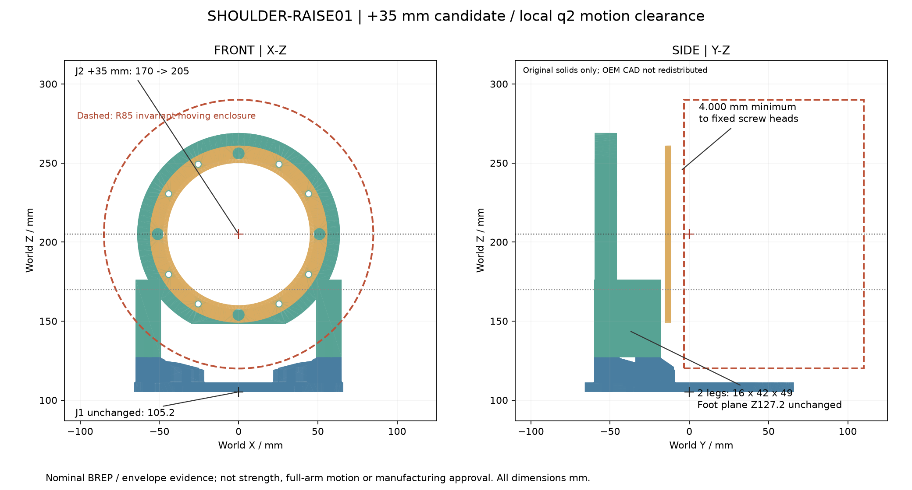

<!-- SPDX-License-Identifier: CC-BY-NC-4.0 -->
<!-- Required Notice: Odradek — Auromix contributors (https://github.com/Auromix/odradek) -->

# SHOULDER-RAISE01：肩轴抬高 35 mm 的局部结构候选

**结论：+35 mm 是本轮得到实体证据的可行局部几何候选，尚未替换主参数。** J1 保持 `[0,0,105.2] mm`；J2 升至 `[0,0,205] mm`。重建 L12 后叉的两条金属腿，保留真实接口后，L23、J3 及全部 28 个已知 L23 紧固件的旋转不变包络，对 J1、底座、新 L12 与 28 个 L12 紧固件有 **4.000 mm 最小名义间隙**，覆盖连续 `q2∈[−90°,90°]`。这不是抽样姿态推测，也不是完整机器人、线束、公差、刚度或承载放行。

[候选图](../../engineering/generated/shoulder-raise-01/shoulder-raise-01.png) · [原创 L12 总成 STEP](../../engineering/generated/shoulder-raise-01/SHOULDER-RAISE01-original-L12-assembly.step) · [几何决策证据](../../engineering/generated/shoulder-raise-01/geometry-decision.json) · [质量、COM、惯量与零件放置](../../engineering/generated/shoulder-raise-01/part-placements.json) · [QA](../../engineering/generated/shoulder-raise-01/qa.json)



## 1. 为什么抬高，以及具体改了什么

[旧肩部域研究](shoulder-domain-01.md) 对旧结构、未含全部紧固件的局部集合给出 ±25° 连续域；约 ±27.42° 已有接触见证。±30° 时 L23 输出板碰到 L12 输出板。这里没有将旧 ±65° 声称为可用范围，也没有用平面侧视替代真实实体检查。

本轮先实现指定的 +35 mm，没有搜索最小可行高度。J2 与所有下游关节、六段中的 L23～L67、整个 HEAD03 在世界零位中只做 `+35 mm Z` 刚体平移；不缩放原厂关节，也不改变下游零件局部 CAD。

| 项目 | 原值 | 候选值或处理 |
|---|---:|---:|
| J1 输出接触面 Z | 105.2 | 105.2，不变 |
| J2 轴心 Z | 170 | 205 |
| J1—J2 轴心高度差 | 64.8 | 99.8 |
| L12 四柱与后叉足面 Z | 127.2 | 127.2，不变 |
| 后叉两腿，各 `X×Y×Z` | 16×42×14 | **16×42×49** |
| 两腿中心 X / Y | ±57 / −39 | 不变 |
| 腿的 Z 范围 | 127.2～141.2 | 127.2～176.2 |
| 足面到 J2 轴高度 | 42.8 | **77.8** |
| 后叉环 OD / ID / 轴向厚 | 128 / 95.4 / 14 | 不变，环心抬高 35 |
| 后叉原环下切边 Z | 113.2 | 148.2；延长的腿仍向下接到 127.2 |
| J2 后 / 前接触面 Y | −45.7 / −15.5 | 不变 |
| J7 世界零位 Z | 640 | 675 |
| HEAD03 face 世界零位 | `[0,55,804]` | `[0,55,839]` |

L12 输出板及其四柱、筋、旧清腔原样保留。前压环只平移。后叉用环、截切、长方体腿及真实孔重新构造一个有效实体；`dz=0` 重建与冻结旧后叉做对称差交叉核对。没有拉伸网格或供应商 BREP。局部/世界变换明细见 [assembly-transform-contract.json](../../engineering/generated/shoulder-raise-01/assembly-transform-contract.json)。若采用此候选，必须同时改变关节原点和零件零位；不能只把显示模型向上拖动。

## 2. 连续肩部避让证据

移动集合为 L23 三个原创零件、J3 原厂全部 47 个实体，以及 28 个已知 L23 紧固件。固定外部集合为 J1 全部原厂实体、8 个底座原创件、L12 三件与 28 个 L12 紧固件。检查使用真实 BREP；内核报告阈值为 `1e−4 mm³`，不等于可制造的尺寸公差。

1. 将每个移动 solid 分别从 **R85、世界 Y=−3.5～110、轴 `[0,1,0]`、轴心 `[0,0,205]`** 的圆柱中相减，确认外逸体积为零。该包络的 R85 是经实体包含验证的值，不能和旧 bbox 角点速度界 86.55634 mm 混用。
2. 此包络绕 J2 轴旋转后保持不变。它与 40 个外部对象逐 solid 求交及距离，无材料穿透；最小 4.000 mm 来自包络 Y=−3.5 面到 8 颗 L12 固定 M4 帽头前缘 Y=−7.5。
3. 因为所有旋转实体始终在同一包络内，结论覆盖整个 ±90° 闭区间；包络对整周也不变，但本轮不把它宣布为整周可执行限位。
4. 对自身 J2，另用 Y≥0 外露集合。它位于 R85/Y0～110 包络内，且在 Y0～2.5 保留 R34.8 中央孔。该轴对称包络与原厂 J2 全部 42 个实体无正体积交集；输出接触面的零距离贴合为预期接口。

16 根未选定长度的 L23 输出 M4 仅建模了厂商已知的 Y−3.5～0 通道段。它们**完整保留在外部碰撞集合**中；但是原厂未提供受控转子/定子 solid 归属，不能把整台电机静止、把螺钉转出原孔来伪造内部冲突，也不能反过来声称内部通过。该负 Y 段的 OEM 内部运动归属与最终螺钉长度继续未闭合。

底座 32 个既有标准紧固件不在本轮实体集合内。旧底座报告最高 Z97.7 低于本轮移动包络最低 Z120，因此有 22.3 mm 轴向隔离的继承几何理由；这里没有冒称重新导入其全部实体。后续完整模型仍需统一纳入。q1、q3～q7 联动、远端 L34～头部对肩架的折返、夹持物、线束、止动器及动态挠度都不由本局部证据覆盖。

## 3. 安装接口、紧固与装拆

原厂安装孔和止口均继承受控 RH 接口提取，源文件 hash 随报告保存。四个实际共面接触面积没有变化：

| 接触对 | 面积 mm² |
|---|---:|
| J1 输出环—L12 输出板 | 1605.361805 |
| 四支柱—后叉双足 | 667.399943 |
| 后叉—J2 后固定法兰 | 1957.714878 |
| 前环—J2 前固定法兰 | 1649.421545 |

接触面积来自名义未变形 BREP 共面求交，不能证明预紧后压力均匀、不分离或承载可靠。孔位、标准螺钉一级来源和未决项沿用 [L12 原接口研究](link12-structure-study.md)；新构型的 M6 底孔改为长腿下端的**盲底孔**，不再称贯穿 49 mm 腿：从足面 Ø5 名义深 15 mm，候选 M6×35 名义进入 13 mm，首末不完整牙和有效牙长仍需加工规范。原厂输出 16 根 M4 长度未冻结。

[静态接口与螺钉检查](../../engineering/generated/shoulder-raise-01/static-interfaces.json) 无正体积冲突。[装配路径报告](../../engineering/generated/shoulder-raise-01/assembly-paths.json) 另含 602 组硬件互检/底座检查、288 组分阶段直杆工具检查，均无冲突。顺序为：

1. 离机把后叉从 +Z 放到输出板，反装四根 M6，再把此预装支架从 +Z 安装至 J1。
2. 从 +Z 装原厂输出 M4；长度与有效牙区间未确认前只作为无载量规/位置验证。
3. J2 从 +Y 装入；用经原厂全部 42 个实体包含核实的两段圆柱，证明 `t∈[0,180] mm` **连续直线装入**不碰已安装结构或螺钉。
4. 前环从 +Y 装入，再装八根 M4×50。后叉、预装支架、前环这三步检查位置为 0、0.1、0.5、1、2 mm，之后每 5 mm；它们仍是明确的离散路径检查。

上述在 J3 和下游尚未安装时成立。工具是有限长直杆，不含柄、手、真实插头与电缆；不把离机装配可达当作整机原位维修可达。

## 4. 质量、惯量与承力跨度

原创件采用 **2700 kg/m³ 均匀密度**积分实际 CAD。该密度为 [thyssenkrupp 6061 一级材料表](https://ucpcdn.thyssenkrupp.com/_legacy/UCPthyssenkruppBAMXUK/assets.files/material-data-sheets/aluminium/aluminium-6061.pdf)的名义参考；实际毛坯牌号、热处理、产品形态与材料证书未冻结，不将旧 3 mm 挤压材的 240 MPa 保证套到此厚件。

| 原创金属 | 原版 kg | 候选 kg |
|---|---:|---:|
| 输出板/四柱/筋 | 0.263796749 | 0.263796749 |
| 后叉 | 0.246434861 | 0.373294611 |
| 前压环 | 0.034361459 | 0.034361459 |
| 合计 | **0.544593069** | **0.671452819** |

净增 **0.126859750 kg**。每件与聚合的 COM、绕自身 COM 的完整世界轴惯量张量均见放置 JSON，单位明确为 m、kg·m²。三件金属聚合 COM 为 `[0.000316, −32.624338, 155.489106] mm`。平行轴汇总与整个原创金属复合体直接积分交叉核对；惯量对称、正定，毫米到米转换另用解析长方体、旋转/平移不变性与尺度律自检。

原已选 12 根螺钉目录总重 0.0852 kg，不再和旧整组 0.20 kg 紧固件预算重复相加。16 根输出 M4 未选长，其质量、真实 COM 与惯量尚不确定。若暂沿用原整组硬件预算，L12 总预算变为 0.871452819 kg；这不是本轮全组件称重，也不把金属 COM 当成已知螺钉 COM。L12 固定側质量仍归 `preceding_joints=1`，不直接算进 J2 输出侧。

[净截面输入](../../engineering/generated/shoulder-raise-01/net-sections.json) 以 0.001 mm 薄片截取实际后叉，保留孔和环/腿交叠。Z134 mm 的两腿减四个 Ø5 孔，与解析面积及两弯曲轴面积惯性矩反向核对：A=1265.460184 mm²、Ixx=184172.052576 mm⁴、Iyy=4140029.418249 mm⁴。某些高度有多个不连通截面岛，不能自动按理想组合梁采用其大惯性矩；也没有把 `Ixx+Iyy` 当扭转 J。

新足面到肩轴跨度 77.8 mm，旧后叉的刚度和局部直梁敏感性不能直接继承。抬高对同一接口力的新增力矩为 `ΔM = [−0.035 Fy, +0.035 Fx, 0] N·m`；纯竖向 Fz 因该竖直位移不会产生额外力矩。真实载荷还要加入新增叉架质量、惯性、接触和力传递，本报告不计算新的整臂 M/C/G。

工艺/放行仍需处理：长腿与环连接的内角/刀具路径、根部圆角与加工余量、刚度与模态、预紧/接触/铝牙拔出、孔边和止口公差、反复载荷疲劳以及真实上臂载荷谱。此处没有通过削薄腿换间隙；两腿保留 16×42 名义截面。3D 打印只可做外部支承下的无载几何量规，不承受关节自重或工件。

## 5. 文件与复现

脚本：[shoulder_raise_study.py](../../engineering/shoulder_raise_study.py)。生成目录包含三个独立原创 STEP、原创装配 STEP、两个证明用包络 STEP、参数/质量/接口/路径/净截面 JSON、PNG/SVG。包络是明确的验证几何，不是可制造零件。原厂 STEP 不公开导出，供应商来源仅保存文件名/hash/实体数。主参数、原六段 CAD、HEAD03 和 HEAD-MASS04 均只读。

```bash
python engineering/shoulder_raise_study.py --raise-mm 35 --export \
  --model RH25-B=/private/vendor/RH25.step \
  --model RH20-B=/private/vendor/RH20.step \
  --model RH17-B=/private/vendor/RH17.step \
  --model RH14-N=/private/vendor/RH14.step
```

需要 CadQuery/OCP、NumPy、matplotlib，以及当前项目生成器的既有 Python 依赖。OEM 输入 hash 必须匹配受控接口提取。输出只属于 SHOULDER-RAISE01；采用与否须由整臂动力学、完整碰撞、结构与制造复核决定。
