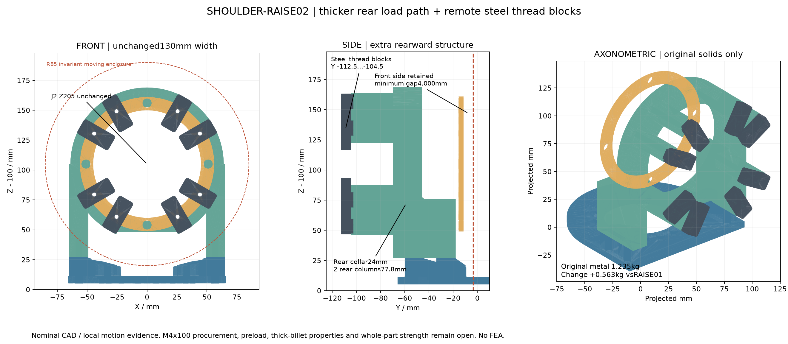
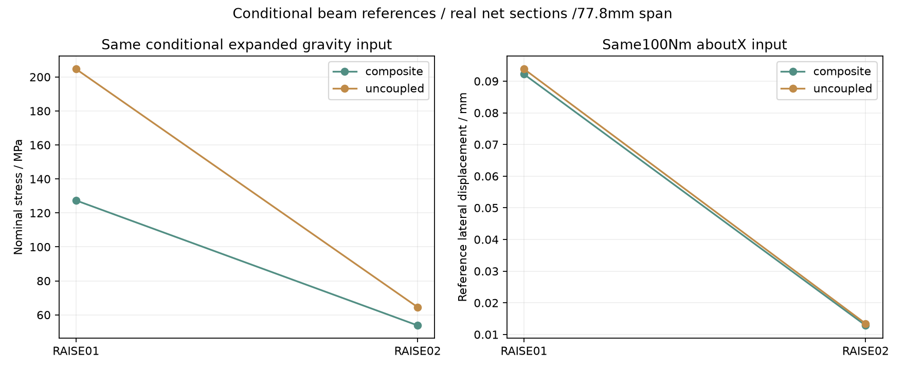

<!-- SPDX-License-Identifier: CC-BY-NC-4.0 -->
<!-- Required Notice: Odradek — Auromix contributors (https://github.com/Auromix/odradek) -->

# SHOULDER-RAISE02：后向承力柱与尾后钢制螺纹块

**独立结构候选，不改 RAISE01、STRENGTH01 或主装配。** J2 仍为世界 `[0,0,205] mm`，J1 接触面、原安装孔、前环和下游零件不变。本版把薄曲环到长腿的承力路径加厚，并把固定 M4 的承载螺纹移到电机尾部之后。当前证据限于名义实体、局部运动/装入、真实净截面及明确假设下的解析比较；没有 FEA、实测刚度、制造放行或 2 kg 额定承载结论。

[生成脚本](../../engineering/shoulder_raise02_study.py) · [实体与结果目录](../../engineering/generated/shoulder-raise02/) · [QA](../../engineering/generated/shoulder-raise02/qa.json) · [原始力学筛查](shoulder-raise-strength-study.md)



图中 130 mm 指后叉；原输出适配板宽度仍为 132 mm。

## 1. 为什么没有直接在原后环加通用 M4 螺母

固定孔半径 51 mm，OEM 后壳半径 47.4 mm。原后环 ID95.4 与 M4 大径之间只有 `51−47.7−2=1.30 mm`。仅加厚环不能增加这条径向牙边。

即便按 M4 六角螺母 AF7 的尺寸情景，朝内平边距后壳也只有约 0.1 mm，尚不含公差；约 Ø9 mm 的垫片和套筒更差。本次用每孔后方 **Ø9.2、Y−65…−52 mm 实体探针**检查真实 RH25 CAD，八处均有约 **48.794 mm³** 交叠。因此不把“换螺母”画成已经解决，也没有把大外径嵌件塞进更薄的边缘。该探针是受阻空间证据，不是假定某个已选套筒或螺母的受控 CAD。

选用的路线保留孔圈：在后环之后设置八条压紧肋，让八个原创钢制螺纹块在电机尾部之后承接长螺钉。OEM 已到 Y−103.2；钢块主后面到 −112.5，新增最远后伸约 **9.3 mm**。后叉横向最大宽度仍为 **130 mm**。

## 2. 真实零件与连接

| 项目 | RAISE01 | RAISE02 |
|---|---|---|
| 足面至肩轴 | 77.8 mm | 77.8 mm |
| 后接触环轴向厚度 | 14 mm | **24 mm，Y−69.7…−45.7** |
| 两条后柱 | 长腿接薄曲环 | **16×24×77.8 mm 直立后柱**接至轴高 |
| 前侧腿段 | 16×42×49 mm 名义段 | Y 向延至 51.7 mm，前边 Y−18 不动；腿顶不前侵 OEM |
| 可见腿/柱过渡 | 未闭合 | 两处实际 **R2**；后肋十四条可见根边 **R0.8** |
| 固定 M4 螺纹 | 后叉铝牙，内缘 1.3 mm | 八个独立钢块，最小名义大径侧边 **5 mm** |
| 后向压紧肋 | 无 | 八条，Y−104.5…−69.7，径向 47.7…64，切向名义宽 14 mm |
| 钢块 | 无 | 主体径向 30×切向 14×轴向 8 mm，轮廓 R2；定位舌 R1，开口槽 R1.2 |
| 固定螺钉 | M4×50 候选 | **M4×100 尺寸候选，精确 PN/等级/供货未核准** |

钢块通过后侧开口槽定位；外侧定位舌进入 2 mm，槽边名义间隙 0.2 mm。它提供拧紧时的止转几何，不等于已验证的扭矩容量或防松机制。主承压面在 Y−104.5；钢块与电机尾部名义轴向间隙 1.3 mm。模型包含真接触面与孔，不用隐藏穿透表示连接。

**尾部接插件是必要接口阻断项。** 钢块内伸至半径 34 mm，距已知后表面仅 1.3 mm；受控电机 CAD 未包含已确认的配对插头、出线及插拔工具完整包络。它们可能被钢块覆盖。本轮的 CAD 清零不能解除这个问题；在真实连接器空间确认前，不应加工或采用这一路径。

螺钉仍从原前侧座面 Y−11.5 插入，头部最前 Y−7.5 不变。100 mm 名义杆长到 Y−111.5，93 mm 自由夹紧长度后名义进入钢块 7 mm，距离钢块后面 1 mm。螺纹以 Ø3.3 预钻孔表达；M4×0.7 牙形、首末完整牙、倒角、孔轴公差、有效啮合及长螺钉料号仍须确认。**原 M4×50 不能沿用。**

**OEM 接口依据另行确认：** 原厂 `RH-25-100-E-B-D 2D-A0.PDF` 第 1 页、PCD102 的右上视图明确标注“8×Ø4.5 Through Hole”；PDF SHA256 为 `2ca7fc165dfae32adf45bbb4b6c9b4ab90d803aa5a9eaa251b00084149a324c4`。它与 PCD77 的十六个 M4 输出螺纹孔是两组孔。这里不是只根据 CAD 圆孔推断可穿越，不假定 OEM 有串联啮合的 M4 牙，也不要求修改原厂孔。[官方 CAD 图包](https://www.myactuator.com/_files/archives/cab28a_bc732701dadf4512a0d917ecaab12747.zip)；[本轮接口和来源记录](../../engineering/generated/shoulder-raise02/interface-and-sources.json)。

完整轴向经过为：原创前环 4 mm → 原厂固定法兰 30.2 mm 通孔 → 原创后环及压紧肋 58.8 mm 通孔 → 原创钢块 7 mm 名义啮合，共 100 mm。螺钉头压在原创前环，不直接压 OEM 前面；前环再压 OEM 固定面。原厂图没有给这一路径的允许总夹紧力或本版长拉杆方案背书，因而**预紧/压紧 OEM 固定法兰的允许值仍是必要门槛**。

后叉 M4 改为 Ø4.5 通孔，内侧几何边为 1.05 mm；去掉了薄边内螺纹，但薄边并未消失。偏斜、侧向孔壁承压、压紧面局部变形和磨损仍是门槛，不能把通孔净边称作强度已经通过。足部 M6 与 J1 输出连接保留；其原有效牙深、预紧和原输出板局部柔度问题仍在。

## 3. 运动、工具与装入证据

最终数值与逐项检查见 `continuous-motion.json`、`geometry-first.json`、`assembly-paths.json`、`steel-block-paths.json`。其定义沿用真实 OEM 每个 solid 单独检查的方法，避免对 compound 直接布尔运算漏判。

- L23 三件、真实 J3 及其全部 28 个已建模硬件继续包含在轴对称 **R85、Y−3.5…110** 的连续旋转外包络内。对新后叉、钢块、长螺钉、J1 和底座逐件检查；局部 q2 **−90…+90°** 不缩小。
- 原关节自身外露接口继续用独立环空包络检验。已知负 Y 输出螺钉段仍保留对外部的完整检查；没有 OEM 内部转子/定子归属证明，不对其内部作认证。
- 关节由 +Y 装入：真实 OEM 全体包含于受控两柱包络，其 180 mm 连续平移并集与新固定体检查。后侧钢块另有逐个从 −Y 装入的 **60 mm 连续保守并集**，包含已装的其他钢块、实际 OEM、结构和非固定侧硬件。
- 后叉上装、支架总成落到 J1、前环插入仍是原约定离散位置检查，**不是连续装入证书**。前驱动直杆、J1 输出驱动杆及足面台外反向装配顺序重新检查；没有手柄、手部或电缆服务空间的认证。
- 钢块要在螺钉开始啮合前临时由装配人员或夹具保持。定位舌不保证钢块自行挂住。装配时 J3/下游未装，不把这一顺序说成整臂上的直接拆卸路径。

## 4. 质量、惯量与相同载荷比较

质量以实际原创 BREP 及各自名义均匀材料积分；不通过改旧总数估计。`part-placements.json` 给出逐件和混合材料聚合质量、世界 COM、世界轴中央惯量及 STEP 哈希，**STEP 本身就是世界零位 mm，变换为单位阵**。J1 之后整体运动时这些固定侧件仍属于 preceding_joints=1。

<!-- RESULTS -->
| 名义原创金属 | 质量 kg |
|---|---:|
| RAISE01 三件 | 0.671453 |
| RAISE02 后叉 | 0.720230 |
| RAISE02 八个钢块 | 0.216182 |
| 未变的输出板与前环 | 0.298158 |
| **RAISE02 总计 / 比原版增加** | **1.234570 / +0.563117** |

新原创金属聚合 COM 世界坐标为 **[0.000172, −57.599846, 176.561471] mm**。世界轴中央惯量（kg·m²）为：

```text
[ 0.004736194  −0.000000016   0.000000013 ]
[−0.000000016   0.005421223   0.001207063 ]
[ 0.000000013   0.001207063   0.004033714 ]
```

| 同一输入、同一梁参照 | RAISE01 | RAISE02 |
|---|---:|---:|
| 条件扩展载荷，组合截面名义应力 MPa | 127.35 | **53.77** |
| 条件扩展载荷，无岛间力偶名义应力 MPa | 204.69 | **64.51** |
| 100 N·m 绕 X，组合参照侧移绝对值 mm | 0.09219 | **0.01286** |
| 100 N·m 绕 X，无岛间力偶参照侧移 mm | 0.09384 | **0.01344** |
| 100 N·m 绕 Y，组合参照侧移 mm | 0.001273 | **0.000776** |
| 100 N·m 绕 Y，无岛间力偶参照侧移 mm | 0.14530 | **0.08040** |

新构型同一条件下的名义截面与柔度参照改善明显；它不是已测刚度倍数。以截面岛自身惯量和正平行轴项重构整体张量，并与整个薄片独立积分反核，张量最大相对差约 2.77×10⁻⁹，面积约 1.15×10⁻⁸；约 0.5/1 mm 高度采样的有效柔度元素差小于 0.38%。这些是数值/单位核对，不是实体强度验证。
<!-- END_RESULTS -->



比较使用相同 157 个高度、真实孔/圆角/肋净截面、相同 77.8 mm 跨度，以及 STRENGTH01 的相同 J2 后接面条件扩展输入：Fz=269.914 N，重力矩 XY 范数界 122.766 N·m。下游质量不变，所以这处输入可复用；新增后叉及钢块自重在足面/J1 的增量另见 `supplement.json`，不能沿用原整臂载荷总数。

两种梁参照仍为“理想组合截面”和“无截面岛轴向力偶”。第二者删掉岛间平行轴项，二者之间的柔度次序仅在规定梁模型中成立；不是实际三维曲环/八点接触的严格上下界。报告不给扭转极惯量代替扭转常数，不把未建模转动的零列解释成零变形，也未分布求解新增零件自重、剪切、接触和螺栓柔度。

新增钢块已独立计入原创金属，不再放进紧固件余量。原 0.20 kg 紧固件代理预算未由本研究重建；长螺钉光杆包络质量仅是独立估计，不能叠加在已含同组螺钉的总预算上。没有将新结果写回全臂模型。

仅上述新增原创金属，在零位产生额外支承力 **+5.5223 N（Z）**，足面与 J1 输出的额外力矩分别约 **−0.2672 / −0.4825 N·m（X）**。它们是带符号的名义重力增量，不包含新紧固件质量差或动态惯性。八根 M4×100 的光杆/头部均匀钢包络合计约 0.08920 kg，仍不是目录质量或已选件。

## 5. 预紧与材料的实际门槛

`connections.json` 给出钢块真实共面承压面积及八条后肋的实际净面积。只将旧 **22.322 kN 总夹紧力条件值**作为均分示例：每路约 2.790 kN。其来源仍是独立 157 N·m 峰值情景、假设 μ=0.15 和有效摩擦半径 51 mm；不是选定预紧。平均面压/轴向压应力不含偏心、翘曲、局部压溃、接触开闭、撬力与松弛。

每块实算共面面积约 **117.70 mm²**；该条件下平均面压约 **23.71 MPa**。均匀接触压力的形心相对螺钉偏心约 **2.318 mm**，对应每块约 **6.469 N·m**，不能把它当成完全同轴压紧。若仅用 10×8 mm 净矩形条作名义弯曲参照，约 60.65 MPa；这不是钢块三维/螺纹容量。后肋 Y−85 截面的总净面积约 1703.29 mm²，对应均匀轴压约 13.11 MPa，也没有处理偏载和压曲。

100 mm 全螺纹钢杆参照（E=210 GPa、As=8.78 mm²）在 2.790 kN 下伸长约 0.151 mm；直接把这组条件预紧加上 521 N 外载，名义轴向应力约 377 MPa。实际光杆/牙长、连接件柔度、分离分担、拧紧扭转与热松弛均未闭合，不能用这些数值选扭矩或宣布连接通过。

钢块候选为 **Ovako 42CrMo4 M (6082)/MoC410M，+QT，原 Ø50×14 mm 圆棒**；每个实体已用实际圆棒包络反向包含检查。已保存的厂商表对 `40<D<100 mm` +QT 圆棒给 Rel≥650 MPa，适用尺寸依据原棒 Ø50，不是成品 8 mm 厚度。这是指定供货条件与材质证明下的候选值，不是所有同名钢的保证。[既存官方材料证据](https://steelnavigator.ovako.com/steel-grades/42crmo4/)；本轮只读已保存的[来源记录](sources/p16-carrier02.json)，未重新联网核验。

铝后叉候选仍为 6061-T6，但整个包络 Y 向为 **86.5 mm**，原料还须留加工余量。现有资料没有这个厚坯/供货形态对应的受控屈服保证，故 **未应用铝屈服值、未输出屈服通过**。E=70 GPa、ρ=2700 kg/m³只用于名义几何比较。长深腔刀具伸出、基准转换、变形、R0.8/R1.2 工具、去毛刺、内孔/面公差需与加工方复核；这些不是现成工艺图。

本地 Unbrako 官方目录 PDF 第 17–19 页支持原 M4 基本尺寸和已列长度，**没有给本版 M4×100 的具体可订货条目**。目录的拧紧建议不能转用为本结构的已选扭矩。缺少长螺钉具体料号、有效牙、摩擦/接触模型和热松弛验证时，这个连接仍不可放行。[目录来源](https://www.unbrako.com/images/downloads/Unbrako_US_Product_Guide.pdf)

可打印件只用于几何与装配顺序。禁止凭打印件复制金属解析结果，不能把 3D 打印后叉当作可带电运行或承重支架；原有各向异性、层间与蠕变问题没有因本版加厚而消失。

## 6. 复算与后续决定

```bash
../../work/r4-runtime/venv/bin/python engineering/generated/shoulder-raise02/delivery_check.py --prepare
../../work/r4-runtime/venv/bin/python engineering/shoulder_raise02_study.py
../../work/r4-runtime/venv/bin/python engineering/generated/shoulder-raise02/supplement.py
../../work/r4-runtime/venv/bin/python engineering/generated/shoulder-raise02/delivery_check.py
```

准备步骤只删除本分支旧的两个末级报告，避免阶段一哈希表纳入已被重建的阶段二结果；不清除模型、源文件或旧研究。主脚本需要本机已哈希核对的四型号 OEM STEP；不会导出、复制或许可原厂几何。公开装配仅有原创金属与明确的螺钉尺寸代理。补充脚本独立复查非固定侧螺钉以及新增金属重力矩，最后冻结本轮文件清单，仍不修改旧模型。

本候选应由“截面改善是否值得新增质量和后深”来判断。进入下一轮前仍需闭合长螺钉采购/牙深、厚坯材料证明、真实预紧/面压与疲劳，并重算完整质量模型与全臂干涉。可以继续压缩后肋/钢块质量，但不能删除其载荷路径后继续继承本版结论。
