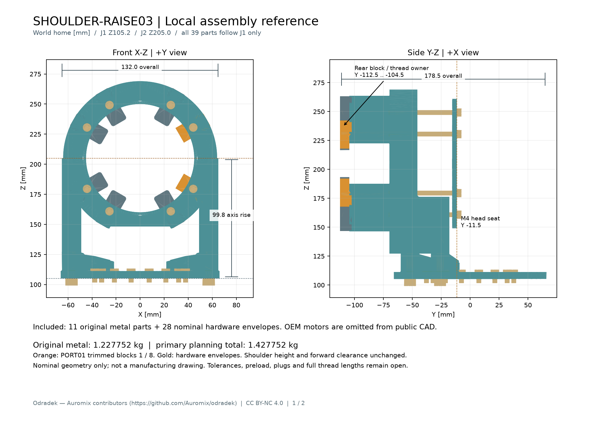

<!-- SPDX-License-Identifier: CC-BY-NC-4.0 -->
<!-- Required Notice: Odradek — Auromix contributors (https://github.com/Auromix/odradek) -->

# SHOULDER-RAISE03：尾部让位钢块与具体长螺钉的局部装配

本版把冻结 [RAISE02](shoulder-raise02-study.md) 的两块尾后钢块换为 [PORT01](shoulder-port01.md) 的 R38 让位件，并加入 [PROC01](hardware/shoulder-procurement01.md) 已核对的 **8×Fabory 07000.040.100** 名义外形与目录质量。39 个命名实体已导出；原创金属 **1.227752 kg**，保留既有 0.20 kg 总紧固件规划账时，局部总量 **1.427752 kg**。本轮完成局部几何、装入条件和质量输入，没有更新主整机，也没有制造或承载放行。

J1 仍为世界 `[0,0,105.2] mm`，J2 为 `[0,0,205] mm`。所有输出 STEP 已在这个世界零位，变换为单位阵；**不能再加 35 mm**。本组件全部附着于 **J1 输出／J2 固定侧**，只随 J1 转动，`preceding_joints=1`，没有任何零件随 J2 输出转动。OEM J1/J2 的质量与实体不在本次公开装配中。

[复算脚本](../../engineering/shoulder_raise03.py) · [命名总装 STEP](../../engineering/generated/shoulder-raise03/SHOULDER-RAISE03-named-assembly.step) · [原创金属 STEP](../../engineering/generated/shoulder-raise03/SHOULDER-RAISE03-original-metal.step) · [两页尺寸参考 PDF](../../engineering/generated/shoulder-raise03/SHOULDER-RAISE03-assembly-reference.pdf) · [结构件接口](../../engineering/generated/shoulder-raise03/structure-parts.json) · [质量模型](../../engineering/generated/shoulder-raise03/mass-properties.json) · [逐件 BOM](../../engineering/generated/shoulder-raise03/bom.csv) · [QA](../../engineering/generated/shoulder-raise03/qa.json)



## 1. 只改变两块钢件和八颗螺钉的具体定义

三个铝件和其世界位姿全部不变。后叉仍为 24 mm 厚后环、两根 16×24 mm 后柱、八条压紧肋及原有加工圆角；足面至肩轴承力跨度 **77.8 mm**，后叉宽 130 mm，输出板宽 132 mm。

| 项目 | RAISE03 定义 | 与 RAISE02 的关系 |
|---|---|---|
| 钢块 1、8 | 内侧平面从径向 34 改为 38 mm | 直接读取冻结 PORT01 STEP，逐件是原实体的子集 |
| 其余六钢块、输出板、后叉、前环 | 原冻结实体 | BREP 双向差体积检查，无重新近似绘制 |
| 固定侧八颗长螺钉 | Fabory 07000.040.100，M4×0.7×100，12.9 级、本色钢；头最大 Ø7×4、AF3、目录 b20 | 替换旧 Ø7.22×4 尺寸占位；杆长、轴线、头下座面不变 |
| 四颗足部螺钉 | Accu SSC-M6-35-HK-12.9；沿用冻结名义实体 | 目录单重 9.9 g，非实测 |
| 十六颗 J1 输出 M4 | 沿用旧安装通道占位 | **料号、完整长度、质量和有效啮合为 null/TBD**；7.5 mm 模型杆段不是已选完整螺钉 |

新总装不是供应商真实螺纹 CAD。圆柱头、杆及牙的最大外圆用于空间检查，没有六角窝、螺旋牙、倒角或牙尾的详细实体。各件 `geometry_is_envelope` 和 `inertia_is_proxy` 均随机器可读清单交付，避免把尺寸代理当作受控产品实体。

两个 R38 钢块合计去除约 868.531 mm³，按名义钢密度 7850 kg/m³ 减重 **6.817968 g**。两块均在世界 +X 一侧，故整体 COM 的 X 从近零变为 −0.173196 mm；这是同位去料的结果，不是装配镜像错误。

## 2. 螺钉经过路径与真实接触

原厂固定法兰孔的依据仍是冻结接口包：RH-25-100-E-B-D 2D-A0.PDF 第 1 页的 **8×Ø4.5 Through Hole，PCD102**。这组固定通孔与 PCD77 的十六个 M4 输出螺纹孔不同。没有把 CAD 空洞自行当成已获准的通孔，也没有引入 OEM 螺纹与尾后钢块串联啮合。来源页码、PDF SHA256 和原厂图包见 [RAISE02 接口记录](../../engineering/generated/shoulder-raise02/interface-and-sources.json)；本版只读并核对这些冻结输入。

头压在原创前环 Y−11.5 平面；完整路径仍为前环 4 mm → OEM 固定法兰 30.2 mm → 后环和肋 58.8 mm → 钢块名义进入 7 mm。螺钉尖端 Y−111.5，钢块后面 Y−112.5；自由夹紧堆叠 93 mm、名义后余量 1 mm，不增加垫片。b20 的目录位置意味着光杆 80 mm、牙段 Y−111.5…−91.5，在钢块入口前已经进入牙段。**完整牙有效啮合仍未知**，不能将这 7 mm 直接用于螺纹容量放行。

[接触变化逐项结果](../../engineering/generated/shoulder-raise03/connection-changes.json)重新求取实际共面 BREP 交面：

- 两个让位钢块与后叉的名义平面承压面积仍分别为 **117.701385 mm²**；其余六块同值。去料与各螺纹轴 R7 保护邻域交叠为零。M4 大径至切向侧边为 5 mm，至新径向内平面为 11 mm。它们是几何净边，不是缺口、接触或疲劳容量。
- 头最大直径变小后，八处头下平面面积从 **25.037237 降至 22.580197 mm²**。公式为 `π[(D头/2)²−(4.5/2)²]`，与实际交面数值一致。在同样作用力且假设均匀接触时，平均面压乘 **1.108814**，不能因装入间隙增大就继承旧面压裕量。
- 这里采用最大头径且未扣头下圆角，得到的只是名义参考面积，**不是实际最小保证承压面积**。接触刚度、压紧 OEM 法兰的允许值、预紧散差、长杆松弛、孔壁偏载和螺纹剥离仍须校核。本版没有选定预紧或拧紧扭矩。

## 3. 装入与运动证明如何继承

[几何继承记录](../../engineering/generated/shoulder-raise03/geometry-inheritance.json)包含全部 39 个“新实体 ⊆ 同位旧实体”的逐件差体积、原来源 SHA256 和作用范围；OEM 受控 STEP 哈希也与 RAISE02 一致。集合包含只能继承避让，**不能继承刚度、强度、承压或装配保持能力**。

| 检查 | 本版证据与严格条件 |
|---|---|
| 局部 q2 −90…+90°，q1=0 的原检验位姿 | 下游 L23/J3 和已建模的 28 个硬件均未变；沿用 R85、Y−3.5…110 的旋转不变外包络，再对本版 39 件逐件重查，最小 BREP 距离仍 **4.0 mm**。J1/底座仍为原冻结外部固定体。 |
| J2 从 +Y 装入 0…180 mm | 原受控 OEM、位姿和连续平移并集不变；所有本版障碍物为旧障碍物子集。保持旧装配阶段：J3/下游未装。 |
| 八钢块从 −Y 装入 0…60 mm | 逐块移动时，新移动块和其他已装障碍物均为同位原集合子集。长固定螺钉未装；钢块需手持或工装临时保持，定位舌不保证自行挂住。 |
| 八颗新长螺钉从 +Y 装入 0…100 mm | **新增连续实体检查**，对实际 J1/J2、底座和其余局部件共 **1,040 个 solid 对**无非预期穿透；详见下文。 |
| 后叉、支架总成及前环其他装入 | 仅继承原记录的离散位置检查，不升级为连续证明。 |
| 内六角工具 | 沿用 AF3 对应 D5 直杆探针条件；未确认手柄、手部、整机上更换操作、插头或线缆扫掠。 |
| 后部四开口 | 精确沿用 PORT01 四个开口面积向后 60 mm 的探针；1/8 让位后相关距离约 **1.355942 / 1.216881 mm**。开口探针不是真实配对插头，不能据此宣布接插件已可装入。 |

新增螺钉证明在 [long-screw-insertion.json](../../engineering/generated/shoulder-raise03/long-screw-insertion.json)：螺钉从最终位姿向 +Y 退 0…100 mm，头部并集是 R3.5、Y−11.5…92.5 的柱体，杆/牙外圆并集是 R2、Y−111.5…88.5 的柱体。该解析并集包含区间内每一个名义刚体位置。只在每颗螺钉对**自己的钢块**这一对检查中扣除最终 7 mm 预期螺纹区域；没有忽略整对零件或忽略 OEM。它验证外包络通道，不模拟旋入牙形、导入倒角和公差。J3/L23/下游在此装配阶段尚未安装。

旧 q2 关节自身外露部分的环空包络证据保持原范围；负 Y 输出螺钉内段的 OEM 转子/定子归属仍未获得原厂证明。本版对原零位肩架中的 q2 单轴角域作继承检查，没有另外扫掠 q1；局部 q2 证明不是整臂多轴同时运动的无碰撞证书。

## 4. 双层质量账与整机替换接口

质量不是从旧总数直接加减得到：11 个原创 BREP 逐件重新按各自名义密度积分 COM 和中央惯量，再用平行轴公式聚合。铝为 2700 kg/m³，钢为 7850 kg/m³，均非称量。后叉候选原料沿用 PROC01 的 **101.6 mm 原厚 6061-T651 轧制厚板**；钢块沿用 +QT、原 Ø50 圆棒候选。材料证书、取向与热处理尚未绑定，未采用屈服许用值。其余两个铝件仍保留原供料状态待定，不被默认为同一厚板。

| 质量口径 | kg | 用途 |
|---|---:|---|
| RAISE01 原创金属 | 0.671453 | 历史比较 |
| RAISE02 原创金属 | 1.234570 | 历史比较 |
| **RAISE03 原创金属** | **1.227752** | 本版 11 件名义 CAD 积分；比 01 +0.556299、比 02 −0.006818 |
| 8 颗 Fabory M4×100 | 0.088000 | 目录 11 g/颗 |
| 4 颗 Accu M6×35 | 0.039600 | 目录 9.9 g/颗 |
| 已定目录质量的 12 颗合计 | 0.127600 | 单独已知账；不是全部硬件 |
| 金属 +12 颗的可计量小计 | 1.355352 | 不含十六颗未选输出螺钉及其他未分配项，不能直接作为完整装配总重 |
| **主规划模型：金属 +0.20 总硬件预算** | **1.427752** | 0.1276 在预算内分配，剩余 **0.0724 kg** 未分配；并非有保证上界 |
| 敏感性：金属 +0.2424 总硬件预算 | 1.470152 | 保留历史未知余量 0.1148，再替换已知螺钉组；不是默认采纳 |

原创金属 COM 世界坐标为 **[−0.173196, −57.317186, 176.403546] mm**，关于此 COM、沿世界轴的中央惯量（kg·m²）为：

```text
[ 0.004710553913  -0.000010910822   0.000006099743 ]
[-0.000010910822   0.005406667359   0.001197139127 ]
[ 0.000006099743   0.001197139127   0.004009199924 ]
```

12 个目录质量螺钉的 COM/I 用相应名义外包络均匀分布作为**惯量代理**；未按光杆体积乘钢密度覆盖目录质量。十六个完整长度未知的 M4 保留 `mass_kg=null`，代理几何体积不用于生成虚假质量。

主规划模型保持已有“整个硬件预算位于原创金属 COM”的代理策略，并保留 50 mm 均匀立方体惯量：0.20 kg 时三个对角项均为 **8.333333333×10⁻⁵ kg·m²**。其 COM 恰与上列原创金属相同只是规划假设，**不是重新定位了所有实际螺钉**。0.2424 kg 敏感性按质量比例缩放该代理张量。这个规划模型与逐件目录账分列，不能同时求和。

`mass-properties.json` 有两个互斥使用入口：

- `planning_models.primary_preserve_200g_total.bodies`：11 个真实名义金属体 +1 个完整硬件规划体，适合现有整臂模型替换旧 L12 金属及旧 `L12_hardware_reserve`。每体提供 `mass_kg`、`com_home_m`、单位阵 `orientation_home`、世界轴 `inertia_com_kg_m2`、`preceding_joints=1`；不要再次旋转惯量或额外加 35 mm。
- `quantified_bodies`：11 个金属体 +12 个目录质量代理。仅供逐件账及未来补全未知件，不能在其后再叠加整个 0.20 kg 预算。若改为此口径，未知件质量及位置须独立解决。

`structure-parts.json` 逐件给 STEP/hash、世界包围盒、单位变换、原来源、运动依附、代理标记、材料和螺钉堆叠。BOM 中空值真实保留。所有质量体都属 J1 之后、J2 之前；不能将长螺钉或预算附着到 J2 输出。OEM 关节、BASE、L23/下游、头部和负载均不在这个替换集合内。

## 5. 打印与验证边界

[无电几何打印目录](../../engineering/generated/shoulder-raise03/geometry-only-print/)按 11 个原创件边界拆分，没有把钢块与铝叉融合。每个 STL 有可逆 `T_print_from_world_mm`，只是建议摆放；孔保持名义尺寸，没有打印补偿、螺旋牙、热嵌件选型或螺纹保持设计。全部 11 件重新导入后闭合流形且绕序一致；STL 与真实 CAD 的最大体积相对差约 **0.02636%**。打印件用于桌面观察让位、装配顺序和孔位关系，不能带电运行、承重或照搬金属预紧。

39 个 STEP 均重新导入为一个有效 solid，命名总装与逐件体积/COM/惯量核对通过；原始来源哈希未变。质量积分的盒体、尺度、旋转和平移自检保留在 QA。两页 PDF 包含实际实体的正视、侧视、轴测及名义长螺钉堆叠；不是公差齐全的生产图。

[SHOULDER-FEA01](shoulder-fea01.md) 的 RAISE02 **铝后叉**实体未改变，因此其相同理想固定/分布载荷条件的刚度比较仍可引用；该计算从未包含钢块、螺钉、真实接触或预紧，不能转述为本总成连接通过。既往头重与载荷仅为旧研究输入。末端已转向灯片面夹持及空载全闭→全开→全闭 ≤1 s 的新要求，本版不以旧 P16 质量证明新整机强度或动态能力。

仍未闭合的制造门槛是：真实配对插头/出线与 1.2 mm 级开口边距、OEM 内部归属与有效输出牙区、16 颗输出螺钉选型、长螺钉最短完整牙啮合、头下实际承压面积、允许预紧和接触刚度、材料批次证明、孔/面的公差、刀具与装夹、疲劳和整机新载荷。局部避让保持并不能消除这些具体门槛。

## 6. 复算

从仓库根执行：

```bash
OPENBLAS_NUM_THREADS=1 ../../work/r4-runtime/venv/bin/python engineering/shoulder_raise03.py --stage all
```

脚本需本机已哈希核对的四型号原厂 STEP；只读取，不再分发或改变其许可。`--stage build` 可生成不含新螺钉通道复算的几何/质量预览，最终交付必须使用 `--stage all` 并检查 `qa.json.long_screw_paths_complete=true`。生成目录仅含原创、明确的外形代理及验证摘要。源码和本版原创交付使用 CC-BY-NC-4.0，所有被冻结的上游文件及主模型均未改写。
