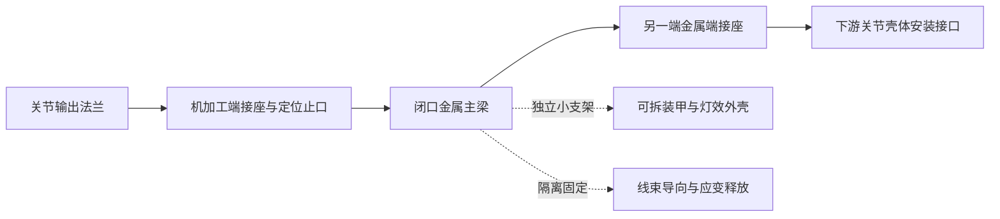

# R4 金属承力结构与质量筛选

状态：**候选，未冻结；截面级解析筛选，不是 2 kg 整机承载验收。** 资料核对日：2026-09-27。当前参数快照为 `R4-layout-03`；与初算 01 相比，本次涉及的关节/连杆质量与轴位置未变。计算数据保存于 [structure-screening.json](../../analysis/structure-screening.json)，可由 [structure_screening.py](../../engineering/structure_screening.py) 重算。03 的楔垫、指根高差与接触位置不在本截面筛选的接触力学范围内。

推荐第一轮实体结构采用 **6061-T6 闭口金属主梁、机加工金属端接件、可拆非承力装甲壳**。60×40×3 mm 适合作为较高刚度候选，50×35×3 mm 作为较紧凑候选；最终分配给哪根连杆，要由真实载荷和整体柔度决定。双 Ø20×3 mm 管可保留为造型/布线路线，但现有 CAD 没有证明其端接、抗扭或疲劳能力。早期塑料打印件只验证几何、装配、走线和外观。

## 1. 先修正质量与几何口径

| R4 项目 | 当前预算 |
|---|---:|
| 7 个关节模组之和，包括固定侧 J1 | 12.32 kg |
| `link_budgets_kg` 之和 | 2.85 kg |
| 本体预算：关节模组 + 连杆预算 | **15.17 kg** |
| 末端头部候选 | 2.00 kg，敏感性 1.80–2.20 kg |
| 净工件 | 2.00 kg |
| 上述合计，含固定 J1、头部与工件 | **19.17 kg**，敏感性 18.97–19.37 kg |

12.32 kg 不能称作整个本体质量。表中仍未单独加入底座板、地脚连接、外部供电/线束等；连杆预算也不是零件称重。下文的管材质量属于这些连杆预算的细化，不能再无条件叠加一次。

R4 的 J3、J5、J7 原点分别含全局 `y=+55、−55、+55 mm` 的偏置，关节轴交替朝向全局 z、±y。结构载荷必须经坐标变换投影到各梁轴，并保留 `M_offset=e×F`；不能将它简化成无偏置、共线的七轴示意链。例如 55 mm 偏心与 100 N 垂直分力会产生最多 5.5 N·m 的附加力矩，方向由叉积决定。

当前 `build_layout.py` 的两段双管路线长度约 127.48、109.77 mm；对应关节原点距离约 188.22、164.47 mm。路线端点只是 CAD 建模规则，尚不是真实夹持/固定边界。本次统一取 **150、200 mm 有效悬臂长度**做敏感性，不把 CAD 管长当已实现的结构跨距。

## 2. 材料数据与适用范围

使用未焊接、室温的 6061-T6 挤压管/型材母材。下表将公开参考值、规定最小值和自选敏感性分开。

| 参数 | 计算取值 | 来源与范围 |
|---|---:|---|
| 弹性模量 E | 70.0 GPa | thyssenkrupp 数据表的指导值，不是供货公差区间 |
| 剪切模量 G | 26.3 GPa | 同上；由 E/G 反算 ν≈0.3308，未另行强行指定 ν |
| 密度 ρ | 2700 kg/m³ | 同上，20°C 参考值 |
| 0.2% 屈服强度 Rp0.2 | **≥240 MPa** | thyssenkrupp T6 挤压管/型材 `t≤5 mm`；本次 t=3 mm 属于此档 |
| 最小抗拉强度 Rm | ≥260 MPa | 同上；不是本次挠度计算参数 |

来源：[thyssenkrupp EN AW-6061 材料数据表，2018，PDF 第 3 页](https://d2zo35mdb530wx.cloudfront.net/_legacy/UCPthyssenkruppBAMXUK/assets.files/material-data-sheets/aluminium/aluminium-6061.pdf)。[Hydro 6061 数据表，2019，第 2 页](https://www.hydro.com/globalassets/01-products--services/extruded-profiles/americas/ena-resources/alloy-data-sheets/hydro_2019_data_sheet_6061.pdf) 对 T6/T6511、壁厚不大于 6.30 mm 的挤压材也给出 240 MPa 最小屈服值；其说明指出焊接区域的 T6 强度会降低。

本次没有找到针对拟采购批次、截面和温度的 E/G 保证上下限，也没有屈服强度保证上限，所以**不写成“240–276 MPa 保证范围”**。脚本另设 E/G 同时乘 0.95、1.00、1.05 的数值敏感性：E=66.5–73.5 GPa，G=24.985–27.615 GPa；这些是自选扰动，不是厂商公差。相应位移/转角乘 1.0526、1.0000、0.9524；给定外力时名义应力不随模量改变。

实际采购必须确认牌号、热处理状态、产品形式、壁厚公差和材质证明。轧制厚板数据、退火料、焊接热影响区和塑料打印件不能直接套用该 240 MPa。

## 3. 截面、方向与公式

局部 z 为梁纵轴，x 沿截面宽度 b 或双管中心连线，y 沿高度 h。`Ix=∫y²dA` 抵抗绕 x 的弯曲，`Iy=∫x²dA` 抵抗绕 y 的弯曲。这里称 x 为弱弯曲轴，不代表机械臂全局某个固定轴。

矩形管按外宽 b、外高 h、均匀壁厚 t，暂忽略圆角：

```text
A  = b h − (b−2t)(h−2t)
Ix = [b h³ − (b−2t)(h−2t)³] / 12
Iy = [h b³ − (h−2t)(b−2t)³] / 12
Am = (b−t)(h−t)                         # 中线所包围的面积
J  ≈ 4 Am² / ∮(ds/t) = 4 Am² t / [2(b+h−2t)]
τ  ≈ T/(2 Am t),  θtorsion = T L/(G J)
```

矩形管的 J 是 Bredt 薄壁闭口近似，**不是 `Ix+Iy`**。公式及端部翘曲约束条件见 [MIT 16.20 扭转讲义，2002，第 3 页](https://ocw.mit.edu/courses/16-20-structural-mechanics-fall-2002/a58ea050460c29f7389ff55e084521ed_ho3.pdf)。3 mm 相对 35/40 mm 截面高度并非无限薄；真实圆角、局部缺口和端部约束需要更精细模型。

单根圆管取外径 D=20 mm、内径 d=14 mm；双管中心距 s=48 mm，总宽为 **68 mm**：

```text
At = π(D²−d²)/4
It = π(D⁴−d⁴)/64,  Jt = 2It             # 圆环的精确截面解
Ix,pair = 2It
Iy,pair = 2[It + At(s/2)²]              # 仅在共同受弯/传递轴向力偶成立时
Jpair,local = 2Jt                       # 只叠加各管自身扭转；不加 At(s/2)²
```

双管绕 y 的大惯性矩依赖端接件能把载荷分配成两管的轴向拉压力偶；有变化弯矩/剪力时还要确认横向耦合与剪力传递。只有两根平行管、几块未验证的小端板，不能自动获得理想组合梁性能。脚本同时计算了两管各分一半弯矩、无轴向力偶的弱耦合参照，其绕 y 有效 I 退回 `2It`。

弯曲采用线弹性小变形、理想固定端 Euler–Bernoulli 梁。用 `κ(z)=M(z)/(EI)` 积分得到转角与位移。对比两种**根部弯矩相同、载荷分布不同**的情况：

| 载荷 | 根部名义应力 | 末端转角 | 末端挠度 |
|---|---|---|---|
| 纯端弯矩 M，沿梁 M 不变 | σ=Mc/I | θ=ML/(EI) | δ=ML²/(2EI) |
| 末端横向力 F，根部 M=FL | σ=Mc/I | θ=ML/(2EI) | δ=ML²/(3EI) |

末端力公式可交叉核对 [ASQ《Mechanical Design Reliability Handbook》，2010，例 1.10（NASA 托管，PDF 第 30 页）](https://extapps.ksc.nasa.gov/Reliability/Documents/Mechanical-Design-Reliability-Monograph.pdf)。本次没有加横向剪切变形；150 mm 梁相对 60 mm 外宽只有 2.5 倍，不能把细长梁假设当成精确的短接头预测。纯端弯矩工况没有横向剪力，而实际机器人会同时有力与力矩。

## 4. 截面刚度与质量结果

| 截面 | 面积 mm² | Ix mm⁴ | Iy mm⁴ | 扭转 J mm⁴ | 150 mm 梁质量 | 200 mm 梁质量 |
|---|---:|---:|---:|---:|---:|---:|
| 50×35×3 闭口矩形 | 474.0 | 89,219.5 | 158,722.0 | ≈171,798.7 | 0.1920 kg | 0.2560 kg |
| 60×40×3 闭口矩形 | 564.0 | 143,132.0 | 273,852.0 | ≈283,907.3 | 0.2284 kg | 0.3046 kg |
| 双 Ø20×3，s=48 | 320.4 | 11,936.5 | 196,511.3¹ | 23,873.0² | 0.1298 kg | 0.1730 kg |

¹ 理想轴向力偶耦合；无耦合参照的 Iy=11,936.5 mm⁴。² 两管各自扭转之和，不含端板框架作用。质量不包含端板、连接块、紧固件、走线、装甲和表面处理。

从 50×35×3 增大到 60×40×3，200 mm 梁体只增加 **48.6 g**，弱轴 EI 增加约 **60.4%**，强轴 EI 增加约 **72.5%**，GJ 增加约 **65.3%**。双管在这一模型下更轻，但弱轴刚度仅为小矩形管的约 13.4%，本身的抗扭刚度约 13.9%；而且双管整体宽度 68 mm 已超过两种矩形管。

### 4.1 弯矩与长度敏感性

下表为**绕弱轴的纯端弯矩**，每格为“150 mm / 200 mm 梁的末端挠度”，单位 mm。完整 JSON 同时包含两轴、20/40/60 N·m、两长度、两载荷分布，共 84 条弯曲记录。

| 截面 | M=20 N·m | M=40 N·m | M=60 N·m |
|---|---:|---:|---:|
| 50×35×3 | 0.0360 / 0.0640 | 0.0721 / 0.1281 | 0.1081 / 0.1921 |
| 60×40×3 | 0.0225 / 0.0399 | 0.0449 / 0.0798 | 0.0674 / 0.1198 |
| 双 Ø20×3 | 0.2693 / 0.4787 | 0.5386 / 0.9574 | 0.8078 / 1.4362 |

L=200 mm、M=60 N·m 时：

| 截面/受弯方向 | 名义最大应力 MPa | 末端转角 ° | 末端挠度 mm |
|---|---:|---:|---:|
| 50×35×3 弱轴 | 11.77 | 0.1101 | 0.1921 |
| 50×35×3 强轴 | 9.45 | 0.0619 | 0.1080 |
| 60×40×3 弱轴 | 8.38 | 0.0686 | 0.1198 |
| 60×40×3 强轴 | 6.57 | 0.0359 | 0.0626 |
| 双管弱轴 | 50.27 | 0.8229 | 1.4362 |
| 双管理想强轴 | 10.38 | 0.0500 | 0.0872 |
| 双管无轴向力偶的强轴参照 | 50.27 | 0.8229 | 1.4362 |

在相同根部 M 下，把纯端矩改为末端横向力，梁理论的挠度为上表的 2/3、转角为 1/2，应力不变；这不是“真实载荷一定更小”的结论。长度由 150 增至 200 mm，固定 M 时挠度乘 1.7778、转角乘 1.3333。若固定的是 F，则 M 随 L 增加，挠度按 L³ 变化。单根梁的转角会继续放大下游工具偏移，表中挠度不能直接作为整臂 TCP 精度。

### 4.2 扭矩敏感性与双管端板影响

每格为“150 mm / 200 mm 梁扭角”，单位 °。

| 截面/连接模型 | T=10 N·m | T=20 N·m |
|---|---:|---:|
| 50×35×3 闭口矩形 | 0.0190 / 0.0254 | 0.0380 / 0.0507 |
| 60×40×3 闭口矩形 | 0.0115 / 0.0153 | 0.0230 / 0.0307 |
| 双管仅各自扭转 | 0.1369 / 0.1825 | 0.2738 / 0.3650 |
| 双管理想刚端板模型 | 0.0972 / 0.1484 | 0.1943 / 0.2968 |

最后一行来自一个明确的框架模型：两管端部对横向转动完全夹固，末端刚板绕梁轴转角 θ，使每管端部横移 `u=sθ/2`。单管固定—导向梁横向刚度为 `12EIt/L³`，由平衡与能量可得：

```text
Ktorsion,frame = 2GJt/L + 6EIt s²/L³
θ = T/Ktorsion,frame
F_each = 12EIt (sθ/2)/L³
M_end,each = F_each L/2
T = 2(GJt θ/L) + F_each s
```

这里出现的是随 L 改变的**框架刚度**，不应塞回一个通用“截面 J”。L=200 mm、T=20 N·m 时，每根管端还有约 **77.9 N 横向力、7.79 N·m 弯矩**；L=150 mm 时升至约 120.9 N、9.07 N·m。端板和夹紧处必须真实传递这些量。端板变形、螺接滑移、剪切变形都没有计入。两行双管结果是两个规定模型的参照，**不是对任何实际装配的保证上下界**；增加闭合金属腹板/剪力壁还会改变结构类型和质量。

### 4.3 为什么不能用屈服比值宣布通过

以弱轴 M=60 N·m、T=20 N·m 组合，并用 `σvm≈√(σ²+3τ²)` 作名义截面筛选：矩形 50、矩形 60、双管分别约 **12.38、8.82、52.32 MPa**。对应 `240/σvm` 为约 19.39、27.21、4.59。双管这一值仅用各管自身扭转载荷，不含刚端板附加弯曲；矩形管使用薄壁平均剪应力。

这些只是母材最小屈服与名义应力之比，**不是设计安全系数，也不是系统余量**。孔边应力集中、局部承压、壁面屈曲、端板撬力、螺纹拔脱、疲劳、实际载荷谱和连接柔度均未进入计算。即使母材远未屈服，单段双管的 1.44 mm 挠度和 0.82° 弯曲转角已经说明必须评估刚度。

## 5. 细长机甲外观对应的承力路径



结构与外观可以通过同一截面协调：把金属梁放在主视觉脊线，装甲用薄的折面、分段覆盖和局部开窗形成层次；装甲开窗不要继续切穿承力梁。真实 Ø70–110 mm 关节包络保留，靠梁段收细、关节过渡件和壳体分缝获得节奏，不假设电机也能缩小。线束走梁内或独立浅槽，避开关节运动剪切区；维护开口优先放在可拆外壳。

第一版优先用原本闭口的挤压管配金属端接座，避免为了隐藏螺钉而将整根梁纵向开缝。若改成两片折弯金属壳组合箱梁，连接缝必须按剪流设计；少量装饰螺钉不能自动恢复闭口梁的 J。若需要焊接，应另建热影响区材料模型并验证焊后状态。

## 6. 接头、疲劳与打印限制

| 问题 | 本轮可以决定 | 冻结前必须补齐 |
|---|---|---|
| 3 mm 管壁接螺栓 | 采用金属端接座、压溃隔套/内衬作为候选 | 孔距/边距、净截面、孔边应力、承压、撬力、局部壁面变形；不把螺栓直接拧紧压在空心薄壁上 |
| 关节法兰与定位 | 保留实际输出法兰与壳体端的运动侧归属 | 厂商孔位/螺纹深度/允许轴承载荷；定位止口或销的剪切与间隙；装配公差与拧紧工具空间 |
| 预紧与防滑移 | 将防分离、防滑移、螺栓强度分别校核 | 螺栓等级、摩擦、涂层/润滑、预紧上下限、夹紧长度和接合面刚度；不能仅凭“4 颗 M4”推导可靠性 |
| 反复呼吸/摆动 | 将轻外壳减重，避免壳体进入主力链 | 实际载荷谱、平均应力/应力比、孔边与表面处理、规定循环寿命和疲劳试验；本轮没有无限寿命结论 |
| 打印端接件 | 做无载几何、装配、线缆与姿态验证 | 打印方向、材料批次、层间强度、孔周铺层、蠕变、温度和螺纹嵌件拔出；未经验证不承载 2 kg 工件 |

量级示例：60 N·m 通过间隔 40 mm 的两排反力传递，需要约 **1500 N 的力偶**；20 N·m 由半径 25 mm 的 4 个等载螺栓传递，纯扭剪分量约 **200 N/颗**。实际还要叠加横向力、轴向力、偏心和预紧，且不一定均分。这两例没有指定螺栓，也没有计算接头通过。螺接分析框架参考 [NASA RP-1228《Fastener Design Manual》，1990](https://ntrs.nasa.gov/api/citations/19900009424/downloads/19900009424.pdf)，其中区分预紧、联合拉剪、连接刚度和安装摩擦；本项目并未宣称符合航天标准。

打印各向异性不能只用一个“塑料强度”表达。作为厂商特定工艺示例，[Stratasys ABS-M30 数据表 Table 5](https://go.stratasys.com/rs/533-LAV-099/images/MDS_FDM_ABS-M30_A4_0920a.pdf) 的 XZ/ZX 方向拉伸 E 约 2.40/2.30 GPa、屈服约 30.8/27.5 MPa、断裂伸长约 8.1%/1.8%。同几何只按 E 比较，其弹性挠度约为本次铝材模型的 29–30 倍。它们只说明方向与工艺的重要性，**不是 Odradek 现有打印机、材料、填充率或零件的许用值**；不得凭照片、切片预览或手握试验升级为承力件。

## 7. 下一轮进入实体设计的条件

1. 用真实关节轴位置、各体 COM 和质量重跑静力/动力载荷，把每个接头的三向力与三向力矩转换到梁局部坐标；本轮 20/40/60 N·m、10/20 N·m 仅是阶段输入，不覆盖所有姿态或急停工况。
2. 冻结候选供货截面与金属端接几何，将实物螺栓、止口/定位、内衬、装甲、线束纳入质量；复核关节额定持续力矩、热与制动保持条件。
3. 对孔/台阶/法兰/端板做包含接触与预紧的局部模型，必要时用三维实体模型处理短梁端部效应；计算网格收敛并与独立手算交叉核对。
4. 用梁段与接头试件测弯扭柔度、滑移和卸载残余变形，再合并关节/轴承柔度预测整臂 TCP 偏移。达到任务所需精度与规定寿命，才有依据冻结承力方案。

## 8. 可复现性与本轮验证

在仓库目录运行，无第三方 Python 依赖：

```bash
python3 engineering/structure_screening.py
python3 engineering/structure_screening.py --check
```

JSON 记录参数文件 SHA-256、质量和轴偏置快照、材料出处、截面性质、84 条弯曲记录、12 条基本扭转记录、4 条双管端板框架记录、18 条名义组合应力记录。`--check` 重算后逐字段比较既有 JSON，不修改文件；输入参数变化会令快照比较失败。

已执行 **60 项数值自检**：由应力/转角反求弯矩、由扭角反求扭矩、N–m 与 N–mm 单位独立计算、曲率数值积分、能量导数、截面转置、几何缩放、薄壁圆管极限、双管框架反力平衡等。全部通过只说明本轮解析实现自洽，不能替代材料证明、装配检查、载荷试验或整机验收。
