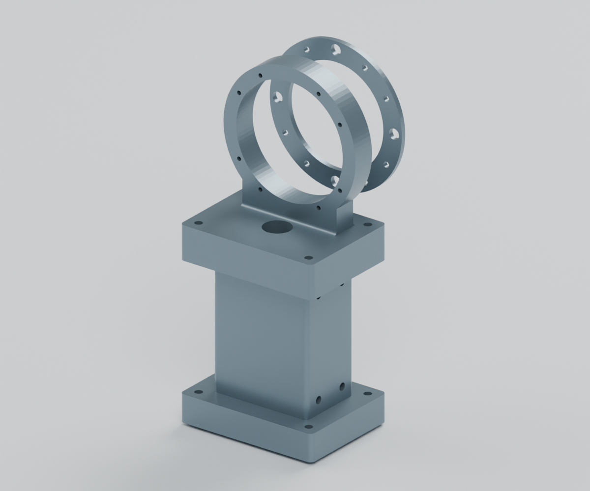
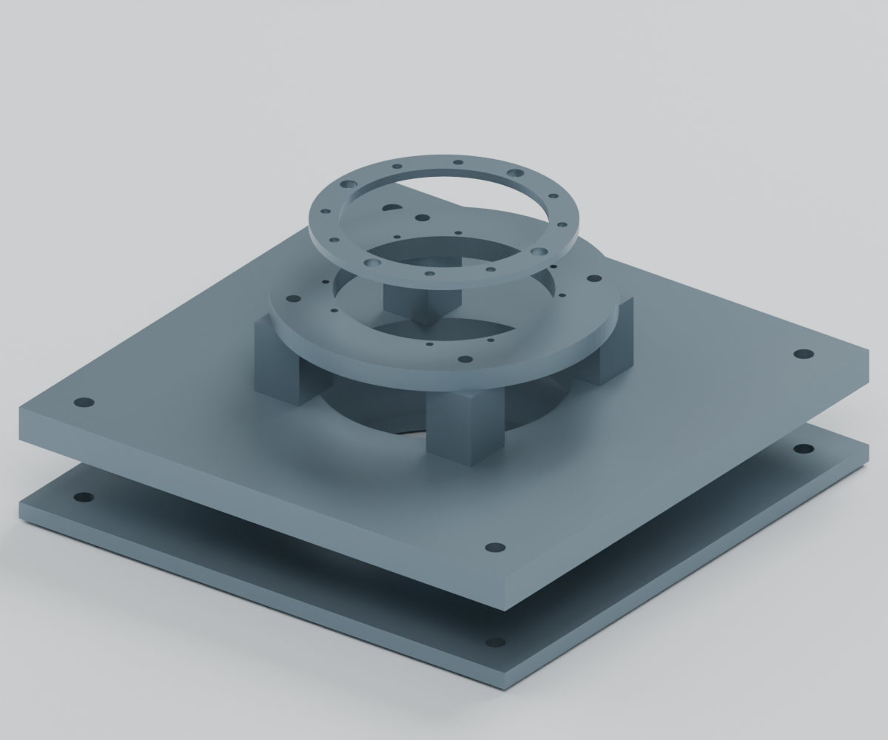
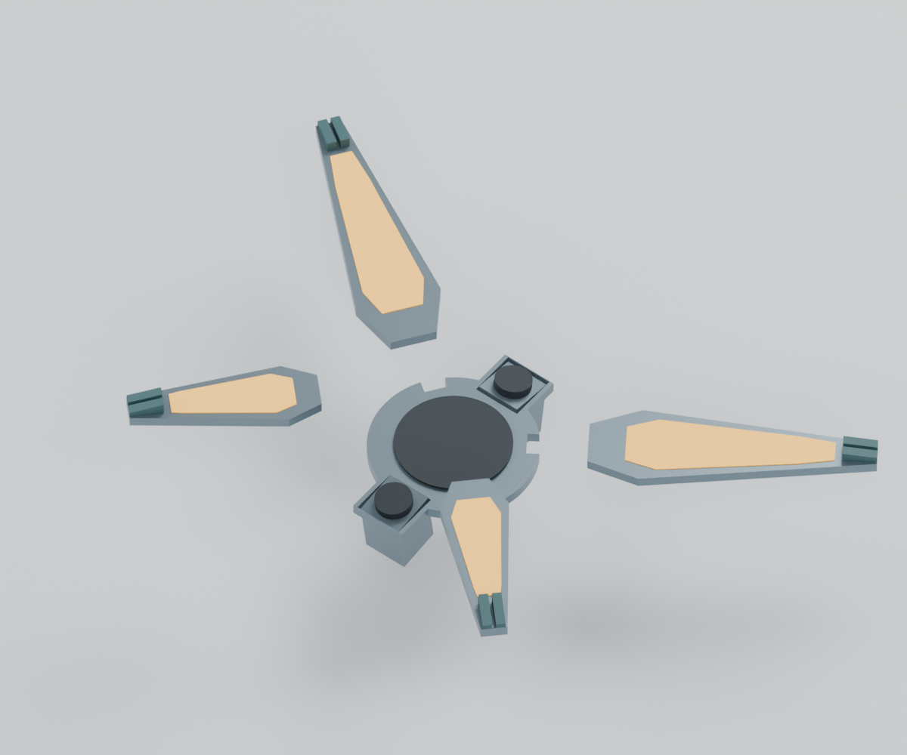
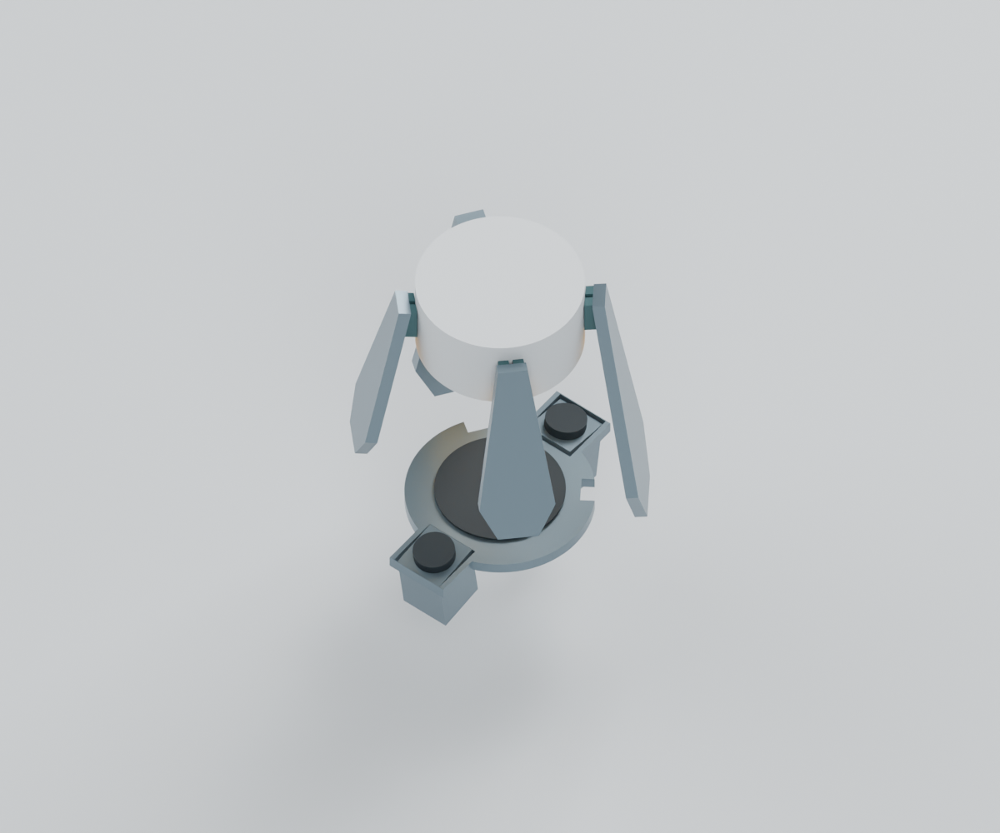
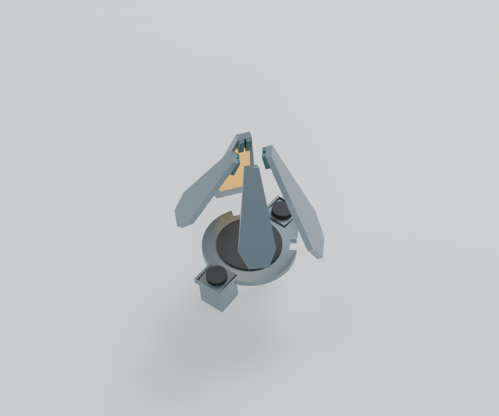

<!-- SPDX-License-Identifier: CC-BY-NC-4.0 -->
<!-- Required Notice: Odradek — Auromix contributors (https://github.com/Auromix/odradek) -->
# 原生 Blender 分组件检查模型

状态：**R4-SUBASSEMBLY-REVIEW-01，三个可编辑场景、五张渲染、四指层级检查完成。** 这是已计算原创几何的检查入口；未将新连接、根部驱动和真实灯板合成为制造装配。

[下载原生 .blend](../../engineering/generated/component-reviews/odradek-r4-subassemblies.blend)；[输入哈希与校验记录](../../engineering/generated/component-reviews/evidence.json)。打开后通过 Blender 顶部 Scene 选择器切换场景。

| 场景 | 几何和操作 | 未包含的部分 |
|---|---|---|
| `01_LINK56_connection` | J5→J6 六个原创金属零件，按实际装配矩阵摆放 | 原厂关节、40 个紧固件和电缆；尺寸和装配检查见 [LINK56](link56-structure-study.md) |
| `02_anchored_base` | 底板、背板、双环及四支柱，共八件 | 桌面、锚栓和原厂关节；背板间隙用于桌架夹固，不能从渲染推断自立稳定性 |
| `03_CONTACT02_four_axes` | 16 个指片/灯窗/软垫、6 个旧中心/相机占位及1个数学圆柱，共23网格；四个独立旋转父节点 | 根部驱动、真实 PCB、保持件和动态线束 |





## 四指操作

`FINGER_UR/UL/LL/LR` 是独立旋转节点，网格通过父级逆矩阵保留其原 STEP 姿态。上指与下指根部有50 mm轴向错位；镜像来自真实几何坐标，不把同一片任意缩放成另一片。

| 帧 | 姿态 | 上指 / 下指 |
|---|---|---|
| 1 | 展开，数学圆柱隐藏 | 0° / 0° |
| 120 | CONTACT-02 的 Ø80×40 mm 侧面接触案例，圆柱 z=115…155 mm | 97.790717° / 102.219295° |
| 220 | 空载研究收拢限位，圆柱隐藏 | 109° / 122° |
| 360 | 回到展开 | 0° / 0° |







收拢限位保留指间间隙，不表示四片密封或能夹住任意小物体。帧间动画只插值角度；中途显隐工件用于对照，**不模拟接近、夹紧、搬运、释放或实际执行器速度/占空比**。灯窗仍是0.6 mm光学面占位。中央圆屏没有添加虚构像素电路。

## 数据一致性与复现

原创 STEP 以0.05 mm线性、0.12 rad角度公差三角化；保存为米制网格，界面按毫米显示。每个产品对象保留源文件路径及 CAD 体积，报告记录全部源 STEP SHA-256。展示地面、灯光与相机另有明确名称，不计为产品件。

对每指在展开、接触、收拢三姿态，读取 Blender 实际父子变换后的顶点，与独立 Rodrigues 旋转比较：12 项通过，最大差约 **0.0000084 mm**。这验证层级变换，不是网格精度、实体干涉或载荷试验。五张完整渲染已经人工查看，无截断；指定工件仅出现在接触图。

依赖已有 LINK56、底座及 CONTACT-02 STEP，从仓库根目录运行：

```sh
python engineering/export_component_reviews.py --output /tmp/odradek-component-meshes.json
blender --background --factory-startup --python engineering/blender_component_reviews.py -- --mesh-json /tmp/odradek-component-meshes.json
```

原始7＋4整臂布局 `.blend` 保留为历史基线。本分组件包没有覆盖该文件，也不能把三场景的各自检查相加当作新整机验证。
