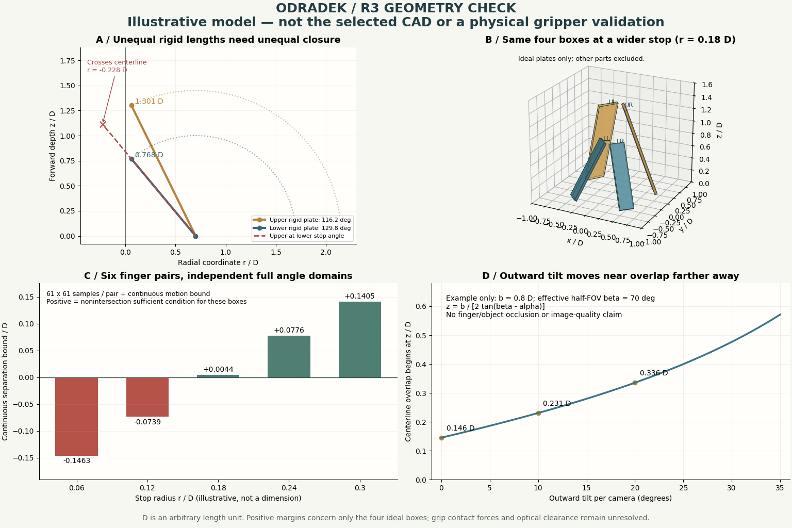

# R3｜外形确认、闭合检查与相机外倾

2026-09-27。用户确认[这张展开参考图](references/r3-approved-open-reference.png)中上两瓣大、下两瓣小、左右对称的外形；相机保持上下位置，上方略向上、下方略向下外倾。本体 7 DOF、四指各独立 1 DOF、J7 整头 roll 和可拆模块方向不变。

**本轮结论：保留选定展开剪影；R2 的紧凑全闭茧形不能作为已成立的收拢外形。** 完整长灯板需要真实的收拢长度、错层和限位。简化模型可以排除几种明显会撞的做法，并给出一个理想矩形板模型的相容角域；它不证明选定外形、整头机构或抓持已经验证。

## 两张图各说明什么

- [外观与机构意图草图](concepts/10-r3-closure-study.png)：保留完整灯板，探索凸起接触垫、相机外倾和较长收纳包络。收纳画面明确为“NOT FINAL CLOSURE”，没有给出可制造的闭合机构。
- [按参数计算的几何检查图](concepts/11-r3-geometry-check.png)：同一组参数计算指尖轨迹、矩形板姿态、独立角域分离界及相机近场重叠。数值为研究用无量纲示例，不是尺寸规格。

## 1. 上长下短为什么不能直接收成短茧

先检查最简单的刚性单板转轴模型。末端正面法线为 +z，每指在自己的径向平面内向前包合。根轴在半径 R、深度 z0，灯板从根轴到尖端的长度为 L，q=0 表示向外展开，q=90° 表示沿 +z。

$$
r=R+L\cos q,\qquad z=z_0+L\sin q
$$

若要达到同一个尖端半径 r，前向闭合支路的尖端深度为：

$$
z=z_0+\sqrt{L^2-(R-r)^2}
$$

因此同根部半径、同根部深度、不同长度的上／下灯板，在相同尖端半径处不会落在同一前端平面。晚一点关某片，并不能消除最后状态的静态穿模。

**纯示例**：D 是任意长度单位。取 R=0.7D、上板 L=1.45D、下板 L=1.0D，尖端收至 r=0.06D：

| 指片 | 闭合角 | 尖端深度 |
| --- | ---: | ---: |
| 上板 | 116.192° | 1.3011D |
| 下板 | 129.792° | 0.7684D |

如果上下都使用下板的 129.792°，上板尖端的径向坐标会变成 **−0.228D**，已经越过中心线。这个例子排除了“同角度继续关紧就自然整齐合拢”的假设；实际板宽还会使碰撞早于中心线穿越。

## 2. 把板宽和厚度也放进检查

构造四块理想刚性长方体，仅用于研究板与板之间的运动关系：

| 参数 | 上右 UR／上左 UL | 下左 LL／下右 LR |
| --- | --- | --- |
| 根部方位角（从 +x 向 +y） | 35°／145° | 225°／315° |
| 根部半径 | 0.7D | 0.7D |
| 长度 | 1.45D | 1.0D |
| 宽度 | 0.35D | 0.24D |
| 厚度 | 0.04D | 0.04D |

根部深度均为 0。每指在 0 到各自收拢限位角内独立运动，限位由上面的 r 公式计算。模型未从参考图提取工程尺寸，也未拟合真实不规则板轮廓。

对四指的**六对组合**分别进行 61×61 个独立角度采样，每对用长方体分离轴法检查 15 个候选轴。不能用一条同步闭合轨迹替代这些独立组合。

| 尖端限位半径 | 采样结果 | 连续角域结论 |
| --- | --- | --- |
| 0.06D | 存在板片相交 | 该模型失败 |
| 0.12D | 存在板片相交 | 该模型失败 |
| 0.18D | 六对均未出现采样相交 | 加入下述运动界后，模型的连续角域不相交充分条件通过 |
| 0.24D／0.30D | 六对均未出现采样相交 | 同样通过；更大的空手余隙并不代表更好的小物体抓取能力 |

为了不把“采样没撞”当成连续无碰撞，对每片构造保守位移界。设角步长 h=q_limit/60，以弧度计算，根轴到角点距离保守界为：

$$
\rho=\sqrt{L^2+(w/2)^2+(t/2)^2},\qquad d=2\rho\sin(h/4)
$$

任意角度离最近采样点不超过 h/2，所有点移动不超过 d。固定采样姿态的一条单位分离轴，其投影间隙 g 在邻近姿态最多减少 d_i+d_j。因此每对满足 `min(g) − d_i − d_j > 0`，即可给出该对整个二维角域不相交的充分条件；六对全部成立则覆盖此四板模型的独立四维角域。

在 r=0.18D 的模型中，最小保守分离投影下界为 **0.004449959D**。这是理想数学模型中的投影界，**不是实际机械最小净空、公差或已选定设计余量**。公式与数值已经独立复核。完整参数、采样结果和连续界见 [closure-results.json](analysis/r3-closure-results.json)。

模型没有关节壳、根部短连杆、软垫、螺钉、线束、掌体、镜头、工件、变形或制造公差。上述部件加入后可能产生新的碰撞；真实不规则灯板仍须用同版 CAD 重新检查。0.18D 也未被选作实际收拢尺寸。

## 3. 有效抓持不能只看“围住物体”

原图灯面朝 +z。按上述向前包合方式，灯面法向会变为：

$$
\boldsymbol n=-\sin q\,\boldsymbol e_r+\cos q\,\boldsymbol e_z
$$

到 q≈90° 时，原来的正面灯窗朝向夹持中心。故本轮修正 R2 的“灯在外侧、垫在相反内侧”假设：**在同一朝向工件的面上，让软垫／承力边框凸出，灯窗凹入**，工件先接触软垫。灯片仍是夹指的一部分，没有另加一套普通夹爪。

q>90° 时，直接用平板面接触还会产生朝掌部的分力；左右对称不会消掉这项分力。可比较两项候选：定角可换指尖垫，使目标抓持角附近的接触法向更接近对向；或独立结构止靠面，承接包络抓取的轴向反力。屏幕、镜头和灯窗都不能作为受力止靠面。定角垫只适合一定姿态范围，不能据此推断任意形状都能稳定夹持。

下一步必须在实际工件上检查接触顺序、法向、摩擦与力矩、四指是否均有效接触、工件会不会被顶向镜头／屏幕，以及松开路径。本轮尚未证明抓取力闭合、负载或防滑能力。

## 4. 相机外倾与近场关注

用户已确认：上相机略向上、下相机略向下，安装本身不新增自由度；左右对称，仍随 J7 整头旋转。

设上下光心间距 b，单侧外倾 α，安装并裁切后的有效竖直半视场 β，轴线目标距光心平面的距离 z。忽略遮挡时，两相机都覆盖该点需满足：

$$
\alpha+\arctan\frac{b}{2z}\leq\beta
$$

当 0<β−α<90° 时，中心共同视野起点为：

$$
z_\mathrm{overlap}=\frac{b}{2\tan(\beta-\alpha)}
$$

例如仅为画图取 b=0.8D、β=70°，外倾 0°／10°／20° 对应起点 0.146D／0.231D／0.336D。**这些不是选定镜头的规格或安装角。** 外倾扩大外围方向覆盖的同时，把正前方近场重叠起点推远；要由最近抓取距离和工件包络反推角度。若要让竖直半高为 a 的整个居中目标落入共同视野，则用 `α + atan((b/2+a)/z) ≤ β` 检查，条件更严格。

该关系是自行推导的二维几何；真正可用画面还依赖镜头标定、裁切、近距清晰度、灯光反射及指片／工件动态遮挡。双鱼眼观察也不直接等于已经具备双目深度能力。

## 5. 下一轮收敛顺序

1. 保留用户确认的展开板形，建立有真实板宽、厚度、根轴和短连杆的同版 CAD。
2. 优先检验完整板＋不同限位／真实前后错层；若收拢包络不可接受，再比较根部偏置或每指单输入载板连杆。后两者目前未选定。
3. 扫六对指片的独立角域，并加入掌体、镜头罩、软垫、线束和公差；同时检查空手收拢路径与目标工件的闭合路径。
4. 明确空手“完全闭合”的机械终点与必要间隙。该状态不等于四尖挤到一点、密封壳体或强行四指同步；是否遮镜头由最终几何决定。
5. 用目标圆柱、方块及薄件检查有效接触与释放，再以最近抓取距离确定鱼眼安装角和可见区域。

## 参考与证据范围

- [OpenCV 官方鱼眼投影与标定](https://docs.opencv.org/4.13.0/db/d58/group__calib3d__fisheye.html)：用于相机模型和校正方法；上面的布局几何为本项目自推。
- [Basler 官方遮挡与深度说明](https://docs.baslerweb.com/stereovisard/tutorials/image_tuning/depth_tuning)：仅被一眼看到的区域不支持正常双目匹配；不作为本项目已实现深度的证据。
- [Robotiq 官方抓取模式说明](https://assets.robotiq.com/website-assets/support_documents/document/online/2F-85_2F-140_TM_InstructionManual_HTML5_20190206.zip/2F-85_2F-140_TM_InstructionManual_HTML5/Content/1.%20General_Presentation.htm)：提示包络接触与掌部支持的关系；没有移植其机构或性能。

艺术板使用内置 imagegen 辅助，几何检查图由 NumPy 计算与 Matplotlib 绘制。它们分别服务于外观讨论和明示假设下的分析，不互相充当验证证据。
