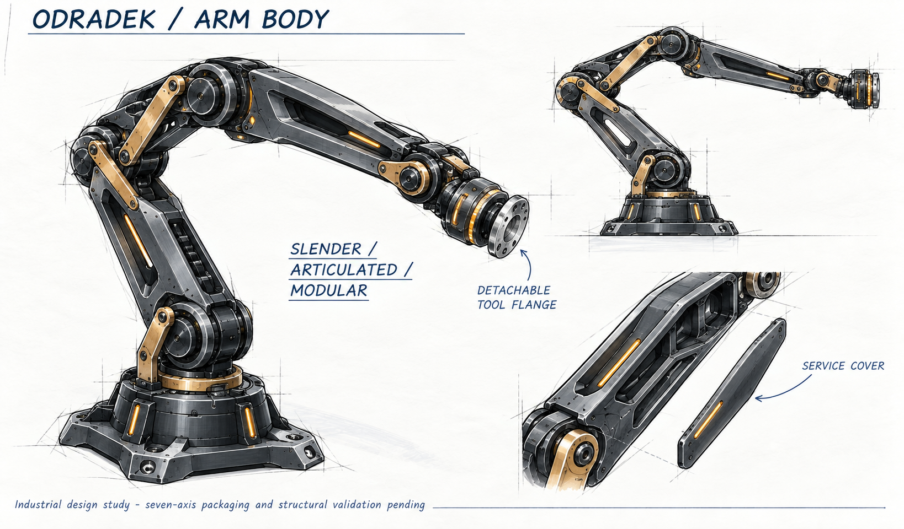

<!-- SPDX-License-Identifier: CC-BY-NC-4.0 -->
# R5：单驱动四瓣末端与独立七轴本体

本轮依据用户最新参考图和明确修订：四瓣无需独立控制，允许一个电机带动另外三瓣随动；电机尽量收进中央后壳。末端和本体分别设计，通过质量、接口和视觉语言协调。

## 末端形态

上瓣保留宽肩、折线收腰、较等宽的长灯面和截平倒角端；下瓣采用相同造型语汇但更短、更小。四瓣左右镜像，上下不作中心对称。图中的中央内部仅表达布置意向，不能从生成的齿轮或连杆直接读出可制造尺寸。

发光面本身参与夹持。当前结构研究方向为可更换透明顺应表层、透明承力层、暗色周边和横梁骨架，LED与PCB置于避载腔；实际材料、摩擦、变形、接触温升和寿命需要验证。圆形LED屏保留像素化灯环和方向图案，双鱼眼仍在上下中线分别外倾。画面不代表闭态通过，闭合姿态必须从同版CAD和运动方程导出。

## 本体形态

本体采用细长主连杆、适度露出的关节层次、浅凹结构面、可拆维护盖和少量琥珀色光。末端拆除后仍应具有完整外观；腕部以短、轻、清楚的法兰接口收尾。生成图中的结构数量不作为七个真实主动轴的证据，实际关节布局以参数模型为准。

2kg指工件净重，另计末端。分开设计不等于把末端重量从本体计算中删除：法兰接口需接收末端质量、质心、惯量和工件六维载荷。约700mm指肩至任务TCP的目标尺度，不能同时把肩至法兰的长度也默认成700mm。概念图不覆盖目前真实关节尺寸、动态线束、承力连接和散热约束。

## 当前架构和权衡

| 项目 | 已确认或当前处理 |
|---|---|
| 本体主动轴 | 7；J7沿末端正面法线带动整头旋转 |
| 末端驱动 | 用户允许1电机＋3瓣mimic，当前首选1主动坐标带动4个瓣关节 |
| 四瓣关系 | 上下可不同速比；真实连杆可能为非线性映射，不预设URDF线性mimic |
| 接触后动作 | 限力夹持；研究分支串联弹性或被动差动，允许先接触瓣让位 |
| 空载能力 | 全闭静止→全开→全闭静止≤1s；持续1Hz热占空未指定 |
| 负载与尺度 | 2kg净工件＋实际末端质量，肩至TCP约700mm |
| 末端质量目标 | 暂争取≤1.5kg，是工程权衡目标，非用户硬指标或已实现值 |
| 接口 | 可拆；EtherCAT执行链、双GMSL/GMSL2同轴、内走线、外置计算 |

少一个主动轴并不自动少一套机械约束。刚性四支联动在第一瓣接触后可能阻止其他瓣贴合；如果增加被动顺应，就需要明确行程、复位、限位和每支最大力。单电机电流只能约束总广义驱动力，不能分别观测四个接触力。

## 本轮工程顺序

先以参考轮廓生成真实上、下指片及透光承力截面；同时综合中央滑块和四支连杆，求解角度、雅可比和死点。随后把二者放到同一装配中检查空手闭合、持物接触、中央光学遮挡和传动空间，再更新惯量、驱动、控制、供电及本体载荷。

[FAST-GRASP01](engineering/fast-grasp-requirements01.md)维护确认输入；[工程基线](engineering/current-baseline.md)区分新路线和历史快照。原P16分支不能满足1s要求，现归档。现有中央屏及其电路可能复用，旧四片PCB是否保留必须服从新灯面轮廓、载荷路径和空间。

本页两张图由内置image_gen使用参考生成，完整提示词与边界见[末端](concepts/11-r5-single-drive-head.prompt.md)和[本体](concepts/12-r5-arm-body.prompt.md)。它们是工业设计研究，尚非制造图、完整运动验证或2kg样机资格。
