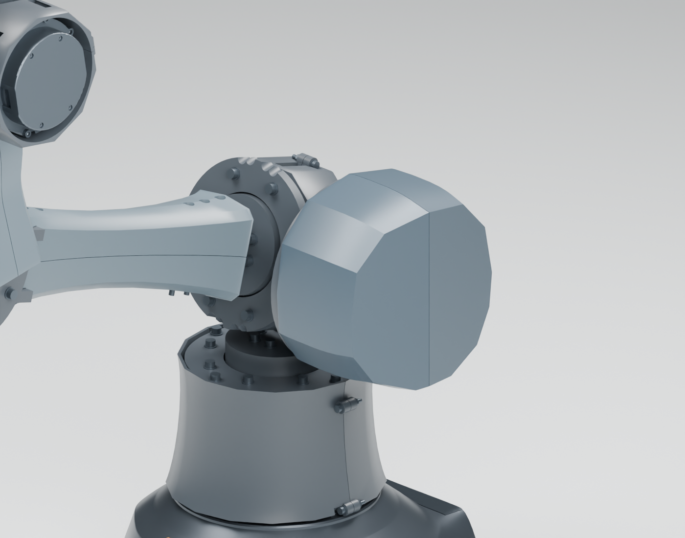
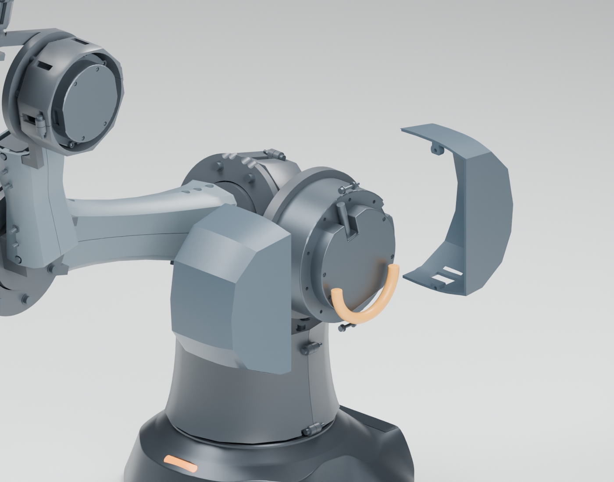

# A12 连续甲壳 · 第一模块：J2肩部护罩

用户已确认[方向A](../../../docs/concepts/selected/arm-body-a12-manta-carapace/README.md)。本模块从实际RS04实体与A11结构基线出发，只替换J2的两片护罩；J3、肩桥、臂根、连杆、肘部及腕部尚未完成A12造型。这不是整机A12的完成版本。

连续收敛的盾形边界、背部双斜面折脊和深色分缝改变原来圆盘电机外露的轮廓。电机、交叉轴间距及接口没有缩放；两半壳保留原有两组M3夹罩位置，以完整拆半壳进行检修。下侧三处开口属于散热意向，不能代替热验证。

## 本轮空间与检查

- 罩体正面总包络约145×142mm，轴向约78.5mm；名义曲面壁厚2.6mm、中心分缝0.4mm，电机圆柱清隙目标1.4mm。实际最小壁厚、打印补偿及夹罩垫片仍待细化。
- 两个自制CAD件均为单连通、闭合实体，STEP与STL在J2.fixed局部坐标。**STL不是已摆放的打印包，未做切片、固定可靠性或打印放行。**
- 七个离散工况分别为idle、attention、reference，以及保持attention其它轴不变的J2=-60/0/45/110°。只检查新增护罩对未改动A11结构/紧固件与原厂电机实体，以及两片护罩之间的实体交集；结果见`build/fit-audit.json`。不是全域、多轴组合或连续路径检查，也没有把A11既有结论移用于新罩。
- 后侧留一个未连接的D10、R36 U形空间目标。检查沿其中心线采样的D10球体与新罩和J2原厂实体的交集；间距约2.36mm，**不是完整连续管道或实际线束证明**。没有连接上、下游线束端点，不能用于判断活动线的扭转、动态最小弯曲半径、寿命或插件可达性。
- 原M3夹罩紧固件只保留名义尺寸和几何席位。环抱垫片、防滑、振动、热传递和实际拆卸均待验证；不把包覆件作为新增承力结构。

## 同源与原生文件

底座直接取相邻权威项目的B06原生文件，为避免另一会话并行修改混入两种版本，本轮使用由源SHA唯一标识的只读缓存。源和缓存指纹在`build/inputs.json`；缓存不成为可编辑底座源。本轮没有验证B06与整个新臂身的集成、桌夹或承载。

- `build/A12-A-shoulder01.blend`：公开原生文件，采用自建电机包络；七轴rig保留。
- 本机`work/arm-a12/shoulder01-actual-motors.blend`：全尺寸原厂实体装配，不随项目许可重发布供应商CAD。
- `build/manifest.json`、`fit-audit.json`、`native-actual-audit.json`、`native-public-audit.json`：本轮独立输入、实体检查与原生复开检查。
- `build/module-context.png`：新J2罩在未改动A11其余本体上的上下文，仅作局部设计进度展示。

先用CADQuery环境运行`build.py`、`audit.py`、`prepare_context.py`，再用Blender4.5运行`blender.py -- --actual`生成本机实体模型及视图，`blender.py -- --no-render`生成公开文件。分别重新打开两个原生文件执行`audit_native.py`。重新生成底座输入快照是显式操作；不得悄悄替换后复用旧报告。

下一模块将围绕J3与肩桥重建运动侧甲壳，连接上臂轮廓与根座，同时确定线材/插头、固定槽、活动端点及夹点边界。最终电机包覆还受输出轴承、封闭后的持续扭矩/温升和3kg目标约束；本轮没有解决这些承载与热风险。
