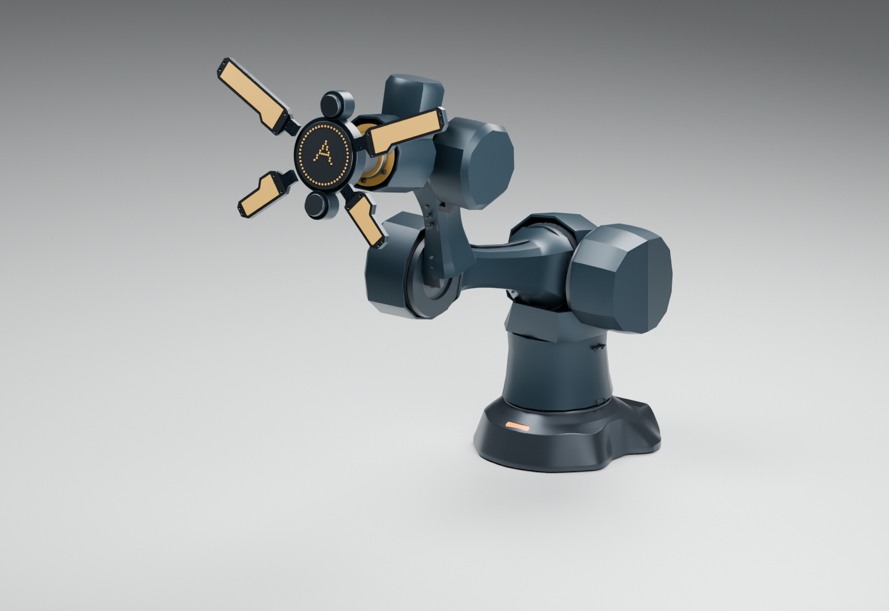

# A12 / A：连续甲壳整臂造型初稿

按已选 A 方向，把长版七轴、同源 B06 魔鬼鱼底座与现有四瓣头放在同一场景中查看。此阶段用于判断整体比例与设计语言；新增外罩是 Blender 设计曲面，尚未进入打印制造发布。

[公开交互预览](../../../docs/viewers/arm-body-a12-style/index.html)支持七轴滑条、三个姿态、外罩隐藏与头部形态参考开关。公开版本使用自主电机包络；本机的实际原厂 CAD 预览位于 `work/arm-a12/whole-style01/viewer-actual/index.html`，完整原厂资产不上传。

## 本轮实现

- 保留 A11 的实际关节轴、长版轴距、结构件和未缩放的电机：J1/J3/J4 RS03，J2 RS04，J5 RS06，J6/J7 RS00。
- 添加 17 个独立外观网格：臂根、肩桥背脊、各关节固定侧罩、转动侧唇边、收腰上臂/前臂及深色背脊盖。固定罩与转动罩分别挂在对应固定/转动坐标系下。
- 两件 J2 肩罩沿用上一模块几何；对整臂统一材质。J2 的局部检查不等同于新增整臂外罩的检查。
- 底座从 shoulder01 已钉住 SHA 的 B06 原生文件读取。四瓣头保留既有 R5 灯瓣实体轮廓与示意中心面板，只作风格上下文，未重新设计夹持机构，也不计入裸法兰 3 kg 结论。
- 背脊中画出两段 D12 固定连杆走线空间意图，默认隐藏。它们没有跨过关节，不是完整线束。

## 仍需收敛的形态与装配问题

真实执行器布局使腕部仍呈现较明显的圆筒叠置，肩、肘的侧面罩也偏大；与已选艺术图中的长盾形过渡尚有距离。下一模块优先修整腕部连续侧罩和端座过渡，在实际电机及支承包络外形成更明确的长盾形轮廓，再回到肩肘外罩细化。

低位收拢展示的是 A11 关节姿态。新增外罩与底座、关节、相邻罩壳的运动干涉尚未验证，不可据图直接执行运动。滑条机械角度范围同样不是已验证安全工作空间。

背脊盖的定位、紧固/卡合、开盖工具可达性、插头出线、活动线束弯折、散热与制造公差没有在本轮完成。新增网格闭合不表示可打印装配；本轮不输出打印 STL，避免将造型试稿混入制造发布目录。

## 验证证据

[网格和原厂模型不变性报告](build/audit.json)：17 个新网格均为闭合、法向一致、正体积单组件；14 组原厂电机几何的顶点/拓扑保持不变，查看器毫米坐标量化最大误差约 0.000863 mm。公开查看器不含原厂几何组。

[实际电机原生模型复核](build/native-actual-audit.json)与[公开原生模型复核](build/native-public-audit.json)：两个 Blender 文件重新打开；三个命名姿态下，七轴坐标系与独立正运动学一致。以上检查范围不包括整臂碰撞、线束、打印/装配或载荷资格。

## 文件与重建

[公开可编辑 Blender](build/A12-A-whole-style.blend)保留七轴 `angle_deg` 控制、独立造型对象和来源信息；本机原厂版为 `work/arm-a12/whole-style01/actual-motors.blend`。

生成顺序：`blender.py --actual`（原厂版和渲染）→ `blender.py --no-render`（公开版）→ `export_viewer.py` 两种模式 → `build_viewer.py` 两种模式 → `audit.py` → `native_audit.py` 两种模式。带 `bpy` 的脚本通过 Blender `--python` 运行，其余脚本用 Python。`audit.py` 需要 numpy/trimesh。查看器在一个目录中打包本地脚本，无外部网络依赖；浏览检查使用临时 localhost HTTP 服务。

A11 基线 SHA、B06 原生文件 SHA、原厂组源 SHA 均随报告留存。未选的 B/C 保持在探索目录，与本选定方向分开。
