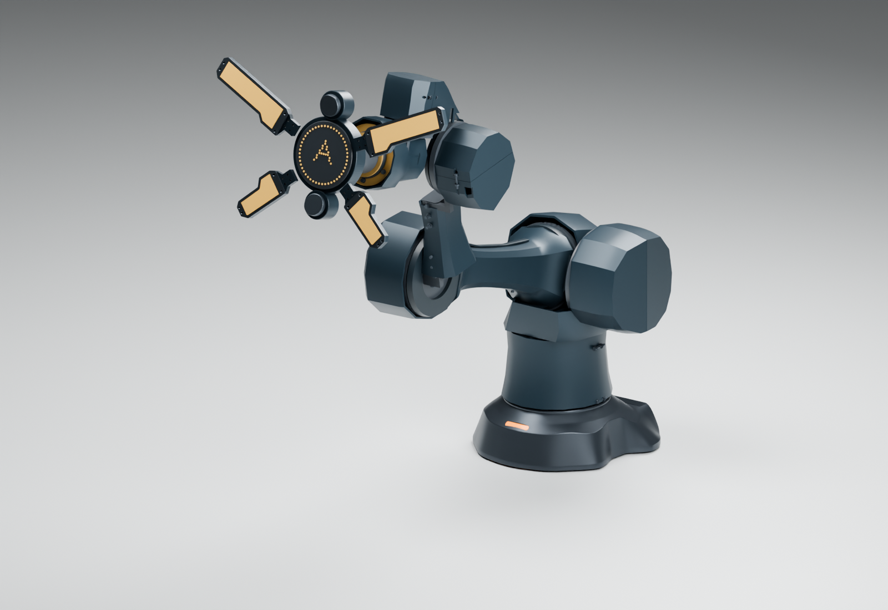

# A12 / A：腕部第二模块

本轮将 J5–J7 从整臂的 Blender 外观曲面推进为六件独立的分体 CAD 外罩，保留实际电机、轴承座、法兰与七轴运动关系。目标是把圆筒叠置改成有脊线、收腰和折面的过渡，而不缩放电机制造好看的假比例。

[七轴交互查看器](../../../docs/viewers/arm-body-a12-wrist02/index.html)可单独隐藏六件腕罩；[可编辑 Blender](build/A12-A-wrist02.blend)是公开包络版。本机原厂版在 `work/arm-a12/wrist02/actual-motors.blend` 和同目录 `viewer-actual/index.html`。供应商原始 CAD 仍不上传。

## 模块与安装边界

| 模块 | 固定坐标系与分缝 | 安装站位（mm） | 形态与界面 |
|---|---|---|---|
| J5 / RS06 俯仰 | `J5.fixed`；X=±0.20 | Y72.25 / Z±49；螺钉沿 X | 后伸盾面、上脊、下侧开口，前口与转动结构独立 |
| J6 / RS00 横摆 | `J6.fixed`；X=±0.20 | Y±33.5 / Z84.70；螺钉沿 X | 后伸楔面收向顶部；为前臂端座和螺钉增加避让 |
| J7 / RS00 末端滚转 | `J7.fixed`；Y=±0.20 | X−1.70 / Z±33.5；螺钉沿 Y | 电机后段收腰、轴承座前段展开、独立法兰出口 |

每个罩分 A/B 两半；名义皮厚 2.6 mm、分缝 0.4 mm，通孔 Ø3.5。复用 A11 六颗 M3×20、六个 M3 六角螺母和十二片名义 0.5 mm 垫圈。固定罩不跨接两个运动关节；沿用独立的转动侧唇边造型稿，唇边不属于本次六件 CAD 试配件。

分体夹紧几何仍需要衬垫和实物固定试验。1.2 mm 是圆柱电机避让体的名义径向余量；不是所有曲面、接口或电线均已测得 1.2 mm 实际间隙。闭合缝隙、螺钉松紧、接触压力、温升和长期保持能力都未批准。

J7 外罩必须包住 Ø84 的既有轴承座，不能按 Ø57 电机尺寸直接收窄。前段保留转动法兰与固定外罩之间的独立间隙，以及轴承座紧固件的访问空间。非承力外罩不改变原有轴承座、转动法兰或端座的负载资格。

## 避让与造型修正

首轮实体检查发现 J7 与 J6 螺钉/垫圈相交，以及 J6 后伸罩在回折时触及前臂端座。几何中增加了固定螺钉的完整圆环扫掠避让、同一刚体相邻螺钉的实际实体余量和十个设计姿态下的端座避让口袋。后者属于离散姿态避让，不能当作连续扫掠证明。

随后中间角度检查发现 J5−60°时 J6 后缘接触端座，以及 J6+20°/+40°和组合姿态下 J7 内侧接触 P05 支架。后缘切口加深，J7 顶部增加 X−14…12 / Y±16 / Z36.2…42.2 的局部避让。24个姿态因此是设计修正后的回归检查，不是未参与设计的独立验证集；其他外观曲面、底座、线束和连续路径不在此实体检查范围。

修正后的24个离散姿态均未发现超过0.05 mm³阈值的相交体积；范围仅为六件新腕罩对既有原厂电机、结构、名义紧固件与J2罩。20个整臂造型网格保持封闭，14组原厂电机的顶点及拓扑未变，两种原生模型的三个预设姿态七轴变换均与独立正运动学一致。结果不证明全行程正间隙或任何负载资格。

J6 避让切削形成的少量孤立薄片被从 CAD 中删除；体积、位置和删除比例留在 [manifest](build/manifest.json) 中，不保留无法连接的打印碎件。主体仍需进行物理壁厚/刚度检查。

原整臂的前臂外观曲面与新 J5 罩有重叠，本轮将该造型曲面收至 X118；实际结构管、端座与电机保持不变。前臂曲面、肩部和肘部的其余外观仍是前一轮造型稿，没有因此进入制造发布。

## 试配与来源文件

- [源 CAD STEP](build/step/)：六件非承力外罩的原始坐标实体。
- [无动力试配资料包](build/wrist02-unpowered-fit.zip)：六件摆放 STL、STEP、三向查看图与来源/检查记录；[完整性检查](build/package-audit.json)。仅针对六件腕罩，不包含全臂打印件或供应商原始 CAD。解压后应结合本仓库的模型和报告查看。
- [原坐标 STL](build/stl-object/)与[摆放后的打印试配 STL](build/fit-print/)：后者按分缝面向下单独摆放，毫米单位；[摆放、尺寸与来源记录](build/fit-print-manifest.json)。打印支撑、切片参数、缩水和材料批次需自行核对，未提供经过实机验证的切片任务。
- [三向投影查看图](build/drawings/)：直接从 STEP 投影，标注坐标、包络、分缝和安装站位；是试配查看图，尚非完整公差/GD&T 制造批准图。
- [实体干涉检查](build/fit-audit.json)、[网格/原厂几何一致性](build/audit.json)、两种原生模型的[实际电机复核](build/native-actual-audit.json)与[公开包络复核](build/native-public-audit.json)。检查结论只按各报告范围使用。

建议先受支撑、无动力地试配：检查两半是否能绕原电机安装，核对螺钉与螺母可达性，确认固定罩不随输出轴转动，再实测衬垫与外壳接触。任何新干涉、松动或擦线都先修正，不做 3 kg 悬臂测试。

三处开口只是检修/布线出口，尚未选定插头、应力消除和实际线束；不会假设电机有通孔。CAN/电源与双 GMSL 同轴的活动连接、弯曲半径、扭转寿命及散热仍需下一模块处理。裸法兰 3 kg 继续是目标，未因本轮试配罩壳得到验证。

六件 CAD 实心体积按 PETG 密度 1.27 g/cm³假设估算约234 g；不含其他外罩、衬垫和紧固件，实际打印质量另测。底座同步只读权威 B06-COMPACT-03，见[来源记录](build/base-context.json)；主轮廓与COMPACT-02相同，后盖与隐藏紧固件有更新，本体项目不另建底座设计源。

重建顺序：`build.py` → `audit_fit.py` → `prepare_fit_print.py` / `drawings.py` → `prepare_context.py` → Blender `blender.py` 两模式 → `export_viewer.py` 两模式 → `build_viewer.py` 两模式 → `audit.py` → Blender `native_audit.py` 两模式 → `package.py`。所有供应商分区及来源模型均绑定 SHA；原厂版仅保存在本机。
