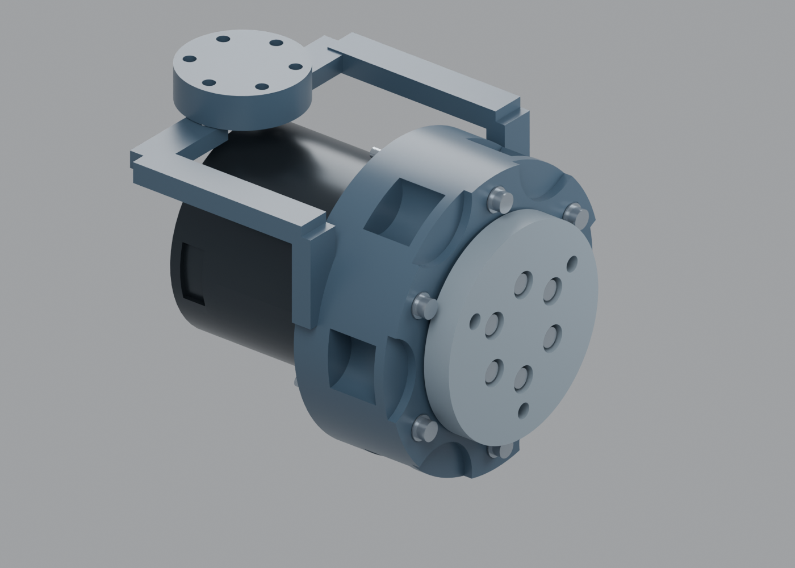
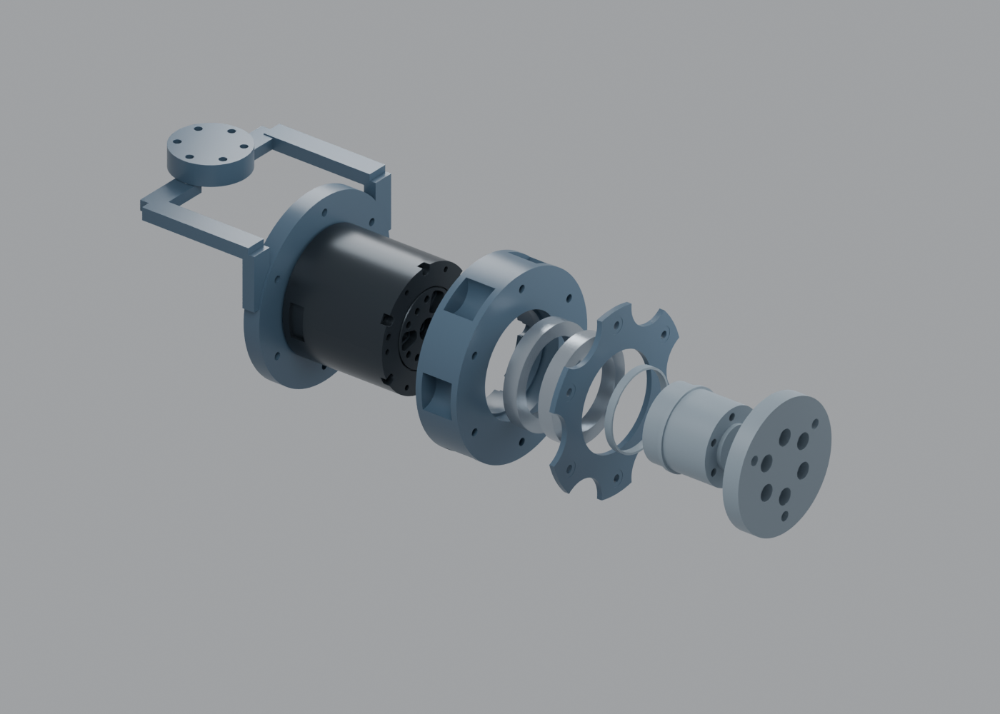

# J7 FIT01：先塑料试配，后续金属骨架

2026-10-09。这是已确认A连续甲壳、约700 mm长版机身的第一个局部结构试配模块。本轮以真实RS00几何和原安装接口为基础，先解决腕部轴承装不进去的问题；没有发布整臂制造文件，也没有改变电机型号、七轴关系或臂展。

## 本轮具体改变

- **前法兰改为可拆件。** 原件的Ø37后挡肩和Ø60前法兰同时大于轴承Ø35内孔，完整轴承无法套入。现拆成轴颈与前法兰，加入Ø20×2 mm定位凸台、Ø20.2×2.2 mm配合凹口，原六颗M3×40电机输出螺钉贯穿连接。保持外法兰前平面X=65.7、Ø60及3×M4/PCD45接口。
- 轴承座在六颗PCD70螺钉之间开径向窗口，保留两端3 mm连接环、轴承座孔和中间挡肩；压盖边缘减材。两件仍保留Ø84最大包络，这次减材不等于腕部缩径或强度合格。
- 提供**6个装配塑料件和6个配合小样**：轴承外圈孔Ø47.10/47.20/47.35，轴颈Ø34.85/34.95/35.05。尺寸均是CAD标称，必须以自己的打印机、材料与实际轴承试配。

轴承座与压盖相对既有实体体积减少约14.5%与26.6%。估算是CAD实心体积，不是切片重量或金属强度证明。两件均只从原实体减材，已核验没有向电机/支架方向增加材料。

## 文件入口

- [打印试配包](build/J7-FIT01-plastic-fit.zip)：六装配件、六小样的STEP和摆放STL、尺寸工作图、BOM、装配说明与检查证据。没有原厂模型。
- [公开原生Blender](build/A13-J7-plastic-fit.blend)：可编辑局部装配，电机用自建包络。`J7.rotor`的`angle_deg`属性控制输出滚转。
- 本地实际电机原生模型：`work/arm-a13/j7-fit01/actual-RS00-fit.blend`，两个原厂固定/输出模型保留真实尺寸，留在本地。
- [轴向堆叠图](build/drawings/J7-axial-stack.svg)、[接口尺寸JSON](build/interface.json)、[零件及打印尺寸CSV](build/parts.csv)、[局部检查](build/fit-audit.json)。

尺寸工作图有实体投影、孔阵、轴承孔/挡肩、深度及基准说明，服务塑料试配。后续金属加工需另设材料、关键配合、公差、表面要求及截面核算，不能把这些工作图当作CNC放行图。

## 先打印什么

1. 用计划打印结构件的材料、喷嘴和切片参数打印六个小样。记录实测孔径/轴径、插拔方式、是否卡滞和是否松动。轴线均竖直打印；小样文件名即尺寸，拆下后按文件名分袋，避免混淆。
2. 用实际6807轴承试配。Ø35.05小样可能过盈；只用手试，不敲击，不拿轴承作塑料切削工具。目标是可装拆而不明显摇晃的试配；这不是精密金属轴承配合。
3. 本版主体仍按孔Ø47.20、轴Ø34.95。若小样表明应选其它尺寸，先改对应CAD并重新生成本版数据，不要打印主体后强行装入。隔圈名义ID35.10，也需实测。
4. 再打印六件装配件。`print-bed`已统一落床且最大尺寸适合230×230×240 mm检查空间；轴颈沿+X竖直，前法兰前面朝床，轴承座孔竖直。支架姿态只是候选，复杂横孔、螺母槽和桥接需在切片预览中检查支撑和工具空间；不要把自动落床视为无支撑可打印。

初次尺寸试配可用PETG；材料并未作承力选型认证。尽量在孔、挡肩、螺母槽与定位台阶保持相同打印工艺，避免小样与主体使用完全不同的层高和补偿。切片壁数/填充、层间强度与热环境另行验证，本包不指定一个未经试验的万能参数。

## 采购件与紧固件

| 项目 | 数量 | 接口/用途 |
|---|---:|---|
| RobStride RS00实际交付版本 | 1 | 两编码器QDD；本轮绑定既有原厂STEP，不混用新版本 |
| 6807轴承，35×47×7 mm | 2 | 外圈分别从轴承座前后装入 |
| M3×40内六角圆柱头螺钉 | 12 | 6颗电机输出，6颗轴承笼贯穿连接 |
| M3×12内六角圆头螺钉 | 6 | 固定侧；名义啮合3.5 mm，前侧可用螺纹深度须交付实测 |
| M3平垫，名义厚0.5 mm | 24 | 输出6、固定6、笼前6、笼后6；厚度影响轴向与啮合 |
| M3六角螺母 | 6 | 笼贯穿连接，后端由支架槽定位 |
| M4六角螺母 | 3 | 工具法兰后侧槽；本轮不加工具负载 |

电机输出螺钉按35.5 mm有效夹持厚度加0.5 mm垫片计算，名义啮合4.0 mm；资料给出的盲孔深度5 mm不能替代实际可用螺纹和底孔检查。固定侧前孔深度尚未确认，因此先用卡尺/深度计核对交付件，不能盲拧到底。

支架与J6连接的螺钉属于下一模块；本轮支架作为受支撑局部夹具，无整臂连接放行。头部接口相关M4螺钉长度需按未来工具板另定。

## 实际装配顺序

1. 电机不通电、模块受支撑。检验支架孔位、实际螺纹深度后安装固定侧螺钉；贯穿螺母先放入支架后侧槽。
2. 将后轴承从轴承座后口装至中间挡肩，前轴承从前口装至另一侧。中间挡肩ID44.8小于轴承OD47，两轴承不能都从同一口装入。
3. 把没有前法兰的轴颈靠在电机输出界面，保持支撑。带两轴承的轴承座从轴颈前端套入，后轴承内圈落到Ø37后挡肩；安装轴承座贯穿螺钉，暂不靠它强行拉正偏斜。
4. 装前压盖及内圈隔圈。先将工具法兰M4螺母放入独立前法兰的后侧槽，再将前法兰套上Ø20定位台阶，装六颗输出M3×40及垫片。核查底孔、名义啮合和塑料压溃，均匀手紧；未定义扭矩，不给出虚构的拧紧值。
5. 测量轴向游隙、压盖—旋转法兰间距和手动转动阻力。名义间距1 mm，塑料变形/打印误差可能吃掉间距；若卡滞则拆查，不用加力拧紧压平塑料来预压轴承。必要垫片按测量再定义。

前法兰Ø20定位台阶只用于本次塑料试配；不声称承担最终3 kg偏载弯矩或替代金属精密定位。拆装顺序与各部件尺寸绑定在`interface.json`。

## 检查范围与下一模块

本轮检查：12个打印文件单实体、闭合且一致定向的STL；打印尺寸；改动两件与真实RS00固定部件、支架、名义轴承/螺钉的局部精确实体检查；J7滚转五个角度下的轴颈与分体法兰；轴承装入路径抽样。报告不把螺纹啮合整片忽略，也不把小样当实物合格证。

**外罩仍以A12所选造型为参照。** 本轮没有完成独立外罩耳座、完整CAN/电源/GMSL关节活动线束、连接器选型、J5/J6运动净空或整臂强度。下一步是J6—J7支架/线束通道与隐藏外罩定位，随后再向J5和肩肘推进。塑料试配模块始终受支撑无载；后续金属骨架单独核算与试验裸法兰3 kg目标。

## 复现

用项目CadQuery Python依次运行`build.py`、`drawings.py`；Blender后台运行`blender.py`，传`-- --actual`生成仅本地原厂版本与效果图；运行`audit_native.py`、`package.py`核验及打包。原厂STEP需已存在本地缓存。公开包只包含原创结构与自建包络。
