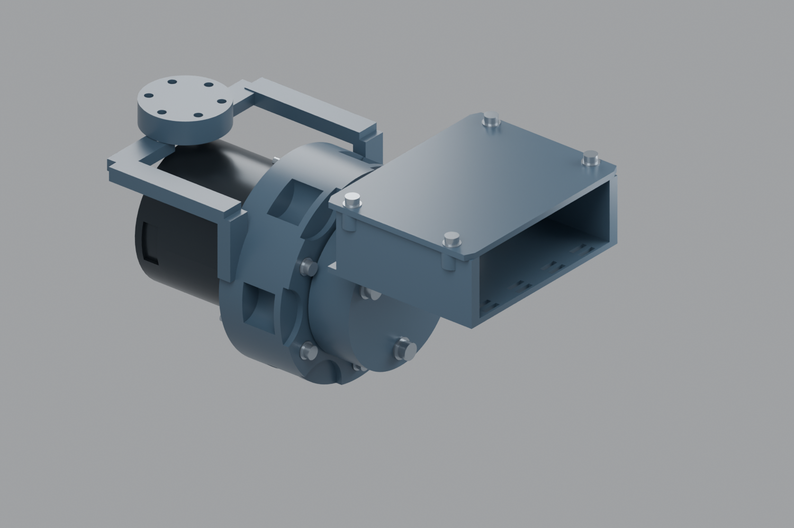
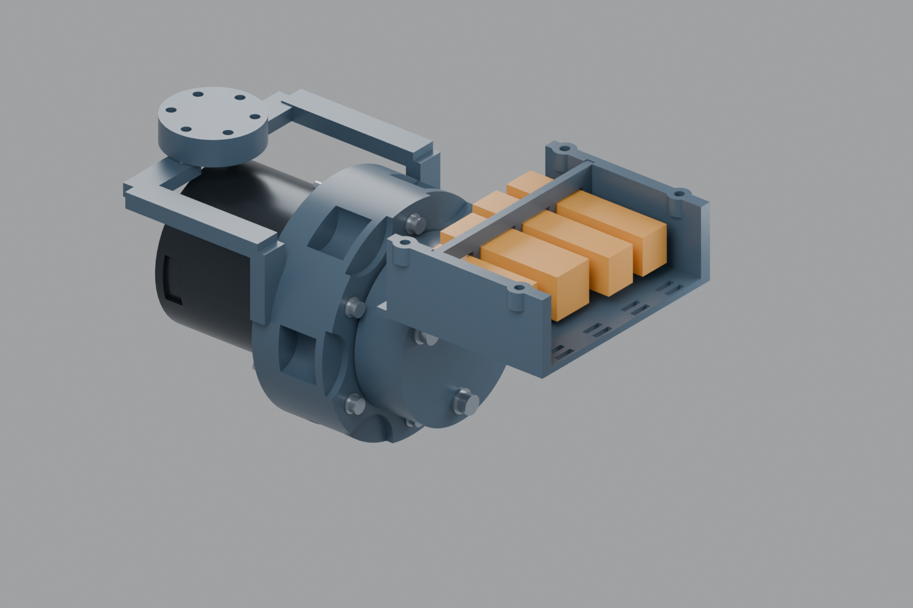

# TOOL-IF01：工具定位与四路独立接口预留

2026-10-09。保留长版、本体与末端分离及A连续甲壳方向。本轮交付**无载、受支撑的机械定位/拆装与连接器空间原型**，没有冻结四瓣头的控制器、连接器总成或通电接线。相机本体仍由末端模块设计；本体不把旧ZED选型当用户已经选定的相机。

图中琥珀色块是**成对连接器的设计空间预算**，不是已经适配某个料号的原厂模型。接口仓放在工具接收板背脊；这是检查内部空间的原型形状，最终要与四瓣头后罩及腕罩共同收敛。没有修改同源底座或四瓣头本体。

## 机械接口：工具可以独立拆卸

| 项目 | 尺寸 / 方式 |
|---|---|
| 本体法兰 | Ø60，端面X=65.7；裸法兰3 kg仍是后续金属版验证目标 |
| 工具接收板 | Ø60主体、厚11；前平面X=76.7，属于工具侧部件 |
| 工具侧居中 | 新Ø18×2凸台，对侧Ø18.3×2.2凹口；先试配Ø18.2/18.3/18.4小样 |
| 防错方向 | +Y偏置24 mm的Ø3×6钢销；正确方向避让，错误120°/240°装入被阻挡 |
| 工具固定 | 3颗M4×20，PCD45、首角30°，0.8 mm垫片及原后置M4螺母 |
| 接口仓固定 | 2颗M3×12及0.5 mm垫片；接收板顶部可装入M3螺母 |
| 检修盖固定 | 4颗M3×10及0.5 mm垫片；M3螺母在接口仓侧耳下方装入 |
| 面板更换 | 开盖后沿+Z抽出，不改承力法兰，可重做连接器孔型/压条 |

首角0°是+Y，正角朝+Z。本轮Ø18工具侧定位与上轮Ø20内部轴颈—法兰定位是两个不同界面。工具固定螺钉与RS00六颗输出M3螺钉分开；换工具不需要卸下电机输出连接。

当前销孔Ø3.1并未提供可靠过盈保持。塑料原型按实测配合及必要的可控胶粘固定钢销；需要记录胶粘/拔出是否适合试配，不能当承力销连接。金属版另定定位、销保持和公差。M4×20名义端点X=57.5，压盖前面X=56.7，只有0.8 mm轴向预算，必须实测螺钉、垫片、螺母、轴向堆叠及塑料变形，防止螺尖擦压盖。没有给出未经试验的紧固扭矩。

## 相机、供电与控制：分别留位

四个槽口沿Y排列。所有成对连接器空间均在工具侧J7.rotor坐标，当前名义轴向中心X=106.7。

| 标识 | 职责 | 成对连接器空间预算 X×Y×Z mm | 面板孔 Y×Z mm |
|---|---|---:|---:|
| PWR | 末端供电 | 40×12×13 | 14×16 |
| CTRL | 末端控制 | 48×16×16 | 18×18 |
| CAM_UP | 上鱼眼GMSL | 56×12×14 | 14×16 |
| CAM_DOWN | 下鱼眼GMSL | 56×12×14 | 14×16 |

这些尺寸是**工程分配值，不是厂商保证的最大包络**。其中供电按Micro-Fit 3.0四路系列作参考；官方[Molex插壳](https://www.molex.com/en-us/products/part-detail/430200400)、[配对插壳](https://www.molex.com/en-us/products/part-detail/430250400)及[系列尺寸图](https://www.molex.com/content/dam/molex/molex-dot-com/products/automated/en-us/salesdrawingpdf/430/43020/430200601_sd.pdf?inline=)说明其配对家族。未冻结端子、线径、连续电流、并联针脚或完整孔型。当前面板**只验证空间，不能直接声称能锁住实物连接器**；具体料号确认后重做独立面板和夹持件，优先不改法兰。

控制位既保留带锁CAN插头候选，也给RJ45尺寸的EtherCAT插入件留预算。实际CAN针脚和EtherCAT接口分别定义，不把低频插头直接赋予高速以太网资格，不把EtherCAT口视为普通PC网口，也不把功能禁能脚称为STO。当前主线末端伺服仍有外置/头内驱动比较，不能偷用旧P16头板作为最新冻结协议。

双相机各用独立同轴路径，不混入CTRL的针脚。普通FAKRA与更小HFM是后续线束总成的候选方向；[Rosenberger HFM官方目录](https://www.rosenberger.com/fileadmin/content/headquarter/Downloads/RF_Coaxial_Connectors/AUTO_HFM_Catalog_2023.pdf)列出GMSL及单/双/四位配置，但不能因此认定本仓已经容纳任意FAKRA，或把HFM与FAKRA直接配插。相机端型、线材组、机械编码、过渡线及完整总成需一起确定。

不把本体48 V直接送给未确认的末端。供电电压、电流、回流/屏蔽、保护、再生吸收和功率预算待配套末端确定；24 V只是已有头部伺服研究的候选，尚未发布本接口电气针脚。PoC也只在实际相机/串行器/解串器兼容后使用，不默认所有相机都靠同轴供电。本版不接电、不热插拔。

## 插拔、检修与线束固定

- 开盖方向+Z。四个锁扣/手指操作位置各有12×12×25 mm的顶部空间预算，已在开盖条件下与本轮塑料件核查；不是对具体连接器按压行程的测量。
- 四个配对空间按+X方向抽出25 mm，核查0/12.5/25 mm三个位置。未来四瓣头后罩必须为这个方向保留路径；当前没有完整头部实体，不能声称接上头以后仍然可拔。
- 每路有一对2×8 mm扎带槽，位于配对空间之后的接口仓底板。扎带/线夹须作用于选定电缆的护套，不压锁扣、端子或裸同轴；实物线夹形状与压紧量待线径确定。
- 三颗工具M4、两颗接口仓M3、四颗盖M3均有直线工具通道预算；报告仅检查名义细杆工具，不替代选定扳手或实际手部操作。

RS00没有在本方案中形成可用的中央贯通线道。线束仍需经过侧/背腔跨J7。归档[CAM-CABLE02](../../../docs/engineering/camera-cable-refresh.md)中的保守动态同轴候选R75 mm、扭转±180°/m不能塞成紧贴电机的反复小弯：若单独把±90°滚转均匀分配到该条件，理论自由扭转长度至少0.5 m，未计其它关节和夹点。它是约束筛查，不是已布出的线道。**本轮没有提交伪造的动态弯线模型。** 下一步必须确定线材/端型，再比较真实动态通道、有限滚转范围或其它经过链路验证的旋转传输方式。

## 文件、版本与打印

- [试配包](build/TOOL-IF01-plastic-fit.zip)：本轮8件（5主体、3止口小样）及共用的上轮5件，共13套STEP/摆放STL；尺寸工作图、接口合同、BOM和检查报告。上轮的旧106前法兰不混装，改用本轮107。
- [公开Blender](build/A13-TOOL-IF01.blend)：自建电机包络；本地实际RS00版本在`work/arm-a13/tool-if01/actual-RS00-tool-interface.blend`。
- [接口与预留空间JSON](build/interface.json)、[局部检查](build/fit-audit.json)、[打印尺寸CSV](build/parts.csv)、[机械接口拆分图](build/mechanical-interface-exploded.png)。

所有新打印实体单一、封闭，摆放尺寸小于230 mm。只生成候选落床方向，仍需切片预览。托盘薄壁/螺母槽、接收板螺母装入槽和定位止口先小样试配；打印支撑须避开关键配合面，清理后再量尺寸。**不要因为原型面板有孔就采购或压入未经核对的连接器。** 受支撑无载装配，不通电自持，不做3 kg测试；金属骨架另行核算。

本轮检查覆盖原创局部实体、名义硬件、实际RS00固定部分/原轴承笼，J7五个滚转角度、三个插拔位移、开盖锁扣空间预算、工具通道和防错销。未覆盖整臂、J5/J6动作、完整四瓣头、原厂实物插头保持、动态线束、电气链路和温升；不要把报告当完整末端接口放行。

复现顺序：项目CadQuery Python执行`build.py`、`drawings.py`；Blender执行`blender.py`（`-- --actual`生成本地原厂版本和图）；Blender执行`audit_native.py`，Python执行`package.py`。公开数据不含原厂CAD。
