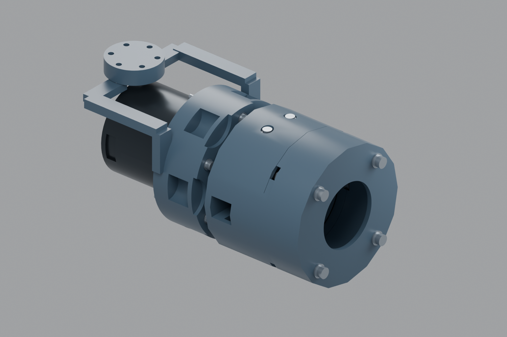
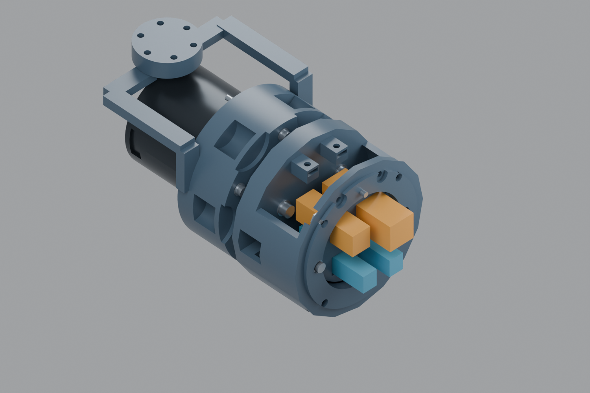
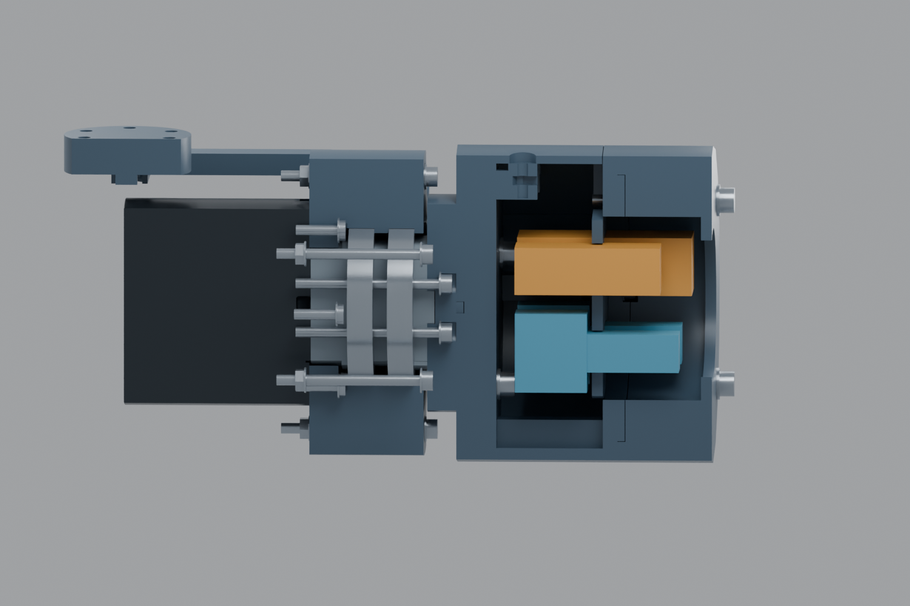

# TOOL-IF02：端面凹腔与隐藏式手动接口试配

2026-10-09。用户认可参考成熟机械臂，把工具接口从突出小仓移入端面凹腔。保留长版、RS00、A连续甲壳方向和同源底座/四瓣头边界。本轮是**受支撑、不通电、无载的局部打印试配**，不是最终外罩或完整连接器装配放行。

## 调整后的结构

由后向前分层：原电机输出/轴承核心 → 内部接合面 → 腕部凹腔 → 外圈工具定位/固定 → 工具侧后腔。保留原始电机尺寸、轴承和六颗输出M3，不在电机上钻孔；原Ø18凸台只定位内部接合，不再占据前部工具开口。

| 界面 | 本轮名义尺寸，mm |
|---|---|
| 原核心接合 | X65.7；原3颗M4×20、PCD45及0.8垫片保留 |
| 内部服务腔 | X76.7..106；中央腔Ø64，前端开口Ø54 |
| 工具端接合面 | X110；外圈Ø76/内圈Ø54、长2的环形定位；对侧Ø76.3、深2.2 |
| 工具固定 | 4颗M4×35，PCD72、首角45°；0.8垫片；本轮长度包含工具侧试验杯及前盖 |
| 工具方向 | (Y,Z)=(0,31)处Ø3×8钢销；试配孔Ø3.1/Ø3.3，保持方式需实测/可控胶粘 |
| 可换端面嵌件 | X103..106；Ø52主体与两侧安装耳；两个M3×12 |
| 背部检修盖 | 上部薄壳；前两颗轴向M3×10、后两颗竖向M3×10按钮头；开盖方向+Z |
| 工具后腔试验杯 | X110..136，前盖中央Ø42出线口；只是后腔所需空间的验证件，未改四瓣头 |
| 名义外形上限 | 十六段外轮廓，外接圆Ø88；没有上一版突出的小仓 |

原来3颗M4与新的4颗工具M4属于不同界面。拆工具不需要拆电机输出连接。前盖/杯厚度改变时必须重新计算工具螺钉长度；M4×35不能移用于任意薄工具板。原3颗M4的螺尖—轴承压盖预算仍只有0.8 mm，需要实测堆叠，不是打印误差裕量保证。

下半壳已挖空，保留三个纵向筋；外观薄壳、内部筋和端面环分工。本轮没有把塑料壳定义为金属版3 kg承力件。位于X110之后的杯/盖属于工具侧，质量与偏置须计入裸法兰外部总负载。本轮工具平面由X65.7移至X110，前移44.3 mm。X110是本轮局部工具接口，不更新整臂URDF/TCP；整臂工作空间和质量矩需在该模块收敛后重算，不能把“长版连杆未改”当工具中心未变。

## 连接器：具体料号与未定型部分分开

两路相机各采用独立50 Ω HFM路径作尺寸研究。已经直接下载并目视核对原厂第一页：

| 候选料号 | 完整壳体名义尺寸 X×Y×Z，mm | 来源 |
|---|---:|---|
| AMK21A-103Z5-y，弯头母端 | 19.8×9.6×21.8 | [原厂图](https://products.rosenberger.com/_ocassets/db/AMK21A-103Z5-Y.pdf) |
| AMS11A-103Z5-y，直式公端 | 25.23×9.1×10.55 | [原厂图](https://products.rosenberger.com/_ocassets/db/AMS11A-103Z5-Y.pdf) |

图中的蓝块是依据上述尺寸构建的完整壳体盒包络，**不是原厂STEP，也没有自绘锁扣假装已经适配**。两个全长直接相加为45.03 mm作保守轴向空间分配，没有扣除未知的实际插接重叠。它检查壳体尺寸级别，不验证正确配插参考面、同轴轴线偏置、锁扣行程、面板保持或线缆尾部。两路建议分别采用A/C编码来防止上下相机错插，实际供应与编码配对需确认。

供电PWR仍保留40×12×13 mm分配空间，控制CTRL保留48×16×16 mm；它们**不是已核对的具体料号尺寸**。Molex Micro-Fit家族原厂图本轮未成功下载，不能用搜索摘要的尺寸作为制造孔型。两个孔只是可换嵌件的候选开口。控制参考空间不保证容纳任意RJ45插座；若选EtherCAT，必须按该料号重新做嵌件/间距检查。当前不发布电压、针脚、连续电流、STO或热插拔能力。

普通弹簧触点不作为本轮GMSL接口。HFM目录和具体件的电气规格只用于候选筛选，不替代相机—电缆—接头—解串器的链路验收。相机类型、PoC、实际线材组及完整线束总成号仍待确认；HFM候选插接次数也不等于高频换工具寿命。[HFM目录](https://www.rosenberger.com/fileadmin/content/headquarter/Downloads/RF_Coaxial_Connectors/AUTO_HFM_Catalog_2023.pdf)

## 内走线与检修顺序

RS00原厂CAD的中轴探针与固定实体有交叠，没有连续贯通线道。因此中央开口只通向**电机之后的腕部凹腔**；后侧X70..85、Y-46..-24、Z±7留侧入口，需接入后续腕罩的侧/背通道。不能把图上有中央孔解释成已经实现穿过电机的轴向走线。

1. 拆四颗工具M4，工具杯沿+X退出；工具接口销仅保留方向，不承担载荷资格。
2. 手动断开相机、供电和控制；不是螺钉拧紧时自动盲插。当前包络不含锁扣保持件，实物连接器需在开放状态验证后另制压条/夹持件。
3. 拆前两颗轴向和后两颗竖向检修盖M3，背盖沿+Z抬起。前部细杆工具通道按“工具杯已移去”检查，后两颗从上方操作。
4. 必要时拆两颗端面嵌件M3，将嵌件向+X取出；可独立替换，不更改电机接口。

打印包中的工具杯是检修/后腔样件，不能直接当已装上四瓣头的最终结构。换真实头后，需要重新检查拔出、开盖、锁扣及相机视野。

线缆目前只检查直线出口：相机按OD3.1，供电/控制按Ø5束线预算。归档动态同轴候选仍要求R75 mm和单独给出的±180°/m条件；本轮不把直线段当动态线束，不在小凹腔里画未经验证的反复紧弯。J7±90°的活动线束、夹点、弯扭寿命、通道损耗和温升均未通过；下一步须在线材确定后评估局部滚转路径，必要时调整J7布局/范围。

## 文件与打印

- [打印试配包](build/TOOL-IF02-recessed-fit.zip)：本轮5个装配件、3个定位小样；共用J7核心101—105与IF01的107，共14套STEP/摆放STL。旧201—204、小仓和IF01的小定位样件不混装。
- [公开Blender](build/A13-TOOL-IF02.blend)：自建电机包络；原厂RS00版仅本地`work/arm-a13/tool-if02/actual-RS00-recessed-interface.blend`。
- [接口合同](build/interface.json)、[局部检查](build/fit-audit.json)、[尺寸与打印表](build/parts.csv)、[工作图](build/drawings)。

本轮442项名义实体检查含J7的−90°、−45°、0°、45°、90°五个采样角、拆件位置与细杆工具通道；采样不等于连续扫掠或整臂避碰。原厂电机网格与两份Blender的自建几何分别核对，剖图只用于表达，未将切割修改器保存进装配文件。

先打印Ø76.1/76.2/76.3的小样验证定位环，再试载体与可拆盖；止口、螺母槽和检修盖薄壁需要切片检查与实测。摆放STL的平移/旋转有记录，不代表已经验证支撑方案。建议沿用已校准的PETG工艺，先用切片预览检查载体内腔顶面、螺母槽和盖内安装耳，设置可拆支撑，避免将支撑封死在腔内。测量螺母厚度与孔隙后手动轻紧；禁止用电机驱动未确认配合的轴承组。

原始核心的轴承/轴颈小样仍见[J7 FIT01](../j7-fit01/README.md)。工作图以STEP为几何依据，只是塑料试配图，不是CNC公差/工艺放行。没有完整头部、整臂运动、电气、温升或3 kg试验。

[接口五金表](build/interface-hardware.csv)仅列本轮接口；继承核心五金见FIT01。连接器条目是尺寸候选，尚非采购冻结单。[名义实体体积](build/nominal-volume.json)附自建五件的体积/质心，密度换算不等于实际切片重量，也未更新整臂负载模型。

复现：CadQuery Python运行`build.py`、`drawings.py`；Blender运行`blender.py`（`-- --actual`生成仅本地原厂版与图）及`audit_native.py`；Python运行`package.py`。所有源SHA绑定在manifest；原厂PDF/CAD留在忽略的work目录，不随公开包分发。
