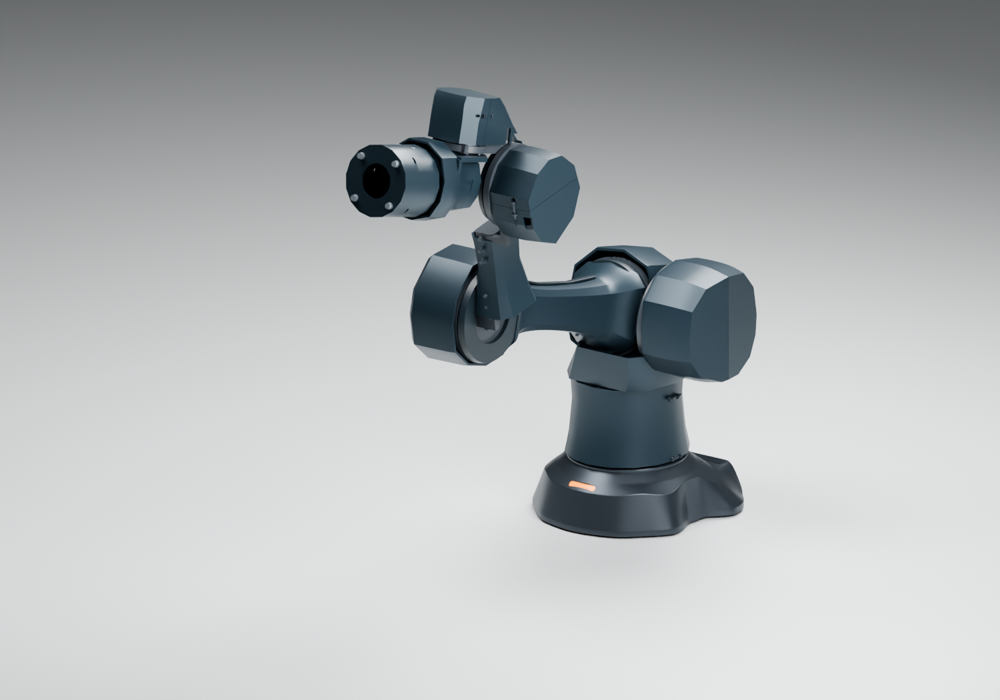
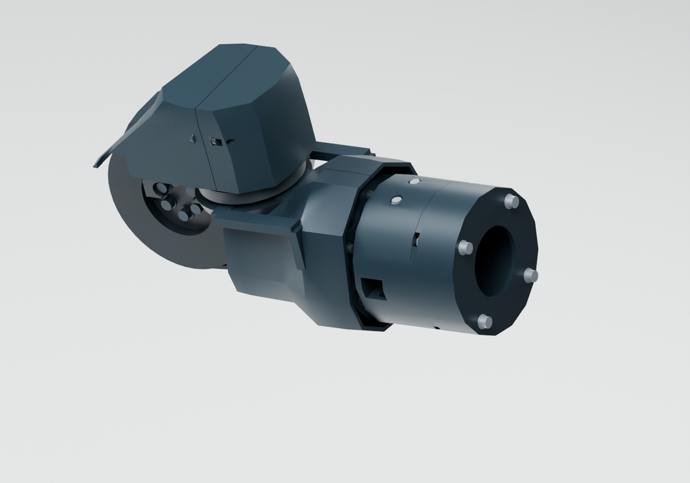

# WRIST-ROUTE01：整腕集成、支架避让及动态走线筛查

2026-10-09。沿用已选A连续甲壳、长版、RS关节、同源B06底座；将J7 FIT01和TOOL-IF02装回原七轴模型。四瓣头不在此处重建。当前只有局部塑料试配资格，尚无整臂、3 kg或动态线束放行。

## 本轮结构修正

旧105支架在J6的±20°/±40°及组合中间姿态与J6固定螺钉头相交，端点检查没有暴露。新108支架在J7.fixed局部(-25,0)的J6轴周围切出完整圆周避让：内R21.1、外R28.9、Z34.8..39.1 mm，覆盖名义螺钉头和垫圈，再留0.4 mm余量。只减少约188.5 mm³（约0.347%）实体，保持一个封闭实体，未修改电机、孔位、轴承、关节轴线或工具平面。

该环槽的完整扫掠仅证明这些名义同轴圆柱头/垫圈包络的避让；不等于整腕连续扫掠、实际紧固件公差或承力资格。分体外罩保持原A12腕罩。打印时**用108替换105**，两者不叠装；旧IF02包保持历史，新的集成包使用108。

## 检查范围

73个离散姿态：原24个腕罩回归姿态，加J6×J7的7×7网格。检查11件更新后的J7核心/接口实体与上游真实电机、结构、名义五金和六件腕罩。新增IF02五金跨上游另作保守外接盒筛查，其自身精确局部实体检查仍见IF02；不把盒相交当作实际螺钉相交。原有上游之间的接触、整臂外罩、桌面与全域动作未在本轮重新放行。

修正前、修正后的逐实体记录分别在`build/integration-before.json`、`build/integration-review.json`。公开Blender使用自主电机包络；真实14组供应商模型仅保留在本机`work/arm-a13/wrist-route01/actual-motors.blend`。底座仍从原模型读取，未更改另一会话的来源。

## 工具中心与负载变化

本轮接口基准为J7局部X110，替代X65.7；并非把旧URDF工具点继续当真。报告提供三个命名姿态的旧/新法兰世界坐标，以及相同3 kg点负载的重力矩差。它只计算44.3 mm接口平移带来的点负载差，不包含新增外壳、接头、真实工具质心、惯性、线缆反力或热能力；不是完整电机选型或3 kg合格结论。工具侧后腔与头自重须纳入法兰总外负载。

## J7活动线束：筛查结果的含义

当前RS00没有连续中轴线孔，固定线与工具旋转线必须经侧面过渡。在J7固定侧(-18,-40,0)和旋转侧(77.5,-36,0)设置一对**诊断锚点**，将直接连线以Ø3.1圆柱做碰撞探针；它不包含端部切向、不保持运动中的物理线长，只用于否定“直接侧边拉一根线就可以”的构型，不能把无碰撞的某一条弦当真实可用线道。

Rosenberger现行本地受控快照CG03的动态R75与±180°/m是分别给出的条件。若J7±90°只靠该对独立抗转夹点之间的均匀纯扭转，必要自由长度500 mm；约100 mm级弦长不够，且直接弦可能穿过轴承座/电机。该长度不证明所有三维储线构型均不可行，不据此偷偷缩小J7范围。

更细的[Times Microwave PT-047原厂目录](https://timesmicrowave.com/wp-content/uploads/2023/06/micro-coaxial-brochure-web.pdf)给出最大OD1.651 mm、动态R19.05 mm；这是值得试样的机械尺寸方向。资料未批准J7复合弯扭、GMSL2/PoC或与本轮HFM端子的端接，不能把它直接替换成已经选好的线束。此前RH空心关节/P16研究属于另一硬件分支，不套用到当前RS00结构。

本轮不画未经验证的紧绕线，也不装通用滑环来宣称GMSL旋转通信已经解决。下一轮需要取得小径动态50Ω成品总成与受控端接尺寸，再比较平面储线/滚转过渡构型；电源和控制线必须同时满足各自弯曲条件。线材、夹点与储线构型未收敛前，腕罩走线孔和动态封装不作最终冻结。

## 文件与试配

- 集成Blender：`build/A13-WRIST-ROUTE01.blend`，七轴仍可用各`J*.rotor.angle_deg`调节。
- 新108的STEP、原坐标STL与摆放STL：`build/step`、`build/stl-object`、`build/print-bed`。
- 集成打印包：`build/WRIST-ROUTE01-fit.zip`，14套STEP/STL，其中108替换105。核心装配与接口说明同时提供，旧106及201—204不混装。
- 受支撑、不通电、不带载；先在实物确认轴承配合、螺钉深度、定位环和手动转动。新槽切片后检查支撑、壁厚和拆装，未提供实机切片参数。

复现`carrier.py → review.py → blender.py → audit_native.py → package.py`。`review.py --baseline`仅复现修正前对照。原始供应商几何仍不公开，脚本在完整仓库及本地受控来源下运行。
