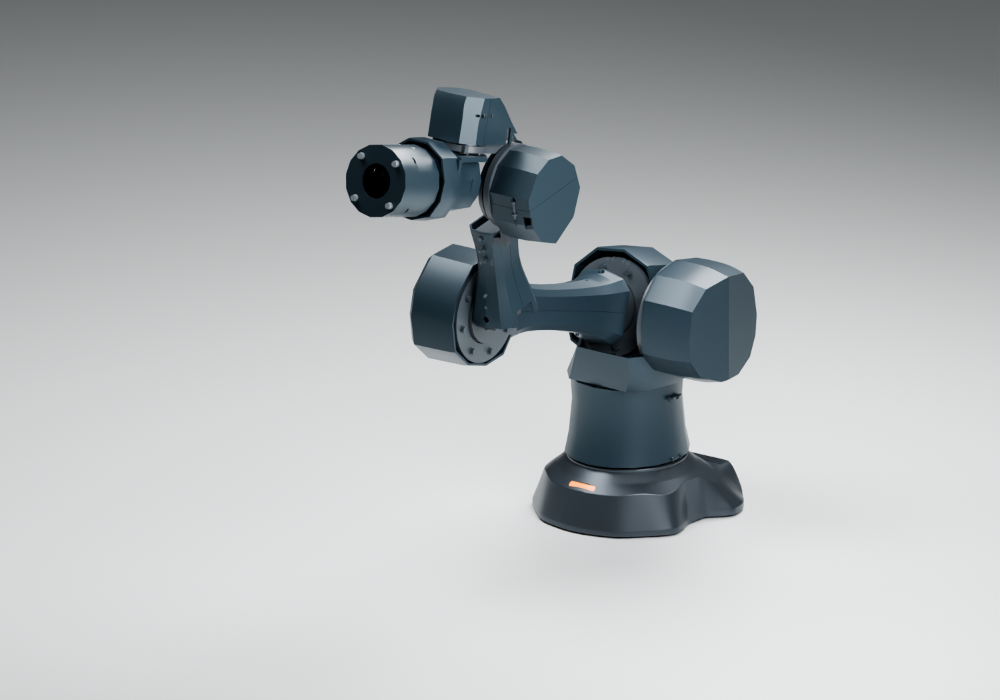
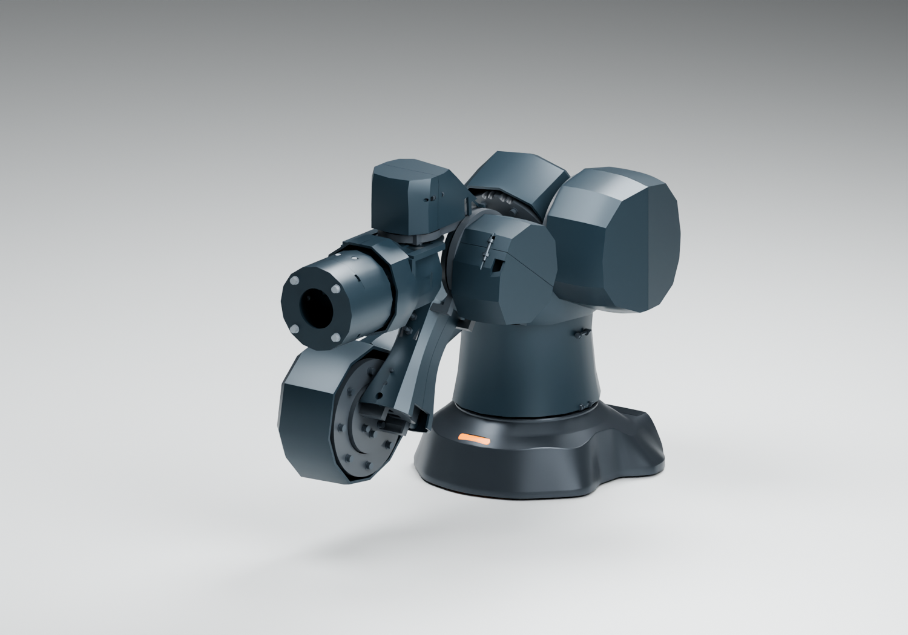
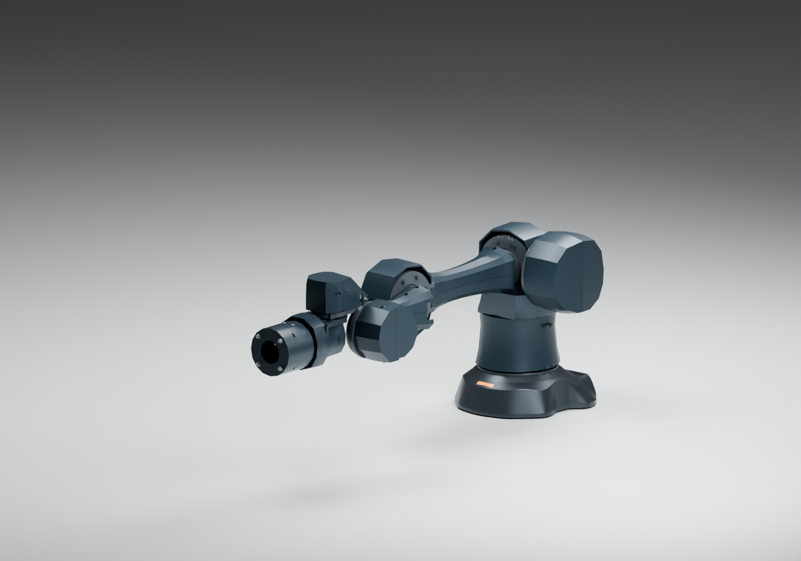

# LINK-SHELL01：连续甲壳的连杆实体深化

2026-10-09。延续已选 A 方向，保留原长版轴线与真实电机尺寸；底座读取同源 B06。上臂/前臂从 Blender 造型曲面转成四件可拆 CAD 实体。这是**受支撑、无载的试配研究件，尚非整臂生产或打印放行**；当前电机持续保持能力见 [QUAL01](../qualification01/README.md)。

## 外形与分件

连续纵向脊线配合清晰横截面折线。上臂两端收紧，不再保留很大的喇叭口；范围 X58..282，最大宽80、高约46/43.5 mm。前臂范围 X6..129，最大宽约59.7、高约40.5/38.3 mm。长版连杆中心距离、低位 Z 折叠定义和关节角范围未改变。整个甲壳由对应刚体独立承载，不跨接活动关节。

四件外罩替换旧 W20/W21 曲面与 W22/W23 背脊示意盖；上臂/前臂近端的旧 W13/W14 装饰唇不再与新分壳叠装。其他关节外观件仍按原模块状态管理，本轮没有将其全部变成制造件。

截面采用真正内偏置的 2.6 mm 名义壁厚；纵向平滑实体放样保留折脊，实际法向壁厚会随纵向斜率及避让改变。上下壳缝 0.4 mm。前臂近端有一对 R8 圆弧避让，并将 J4 固定螺钉头/垫圈的同轴旋转包络完整避让 0.4 mm。此包络只适用于对应名义同轴五金，不等于整臂连续扫掠。

## 安装与检修

固定使用已有结构件侧装的 M3 螺母，而不是夹紧电机外壳。上臂 X65/X275、Y0；前臂 X15/X120、Y62。上下各两颗 M3×12 及名义垫圈，合计8颗螺钉、8颗螺母、8片垫圈；完整 ID 在 `build/parts.json`。保留原头部/垫圈平面和螺钉伸入，贯孔 Ø3.5、直通检修孔 Ø8。

安装柱底面按原骨架筋条和套筒的名义实体做贴合避让，不再保留穿入骨架的柱材料。这种底面是打印试配的贴合研究，不是已经冻结的金属加工基准。局部座厚、预紧、磨损和实物配合需要验证；不能套用金属紧固的拧紧力矩。

先将螺母装入侧槽，再安装标准管、套筒和固定螺钉；受支撑手动核对运动后安装下壳、上壳，从 Ø8 检修孔装 M3 螺钉。拆壳按相反顺序，不需要移除电机。当前贯孔只定义装配入口，尚无包含整臂全部零件的工具直线可达证明。

## 文件、检查与打印边界

- `build/step/`：四件同源实体 STEP。
- `build/stl-object/`：原关节局部坐标的 STL。
- `build/print-bed/`：缝面朝下、移至床面正坐标的摆放 STL；上臂包络约224×80×46 mm，前臂约123×59.7×40.5 mm。尺寸可以放进256 mm级床面，不代表支撑、切片或工艺已经通过。
- `build/parts.json`：CAD/STL 哈希、质量假设、坐标、固定点和打印变换；四件各为一个有效实体，三角网格封闭、方向一致且单连通。
- `build/geometry-review.json`：对真实原厂电机、骨架、名义旧五金和已完成的关节 CAD 壳进行离散 BREP 交叉检查；具体命名姿态、路径与诊断角度分开记录。检查结果以该文件为准，不假称全部角域可用。
- `build/A14-LINK-SHELL01.blend`：公开自主电机包络的七轴模型。本机 `work/arm-a14/link-shell01/actual-motors.blend` 使用未缩放的原厂模型。

走线尚未放行。这里没有把背脊条画成已经装好的线束，也不把中部空腔当成端到端动态路径。电源/CAN 与双 GMSL2 必须有成品规格、锚点、储线、端接及实测循环；新关节通过后，接口端与甲壳内的线夹一起冻结。

同版本塑料材料、切片支撑、孔位补偿和配合样条尚未确定。当前只能在支撑、无载、不通电的条件下进一步审查/试配，不能依靠塑料骨架自持整臂或3 kg负载。金属关节座、持续负载、散热及寿命验证独立进行。

当前记录为56个离散配置：3个命名姿态、21个角域诊断配置、两段插值的32个中间点。3个命名姿态及32个插值点的新外罩检查通过；唯一残留是诊断配置 J5=-90° 时前臂两片与旧 J6 后罩 B 相交。这个诊断不在所检两段路径上，但仍需在后续腕罩修正中处理，不能删掉记录或缩角度来制造全部通过。其他零件相互之间、非实体造型罩与连通线束不在此报告的放行范围。

公开/本机 Blender 分别完成四件CAD网格和3个命名姿态的坐标复核；本机14组原厂电机网格、同源底座指纹保持一致。四件 PETG 均匀密度估算合计约0.206 kg，这不是切片后称重，也不意味着整臂持续载荷已经解决。

复现：`build.py → review.py → blender.py → audit_native.py`。Blender 实体来自 STEP 的同源三角化，不添加改变制造几何的外观修改器。原始供应商 CAD 不公开重新分发。
