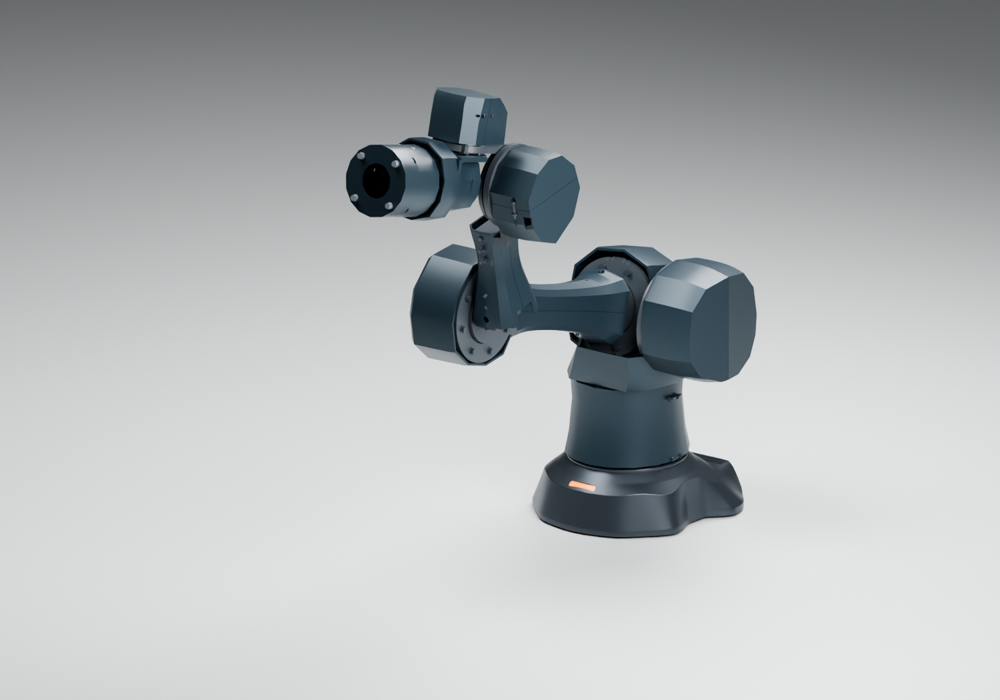

# WRIST-TAIL01：收短腕罩，合并连杆试配版本

2026-10-09。保留长版、A 连续甲壳、真实电机尺寸和同源 B06 底座。本轮替换 J6 后罩 B，连同四件 LINK-SHELL01 连杆分壳组成当前五件 CAD 集成版本。**这些是受支撑、无载、不通电的装配研究件；整臂尚未达到生产标准。**

## 后罩修正

旧 `A12-WR02-J6-shield-B` 在诊断配置 J5=-90° 与前臂两片相交。新件 `A14-WT-J6-rear-shield-B` 只保留 J6 局部 X≥-44 mm 的原实体，移除非承力长尾；不移动电机、关节轴或夹紧点，不扩大电机孔。

原 Y±33.5、Z84.7 的两个固定位置和相应 M3×20 五金保留，前罩 A 保留。新件为一个有效 CAD 实体、封闭单连通网格；移除体积约7,866 mm³。后侧检修开口变大，当前不构成密封、防护或连通线束证明。原夹紧结构、衬垫及预紧状态仍需实物验证。

## 同版本文件

- `build/parts.json`：五件同源三角网格、坐标、打印变换、来源哈希和替换清单。四件连杆 STEP 继续引用原模块，避免生成两份不同的源。
- `build/step/`、`stl-object/`、`print-bed/`：本模块新后罩。四件连杆在 [LINK-SHELL01](../link-shell01/README.md) 的对应目录。
- `build/geometry-review.json`：65个离散配置的 BREP 相交检查，五件新 CAD 对报告列出的保留实体、以及五件彼此之间均未检出超过0.05 mm³的相交。
- `build/A14-WRIST-TAIL01.blend`：公开自主电机包络版。原厂模型保留在本机 `work/arm-a14/wrist-tail01/actual-motors.blend`，未缩放、未公开重分发。
- `build/native-*-audit.json`：五件 CAD 网格、14组本机原厂电机网格、三种命名姿态和底座源指纹复核。
- `build/viewer-native-*-audit.json`：预览的全部478/485件臂身网格及5件底座背景网格，与对应 Blender 评估几何比较；最大坐标差小于0.001 mm。
- [公开滑条预览](../../../docs/viewers/arm-body-a14-wrist-tail01/index.html)：自包含离线资源；自动预览应通过本地 HTTP 服务打开。本机原厂模型预览在 `work/arm-a14/wrist-tail01/viewer-actual/index.html`。
- `build/A14-five-covers-supported-fit.zip`：仅五件外罩的增量研究包，含 STEP、摆放 STL、零件表、坐标和 README；不含整个承力骨架或整机生产图纸。

65个配置包括3个命名姿态、30个诊断配置、两段动作的32个插值点。检查未覆盖整个连续空间、其他 Blender 造型罩、底座/桌面、IF02 新五金、工具可达空间、制造误差和连接线束，不能据此认定任意滑条姿态可执行。

## 装配研究顺序

1. 比对该版本替换清单，拆除旧长连杆造型件、W13/W14 近端装饰唇及旧后罩 B，避免叠装。
2. 在支撑夹具上核对现有骨架、原尺寸电机和五金。先安装连杆侧槽螺母，再装套筒与标准管；上下壳通过原8个 M3×12 固定点安装。孔位详见连杆模块。
3. 先装原腕罩 A，再装新 B；沿用原两个夹紧站位的2颗M3×20、2颗M3螺母及4片名义0.5 mm垫圈。保持无载，检查接缝、检修入口与手动动作。
4. 打印前先完成材料、切片支撑及孔位补偿试样。当前只有摆放几何，没有经过切片的打印工艺；新后罩床面包络约56.6×72×43.8 mm，四件连杆最大约224×80×46 mm。

五件按均匀 PETG 密度估算约0.231 kg；不是切片重量。不得将本包的非承力外罩、历史塑料骨架或目录峰值扭矩当作3 kg承载能力。动态电源/CAN/双 GMSL2、热设计、新关节适配、独立金属骨架、制造公差和样机试验必须继续完成。

## 复现

先复现 LINK-SHELL01，再运行 `build.py → review.py → blender.py → audit_native.py → viewer.py → audit_viewer_native.py → audit_viewer.py → package.py`。Blender 命令加 `--actual` 使用本机原厂模型；公开版使用自主包络。离线脚本检查需要Node，可用`A14_NODE_RUNTIME`指定可执行文件。全部来源固定到版本哈希，旧报告保留历史范围。
