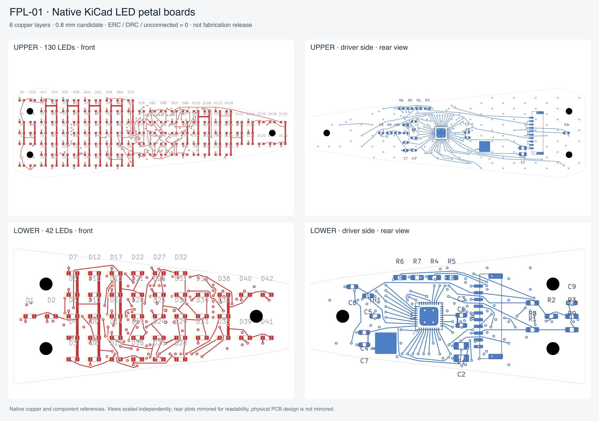

# FPL-01 — 最终片形对应的灯板工程候选

CC-BY-NC-4.0 · Odradek — Auromix contributors

本目录是上片 130 点、下片 42 点的独立原生 KiCad 设计。它接续机械适配研究，保留该研究全部 LED 坐标、板轮廓及安装孔；不同于旧 ULP-02 的 113 点电测样片。数字检查的结果见每板 `kicad/checks/verification.json`，完整源重建记录见 `rebuild-report.json`。没有实物上电、温升或板厂工艺确认，不能据此下制造放行结论。



图中每格分别缩放，后视图仅作显示镜像；器件数值文字在审查派生图隐藏，原始原生图层保留完整内容。

## 文件关系

- `build.py` 从机械适配研究与已审查电路拓扑生成两板 BOM、针脚网表、LED 映射、固件寄存器计划及机械接口。两板电气映射独立；不能把旧 ULP-02 帧表写入本板。
- `upper/kicad/petal.kicad_sch`、`lower/kicad/petal.kicad_sch` 是原生原理图；同目录 `petal.kicad_pcb` 是原生布线板；`FPL.pretty/` 与符号库为依据厂家尺寸重建的项目内封装/符号。
- 每板 `kicad/placement-map.json` 给原生布局；公共 `mechanical-interface-candidate.json` 给机械坐标及 GH 配对框。原生板 Y = 40 − 机械 Y。
- 每板 `kicad/routing-plan.json` 保存实际导线/过孔/铺铜快照，绑定源网表及封装哈希；重建时复放并重新运行 KiCad，而非复制先前的通过标记。
- 每板 `kicad/checks/petal.xml` 是从原理图导出的网表；`erc.json`、`drc.json` 是真实 KiCad 输出。`native-board-audit.json` 独立比较坐标、LED 极性、所有针脚、GH 底面翻转、安装禁区、地层及粗略走线电阻。
- `firmware-mock-check.json` 来自 C99 编译与模拟传输检查。它验证初始化、帧地址与错误返回，不是芯片实测。

## 复现

使用 KiCad 10.0.6 CLI 和该版本带 `pcbnew` 的 Python，另需 Python 3 与 C99 编译器。工具安装路径由调用者提供，不写入仓库。

```sh
python3 engineering/electronics/final-petal-fpl01/rebuild.py \
  --kicad-cli /path/to/kicad-cli \
  --kicad-python /path/to/python-with-pcbnew
```

重建依次生成两板源文件、加载真正 KiCad 封装并翻到底面、导出原理图网表、复放源匹配的布线、重跑 ERC/DRC/原理图一致性、进行独立几何与极性审计、编译并模拟固件，最后导出 SVG。任一检查不通过即终止。原始布线求解是开发工具，不需要在复现时再次求解。可选的 PNG 拼图使用 Node + Sharp 运行 `node engineering/electronics/final-petal-fpl01/tools/render_review_png.mjs`；若 Sharp 不在默认模块路径，可用 `FPL_SHARP_MODULE` 指定其安装目录。该图不是制造图。

## 电流、映射与首次上电边界

LP5860 使用 11 行扫描，LED 阳极接 SW，阴极接 CS。上板使用全部 18 个 CS；下板使用 13 个 CS、仅 4 个有灯 SW，仍保留 11 行占空比。CS 依据物理行重新分配，`mapping-revision.json` 对每个变化逐项记录；SW 分组不变。

20 mA 瞬时灯电流时，上板最大同时 14 点，VLED 峰值 280 mA；下板最大 13 点、260 mA。忽略扫描消隐的平均灯电流分别为 236.364 mA、76.364 mA。3.3 V 轨加每板 0.05 W 逻辑规划值后，单上板约 0.830 W、单下板 0.302 W，四片基线 2.264 W。这是电气预算，不是测得温升，也没有包含中央显示、控制板及线束损耗。

固件例程默认 3 mA、主亮度 0、全帧黑；20 mA 是单独列出的寄存器修改序列，不能自动启动。先以限流实验电源、低 SPI 速率验证四轨/信号参考、读回、扫描与暗态，再分级增加图案和电流。示例回调需由主控实现；尚未连接真实 MCU、线束或 EtherCAT。

## 机械与生产边界

PCB 改为六铜层候选（F、In1、In3、In4、B 用于信号，In2 完整 GND）。四层开发布局残留拥塞，未以降低间距或切割地层处理。六层候选厚 0.8 mm，机械 Z3.6…4.4；LED 本体最大 0.8 mm，加规划焊高 0.10 mm 后顶面 Z5.3。剩余混光间隙是 0.7 mm，透光件 Z6.0…6.6。焊高、PCB 厚度、公差叠加及实际光学混光均待验证。

J1 是侧插 `SM10B-GHS-TB(LF)(SN)`，配 `GHR-10V-S`，导线朝根部 −X；整套参考框 X39.425…46.575、Y±7.875、Z−0.75…3.6。这是 JST 目录参考尺寸矩形，不是受控装配 BREP。实际壳体、锁扣操作、插拔轨迹、压接和出线弯曲仍须用样件验证。相同上/下 PCB 应在左右机械模块中刚性摆放，不能镜像铜层、针序或器件。

C1/C2 按本体最大 1.45 mm 加 0.10 mm 焊高规划，最低 Z2.05，局部底腔 Z1.8，名义间隙 0.25 mm。B 面 X62…66、Y−7…−3 预留无器件/信号/过孔的地铜区，保持阻焊覆盖；其到金属底面仍有 1.7 mm。尚未设计绝缘导热垫、金属凸台或压紧结构。上板 U1 已在 X80，该预留区不能被称为芯片已完成的散热桥。

导线尺寸与过孔工艺按原生规则审查；厂商仍需确认实际铜厚、层叠、最小间距/孔铜、阻焊桥、板边和安装孔加工公差。与焊盘相交的过孔在审计中逐个列出，需要填孔、铜帽与平整度工艺；不能直接替换成开放通孔。QFN 暴露焊盘还需钢网/焊膏与空洞率验证。没有生成声称可直接量产的 Gerber 放行包。

走线电阻审计使用 20°C、35 μm 候选铜厚，把同网全部线段串联作为迹线压降的保守上界；它不包含孔壁、接触、电源回流或升温，不能当作瞬态仿真。去耦环路与 VLED/VCC/VCAP 波形必须在实物板测量，尤其上板 IC 到输入去耦的距离较大。

默认 KiCad 不启用的检查项在原始报告中原样保留；本项目没有以违反项排除清单掩盖未连线或几何错误。数字门检查不代替 EMC、ESD、光生物安全、热、抗振、夹指线缆寿命及整机验证。
