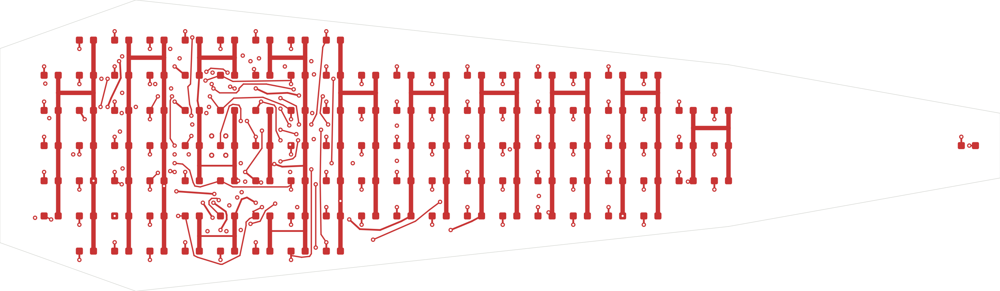
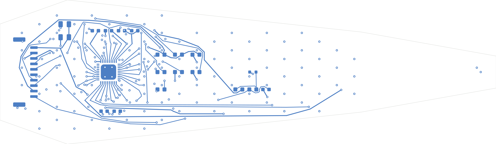
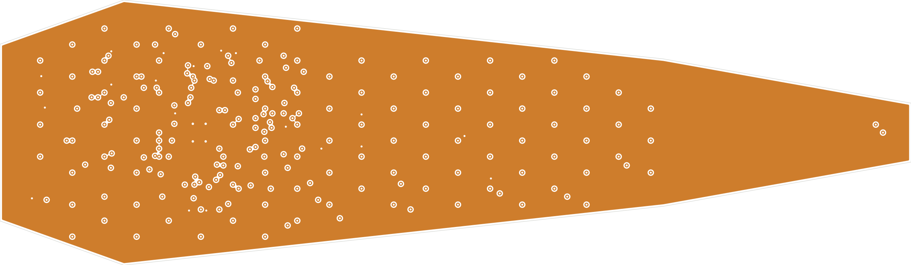

# ULP-02 原生 KiCad 电测板

**真实原理图与四层布线已完成数字检查，尚未实物验证或制造放行。**最终文件是 [`upper-petal.kicad_sch`](upper-petal.kicad_sch)、[`upper-petal.kicad_pcb`](upper-petal.kicad_pcb)、[`upper-petal.kicad_pro`](upper-petal.kicad_pro)。这是保留 113 灯点坐标的 HLIO-R03 独立灯光电测样片，不承诺装入 CONTACT02 正式夹指。

KiCad 10.0.6 的实际结果：**ERC 0；DRC 0；未连接 0；原理图/PCB 不一致 0**。导出 XML 的 317 条针脚与 ULP-02 网络表完全一致；134 个器件、113 颗正面 LED，其他器件全部背面，位置及极性检查无差异。227 个通孔过孔，其中 223 个 0.5/0.25 mm，4 个暴露焊盘热过孔 0.6/0.3 mm；800 段线路。In2.Cu 无信号走线，填铜为一个 GND 连通多边形。

权威记录：[`checks/verification.json`](checks/verification.json)、[`checks/erc.json`](checks/erc.json)、[`checks/drc.json`](checks/drc.json)、[`checks/native-board-audit.json`](checks/native-board-audit.json)、[`checks/rebuild-report.json`](checks/rebuild-report.json)。报告保存工具原有默认忽略检查项；项目没有加入单项豁免。当前启用的线宽、铜间距、孔间距、板边间距、短路、连接性等检查均通过。默认未启用的例如 `track_not_centered_on_via` 仍在原始报告可见，不能把上述数字说成全部可选 DFM 检查或板厂验收。

## 精确重建

Python 3 负责文本生成，KiCad 随附 Python 负责真实 pcbnew API。将下面两个路径指向实际 KiCad 10.0.6 应用，在本目录运行：

```sh
python3 rebuild.py \
  --kicad-cli /path/to/KiCad.app/Contents/MacOS/kicad-cli \
  --kicad-python /path/to/KiCad.app/Contents/Frameworks/Python.framework/Versions/3.9/bin/python3.9
```

这一个命令重新生成 ULP-02 网络/地址/C99样例、本地符号和封装、原理图/基础 PCB、原生镜像封装、精确布线，随后实际执行 ERC/DRC/源网表与位置核对，再导出 SVG/Gerber/钻孔审查文件。失败立即停止。加 `--skip-export` 可只重建并检查。需要本机有 KiCad Python 依赖的图形运行环境；没有依赖 Java 或在线服务。临时下载的官方应用体积、SHA256、版本与签名检查在 [`toolchain-plan.json`](toolchain-plan.json)。

[`routing-plan.json`](routing-plan.json) 是最终实际线路、过孔和背面放置位置的显式快照；`replay_routing.py` 先核对网表及每个封装的 SHA256，再重放。它不是自动猜测新电路的布线器。若器件、映射或封装改变，重放拒绝继续，必须重新完成布线和检验。已经从基础文件进行一次完整重建并重新得到上述零违规结果。

开发顺序为：QFN 有限长度出口、F 层相邻 SW 母线、In1 层 CS 母线、优先受约束引脚、逐段精确碰撞检查的路径，再归一化 T 形连接并清理末端无用支路。自动布线试验只用于研究，没有进入最终重放依赖。中间 DSN/SES/试验板和本地 GUI 配置已移出交付目录。

## 图面和铜损边界

[完整原理图 SVG](plots/schematic/upper-petal.svg) 可缩放查看。各层有独立 SVG；下面是原生铜层输出的 PNG 预览。





最小线宽/间距 0.15/0.15 mm，板边铜距 0.25 mm；SW 的相邻列主线为 0.5 mm，部分局部/跨区连接为 0.15 或 0.20 mm。不能把全网称为 0.5 mm。按 20°C、35 µm 铜，保守地将某一网上所有线段串联并用 280 mA 估算，SW 中最大压降上界 66.3 mV，VLED 线段上界 29.8 mV；该假设甚至给只有一个 LED 的 SW10 施加了全板行峰值，实际各行负荷见父目录。

这些只是**线路电阻上界**，不含过孔、接插件、焊盘收缩、GND 回流、温升及寄生参数。不能据此保证恒流余量、结温或 EMC。外部电源的动态响应、LED 冷态 Vf、公差和热降额需要首板试验。

## 制造审查文件及尚未闭合的项

[`fabrication-review/`](fabrication-review/) 中的 4 铜层、阻焊、锡膏、丝印、轮廓 Gerber X2 和 Excellon 钻孔由这块实际检查过的 PCB 导出，供供应商审查，**不是生产放行包**。`.gbrjob` 中 0.8 mm/35 µm 铜及等分介质是 KiCad 自动生成的候选叠层，不是已订购的板厂材料。钻孔报告为 227 个 PTH、0 个 NPTH，没有安装孔。

待确认事项：受控 JST 订货图及 NTC 焊盘图面逐层叠对；真实板厂叠层、孔径/铜厚/板厚能力；暴露焊盘热孔填孔/盖孔和分割锡膏方案；部件焊接公差与极性；冷/热态点亮、扫描波形与纹波、温升、EMI、鱼眼视频条纹；正式夹指的固定、线弯、插拔和软垫隔离。逻辑主控/外部电源保护及完整头部多板连接仍是独立任务。

许可证 CC-BY-NC-4.0；Auromix contributors。
